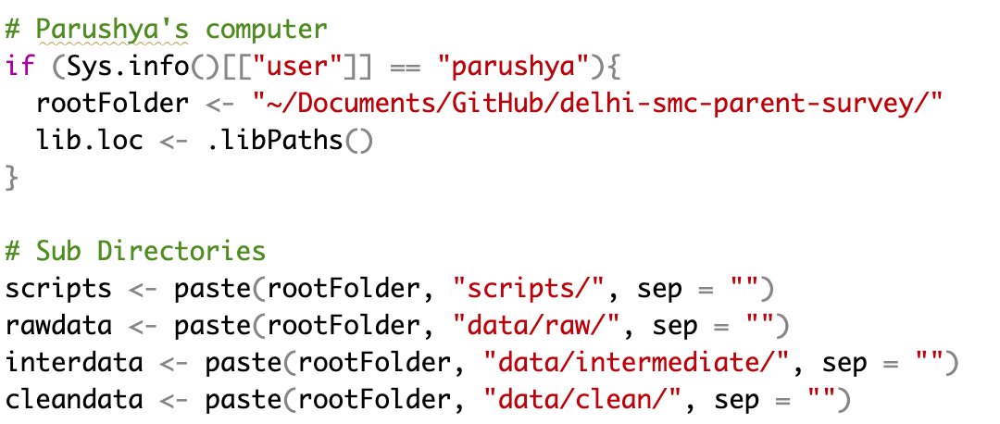
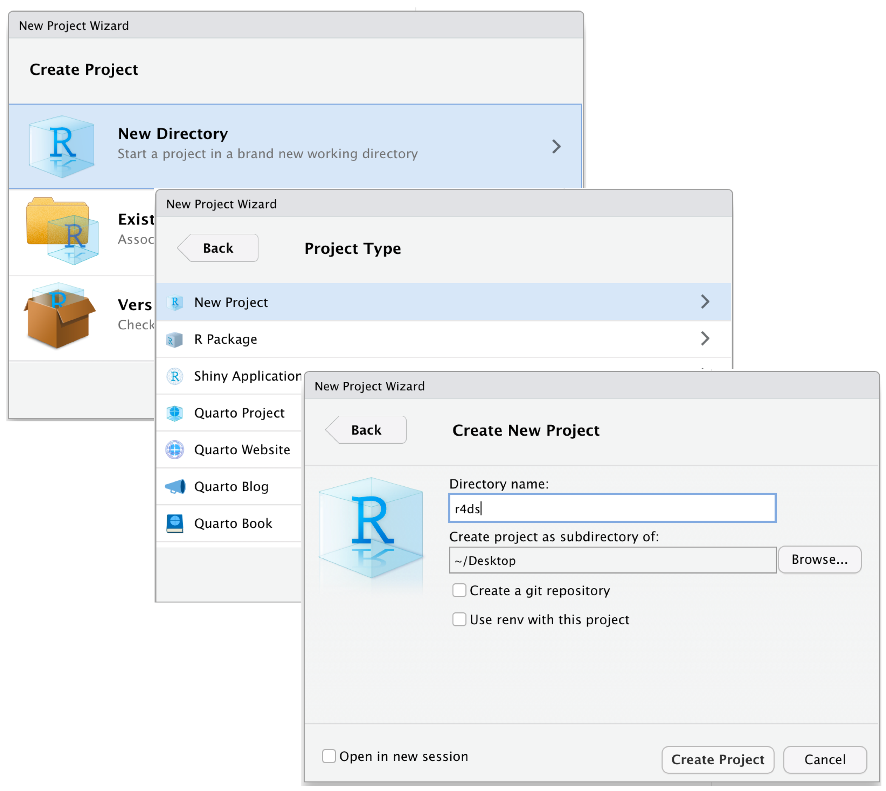
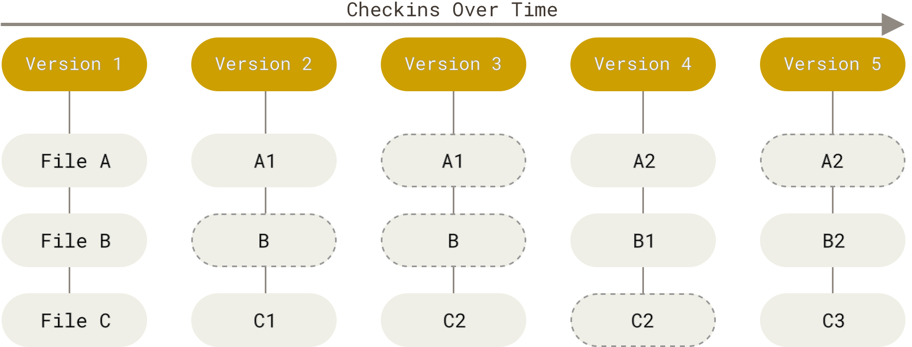

## Before we start {.smaller .gm-before}

::: {.incremental}
- Some [setup](../chapters/11-reproducible-research.html#setup) for today — a
  GitHub account, git installed
- Who here has watched *Interstellar*?
- Pick out a favourite picture of yourself and copy it to desktop
:::

## Ideas develop, data moves, and code changes {.smaller .gm-tight}

::: {.incremental}

- You are working on a research project
- The theory develops to include new confounders
- New measurements are defined
- Corresponding variables from different datasets are merged
- Those datasets live across `../desktop`, `../downloads`, `quant1sept26`, and so on
- You do a draft and close
- Five months later, you rerun the code. Bam!
- You had cleaned the desktop because well.. productivity-maxxxing!
- You had moved the code folder, to make space in a drive!
- Worse, you had thought of a log-log transformation for ggplot, but then
  deleted the code 3 months back
- Even worse, you found a collaborator interested in the same topic
  - You send the code folder
  - It doesn't run, because the dataset is not found and the paths don't resolve!

:::


## Ideas, data, and code, have an *Interstellar* Journey {.smaller}

::: {.incremental}

- Change across time
  - modified code, new operationalizations
  - new data merged
  - older code finds new use

- Move across space
  - New folders
  - New machines
  - New collaborators

:::

. . .

A good project would move seamlessly across them --- and at the very least,
save a headache.


## It's not just you, it's me


Broken Promises (Paths) 

`C:/Users/.../OneDrive - University/Desktop/final_FINAL_v3/data.dta`

. . .

My code from 9 years ago

{.nostretch width="82%" fig-align="center"}


## And others too {.smaller}

Replication packages are full of them too.

. . .

::: {.incremental}
- Download a package from a journal archive
- Open its R scripts or `.do` files
- Count how many paths would run on your machine
:::


## Wider problem, undercuts transparent science {.gm-figure}

![Reproducibility in a stratified random sample of 600 papers published from 2009 to 2018 in 62 journals spanning the social and behavioural sciences [@miskeInvestigatingReproducibilitySocial2026].](images/repro-by-field-figure.png){.nostretch width="100%" fig-align="center"}

## Transparency {.smaller}

Reproducibility is a key aspect of research transparency

. . .

APSA names three parts of research transparency [@elmanTransparentSocialInquiry2018]:

::: {.incremental}
- **Data access** — making available to others the data on which empirical
  claims in published research rest
- **Production transparency** — clearly explicating the most relevant aspects
  of the data generation process
- **Analytic transparency** — conveying the processes through which data were
  analysed to produce claims and conclusions
:::

. . .

A project written to be reproducible is most of **analytic transparency**:
can someone else follow the reasoning from the data to the claim?

. . .

So are **reproducibility** and **replicability** the same thing?


<!-- 4 — Definitions -->
## Reproducible and replicable {.smaller}

Following @barbaTerminologiesReproducibleResearch2018:

. . .

|  | Same data, same code | New data, new study |
|---|---|---|
| **Reproducible** | ✓ same result | — |
| **Replicable** | — | ✓ same finding |

. . .

::: {.incremental}
- **Reproducible research** — authors provide all the necessary data and the
  computer code to run the analysis again, re-creating the results
- **Replication** — a study that arrives at the same scientific findings as
  another study, collecting new data (possibly with different methods) and
  completing new analyses
- This session is about **reproducibility** only.
:::


# Part 1 — File Management and Workflow {.smaller}

##

This comes *on top of* [well-commented code and judiciously named objects](https://cran.r-project.org/web/packages/rockchalk/vignettes/Rstyle.pdf).

::: {.incremental}
1. **Paths** — absolute and relative
2. **Projects** — `.Rproj`
3. **`here()`**
4. **A standard folder structure**, by hand and by script
:::

<!-- 6 — Paths -->
## Absolute and relative paths

**Absolute** — the complete address, starting at the root of the file system.

`C:/Users/YourName/Documents/Project/Data/raw_data.dta`

. . .

**Relative** — the address from wherever the project starts.

`Data/raw_data.dta`

## Analogy — directions to a house {.smaller}

<!-- The analogy is the `callout` block in chapters/11-reproducible-research.qmd
     ("Practical Analogy"), drawn rather than quoted. Like the paths figure it is
     a COPY of the chapter's idea, not a shared file.

     Hand-authored SVG rather than an R chunk, for one reason: reveal fragments.
     The two routes have to arrive one at a time, and a base-R plot can only
     arrive whole. Palette is the deck's: ink #1f2d3a, muted #4a5560, rule
     #c9c9c4, absolute #b5462f, relative #1f5ea8. -->

```{=html}
<figure>
<svg viewBox="0 0 960 500" role="img" style="max-width:100%;height:auto"
     aria-label="A street grid. A red route runs from the city square east to the
     highway, north, then east to the house on Main Street. A blue route runs from
     the library two blocks north, then west to the same house.">

  <defs>
    <marker id="ah-abs" viewBox="0 0 10 10" refX="9" refY="5"
            markerWidth="6" markerHeight="6" orient="auto-start-reverse">
      <path d="M 0 0 L 10 5 L 0 10 z" fill="#b5462f"/>
    </marker>
    <marker id="ah-rel" viewBox="0 0 10 10" refX="9" refY="5"
            markerWidth="6" markerHeight="6" orient="auto-start-reverse">
      <path d="M 0 0 L 10 5 L 0 10 z" fill="#1f5ea8"/>
    </marker>
  </defs>

  <!-- the streets -->
  <g stroke="#c9c9c4" stroke-width="1">
    <line x1="80"  y1="40" x2="80"  y2="440"/>
    <line x1="240" y1="40" x2="240" y2="440"/>
    <line x1="400" y1="40" x2="400" y2="440"/>
    <line x1="560" y1="40" x2="560" y2="440"/>
    <line x1="720" y1="40" x2="720" y2="440"/>
    <line x1="880" y1="40" x2="880" y2="440"/>
    <line x1="60" y1="60"  x2="900" y2="60"/>
    <line x1="60" y1="150" x2="900" y2="150"/>
    <line x1="60" y1="240" x2="900" y2="240"/>
    <line x1="60" y1="330" x2="900" y2="330"/>
    <line x1="60" y1="420" x2="900" y2="420"/>
  </g>

  <!-- landmarks: the two starting points and the one destination -->
  <g font-family="Inter, sans-serif" fill="#1f2d3a">
    <rect x="548" y="138" width="24" height="24"/>
    <text x="560" y="116" font-size="19" text-anchor="middle">123 Main Street</text>
    <circle cx="80" cy="420" r="7" fill="#b5462f"/>
    <text x="80" y="452" font-size="19" text-anchor="middle">City square</text>
    <circle cx="720" cy="330" r="7" fill="#1f5ea8"/>
    <text x="720" y="362" font-size="19" text-anchor="middle">Library</text>
  </g>
  <g font-family="Inter, sans-serif" font-size="15" fill="#4a5560" text-anchor="middle">
    <text x="560" y="92" font-family="monospace">Data/raw_data.dta</text>
    <text x="80"  y="474">the disk root</text>
    <text x="720" y="384">the project folder</text>
  </g>

  <!-- absolute: long, starts at a landmark the whole city shares -->
  <g class="fragment" font-family="Inter, sans-serif">
    <polyline points="80,420 240,420 240,150 545,150" fill="none" stroke="#b5462f"
              stroke-width="3.5" marker-end="url(#ah-abs)"/>
    <circle cx="240" cy="150" r="5" fill="#b5462f"/>
    <text x="300" y="138" font-size="17" fill="#b5462f">right at the light</text>
    <text x="254" y="290" font-size="17" fill="#b5462f">highway north</text>
    <text x="254" y="314" font-size="15" fill="#4a5560">works from anywhere &#8212;</text>
    <text x="254" y="334" font-size="15" fill="#4a5560">and only in this city</text>
  </g>

  <!-- relative: short, but counted from the library -->
  <g class="fragment" font-family="Inter, sans-serif" text-anchor="end">
    <polyline points="720,330 720,150 575,150" fill="none" stroke="#1f5ea8"
              stroke-width="3.5" marker-end="url(#ah-rel)"/>
    <text x="706" y="222" font-size="17" fill="#1f5ea8">two blocks north,</text>
    <text x="706" y="244" font-size="17" fill="#1f5ea8">then turn left</text>
    <text x="480" y="470" font-size="15" fill="#4a5560" text-anchor="middle">shorter, and carries no city in it &#8212; but you must be standing at the library</text>
  </g>

  <!-- what a relative path actually is: only what the box encloses -->
  <g class="fragment">
    <rect x="540" y="128" width="272" height="276" rx="10"
          fill="#1f5ea8" fill-opacity="0.10" stroke="#1f5ea8"
          stroke-opacity="0.55" stroke-width="2" stroke-dasharray="7 5"/>
    <text x="676" y="446" font-family="Inter, sans-serif" font-size="18"
          fill="#1f5ea8" text-anchor="middle">This is all a relative path is</text>
  </g>
</svg>
<figcaption class="small">Same house, two sets of directions.</figcaption>
</figure>
```


## {.smaller}

```{r}
#| label: fig-slides-paths
#| echo: false
#| fig-width: 9
#| fig-height: 4.6

# FLAG: copied from chapters/11-reproducible-research.qmd (`fig-repro-paths`).
# Not shared. Change both if you change either.

ABS  <- "#b5462f"; REL <- "#1f5ea8"
ink  <- "#1f2d3a"; muted <- "#4a5560"
rule <- "#c9c9c4"; panel <- "#fbfbf9"; soft <- "#e8e7e1"
LEFT <- 4; RIGHT <- 96; GAP <- 1.5; PAD <- 3.6

S1 <- c("C:", "Users", "YourName", "Documents", "Project", "Data", "raw_data.dta")
S2 <- c("D:", "phd", "shared", "Project", "Data", "raw_data.dta")

# One type scale for both rows, so the shared tail lands at identical x.
fit_cex <- function(rows, cap = 0.95) {
  need <- sapply(rows, function(s)
    (RIGHT - LEFT - length(s) * PAD - (length(s) - 1) * GAP) /
      sum(strwidth(s, cex = 1, family = "mono")))
  min(c(need, cap))
}

chain <- function(segs, y, h, from, cex) {
  w     <- strwidth(segs, cex = cex, family = "mono") + PAD
  total <- sum(w) + GAP * (length(segs) - 1)
  x0    <- RIGHT - total + c(0, cumsum(head(w, -1) + GAP))
  x1    <- x0 + w
  for (i in seq_along(segs)) {
    rect(x0[i], y - h / 2, x1[i], y + h / 2,
         col = if (i >= from) soft else "white", border = rule, lwd = 1)
    text((x0[i] + x1[i]) / 2, y, segs[i], cex = cex, family = "mono", col = ink)
    if (i < length(segs))
      text(x1[i] + GAP / 2, y, "/", cex = cex, family = "mono", col = muted)
  }
  list(x0 = x0, x1 = x1)
}

bracket <- function(xa, xb, y, col, lab, broken = FALSE, lty = 1) {
  segments(xa, y, xb, y, col = col, lwd = 2.4, lty = lty)
  segments(c(xa, xb), y, c(xa, xb), y + 1.5, col = col, lwd = 2.4)
  if (broken) points((xa + xb) / 2, y, pch = 4, col = col, cex = 1.6, lwd = 3.2)
  text(xa, y - 3.0, lab, col = col, cex = 0.78, adj = 0, font = 2)
}

op <- par(mar = c(0, 0, 0, 0), xaxs = "i", yaxs = "i")
plot.new(); plot.window(c(0, 100), c(0, 100))
rect(0, 0, 100, 100, col = panel, border = NA)
cx <- fit_cex(list(S1, S2))

text(LEFT, 93, "On your computer", col = ink, cex = 0.98, adj = 0, font = 2)
p1 <- chain(S1, 83, 7.2, 5, cx)
text((p1$x0[5] + p1$x1[5]) / 2, 76, "\u2191 .RProj", col = muted, cex = 0.68)
bracket(p1$x0[1], p1$x1[7], 70, ABS, "Absolute \u2014 starts at the disk root")
bracket(p1$x0[6], p1$x1[7], 61, REL, "Relative \u2014 starts at the project folder")

segments(LEFT, 51, RIGHT, 51, col = rule, lwd = 1)

text(LEFT, 43, "On a collaborator's computer", col = ink, cex = 0.98, adj = 0, font = 2)
p2 <- chain(S2, 33, 7.2, 4, cx)
text((p2$x0[4] + p2$x1[4]) / 2, 26, "\u2191 .RProj", col = muted, cex = 0.68)
bracket(p2$x0[1], p2$x1[6], 20, ABS, "Absolute \u2014 no such folder here", broken = TRUE, lty = 2)
bracket(p2$x0[5], p2$x1[6], 11, REL, "Relative \u2014 lands in the same place")

text(LEFT, 3.5, "The blue span sits in the same place in both rows. The red one does not.",
     col = muted, cex = 0.78, adj = 0)
par(op)
```


## R Projects {.smaller}

Built-in mechanism in RStudio for seamless file management and usage of relative paths.

:::: {.columns}
::: {.column width="52%"}


::: {.small}
Source: [R for Data Science](https://r4ds.hadley.nz/workflow-scripts)
:::
:::
::: {.column width="48%"}
`File > New Project`

::: {.incremental}
1. *(top)* click **New Directory**
2. *(middle)* click **New Project**
3. *(bottom)* name it `govt-8001-dataessay`, choose a good subdirectory for its
   home, and click **Create Project**
:::

::: {.fragment}
The `.Rproj` file that appears is the whole point: it marks the root.
:::
:::
::::

<!-- The figure is chapters/new-project.png, the same screenshot the chapter
     uses at `fig-repro-new-project`. Referenced across the project boundary
     rather than copied, so there is only ever one file to replace when RStudio
     redesigns the wizard. -->

## What a Project already gives you {.smaller}

Open the `.Rproj` and the working directory **is** the project root. Try it:

::: {.incremental}
1. Open the project — RStudio's top-right corner names it
2. `File > New File > R Script`
3. Type `read.csv("` and press **Tab**
4. The completions start at the project root: `Data/`, `Scripts/`, `Outputs/`
:::

::: {.fragment}
So `read.csv("Data/raw.csv")` simply works, and plenty of people use Projects
without `here()` and never have a problem.
:::

::: {.fragment}
Another tool makes this robust — `here()`. But why `here()`?
:::

## Where Projects alone fall short {.smaller}

The big one: **R Markdown and Quarto documents.** On render the working directory
becomes the folder *the document lives in* — say `reports/analysis.Rmd`:

:::: {.columns}
::: {.column width="57%"}
::: {style="font-size:1.45em"}
| Path you write | Chunks | Knitting |
|---|:---:|:---:|
| `"data/raw.csv"` | ✓ | ✗ |
| `"../data/raw.csv"` | ✗ | ✓ |
| `here("data", "raw.csv")` | ✓ | ✓ |
:::
:::
::: {.column width="43%"}
**And whenever code leaves RStudio**

::: {.incremental}
- `Rscript` from a terminal
- A scheduled job
- VS Code or Positron, without the project
- A collaborator who just opens the script
- A stray `setwd()`, mid-session
:::
:::
::::

## What `here()` actually does {.smaller}

```{=html}
<figure>
<svg viewBox="0 0 960 430" role="img" style="max-width:100%;height:auto"
     aria-label="A project tree. From analysis.Rmd inside reports, an arrow climbs
     up the tree to the .Rproj marker at the root, and a second arrow descends from
     the root to raw.csv inside data.">

  <defs>
    <marker id="ah-here" viewBox="0 0 10 10" refX="9" refY="5"
            markerWidth="6" markerHeight="6" orient="auto-start-reverse">
      <path d="M 0 0 L 10 5 L 0 10 z" fill="#1f5ea8"/>
    </marker>
  </defs>

  <!-- tree guides -->
  <g stroke="#c9c9c4" stroke-width="1" fill="none">
    <path d="M 165 82 V 300 M 165 116 H 180 M 165 162 H 180 M 165 254 H 180"/>
    <path d="M 205 172 V 208 M 205 208 H 218 M 205 264 V 300 M 205 300 H 218"/>
  </g>

  <!-- the tree -->
  <g font-family="monospace" font-size="19" fill="#1f2d3a">
    <text x="150" y="76">govt-8001-dataessay/</text>
    <text x="186" y="122" fill="#1f5ea8">govt-8001-dataessay.Rproj</text>
    <text x="186" y="168">data/</text>
    <text x="224" y="214" font-weight="bold">raw.csv</text>
    <text x="186" y="260">reports/</text>
    <text x="224" y="306">analysis.Rmd</text>
  </g>
  <text x="224" y="336" font-family="Inter, sans-serif" font-size="15" fill="#4a5560">
    &#8593; you are here</text>

  <!-- 1: climb to the marker -->
  <g class="fragment">
    <path d="M 400 306 H 560 V 116 H 492" fill="none" stroke="#1f5ea8"
          stroke-width="3" marker-end="url(#ah-here)"/>
    <g font-family="Inter, sans-serif">
      <text x="600" y="112" font-size="18" fill="#1f5ea8">1 &#183; climb until a marker appears</text>
      <text x="600" y="138" font-size="15" fill="#4a5560">an .Rproj file, a .here file, a .git folder</text>
    </g>
  </g>

  <!-- 2: descend to the file -->
  <g class="fragment">
    <path d="M 400 70 H 520 V 208 H 330" fill="none" stroke="#1f5ea8"
          stroke-width="3" marker-end="url(#ah-here)"/>
    <g font-family="Inter, sans-serif">
      <text x="600" y="206" font-size="18" fill="#1f5ea8">2 &#183; build the path down from there</text>
      <text x="600" y="240" font-size="17" fill="#1f2d3a" font-family="monospace">here("data", "raw.csv")</text>
      <text x="600" y="268" font-size="15" fill="#4a5560" font-family="monospace">&#8594; …/govt-8001-dataessay/data/raw.csv</text>
    </g>
  </g>

  <!-- the point -->
  <g class="fragment" font-family="Inter, sans-serif">
    <text x="150" y="386" font-size="17" fill="#1f2d3a">The answer does not depend on where the script sat when it asked.</text>
  </g>
</svg>
</figure>
```

## A rule of thumb {.smaller}

::: {.incremental}
- Just scripts, run interactively in RStudio → **relative paths are fine**
- `.Rmd` or `.qmd` files in subfolders, code you share, or scripts run
  non-interactively → **`here()` is worth the small habit**
:::

::: {.fragment}
In practice that is the whole of it:

```r
library(here)

df <- read.csv(here("data", "raw.csv"))
ggsave(here("output", "fig1.png"))
```
:::

<!-- 9 — Folder structure -->
## Standardized folder structure — Minimal

```         
📦 govt-8001-dataessay
├─ govt-8001-dataessay.Rproj
├─ Data
├─ Scripts
└─ Outputs
```

Three folders and the `.Rproj`. Everything below is elaboration on this.

## Standardized folder structure — Expanded {.smaller .gm-tight}

<div class="gm-tree">
<div class="gm-tree-root"><span class="gm-tree-pkg">📦 govt-8001-dataessay</span><span class="gm-tree-files">govt-8001-dataessay.RProj · 000-setup.R · 001-eda.qmd · 002-analysis.qmd · 003-manuscript.qmd</span></div>
<div class="gm-tree-cols">
<div class="gm-tree-col"><h4>Data</h4><ul><li class="d1">Raw<ul><li class="d2">Dataset1<ul><li class="leaf">dataset1.csv</li><li class="leaf">codebook-dataset1.pdf</li></ul></li><li class="d2">Dataset2<ul><li class="leaf">…dta</li><li class="leaf">codebook-dataset2.pdf</li></ul></li></ul></li><li class="d1">Clean<ul><li class="leaf">Merged-df1-df2.csv</li></ul></li></ul></div>
<div class="gm-tree-col"><h4>Scripts</h4><ul><li class="d1">R-scripts<ul><li class="leaf">plotting-some-variable.R</li><li class="leaf">exploring-different-models.R</li></ul></li><li class="d1">Stata-Scripts<ul><li class="leaf">seeing-variable-labels.do</li></ul></li><li class="d1">Python-Scripts<ul><li class="leaf">scraping-data-from-website.py</li></ul></li></ul></div>
<div class="gm-tree-col"><h4>Outputs</h4><ul><li class="d1">Plots<ul><li class="leaf">…jpeg</li><li class="leaf">…png</li></ul></li><li class="d1">Tables<ul><li class="leaf">.csv</li></ul></li><li class="d1">Text<ul><li class="leaf">…txt</li></ul></li></ul></div>
</div>
</div>

<!-- Was a single 40-line ASCII tree set at 0.58em, which is unreadable on a
     projector. Same content, three parallel columns: the three top-level
     folders are siblings, so nothing about the hierarchy is lost, and each
     column is short enough to set at a readable size. Folder vs file is
     carried by weight and ink, not colour. -->

## Exercise — build the folder structure {.smaller .gm-tight .gm-exercise}

The project itself already exists — `File > New Project > New Directory` made
the folder and put the `.Rproj` in it. Only the three folders inside are left.

:::: {.columns}
::: {.column width="46%"}
**By hand**

::: {.incremental}
1. RStudio's **Files** pane, bottom right
2. **New Folder**, three times: `Data`, `Scripts`, `Outputs`
:::

::: {.fragment}
**Checkpoint** — the Files pane lists all three beside
`govt-8001-dataessay.Rproj`.
:::
:::

::: {.column width="54%"}
**…or let a script do it**

`000-setup.R` builds the same tree — the nested subfolders too — from wherever
the project root happens to be.

```r
# 000-setup.R  (extract)
folders <- c("Data", "Data/Raw", "Data/Clean",
             "Scripts", "Scripts/RScripts", "Outputs", ...)

for (folder in folders) {
  dir.create(make_path(folder), recursive = TRUE, showWarnings = FALSE)
}
```

::: {.incremental}
- **Download:** [`000-setup.R`](../chapters/000-setup.R) — right-click, *Save link as…*
- Save it in the project root, beside the `.Rproj`
- Open it in the project's RStudio window and run it once
:::
:::
::::

::: {.fragment}
Running it twice is safe: it leaves anything that already exists alone. It builds
every path with `here()`, so there are no backslash problems on Windows.
:::

<!-- Was two slides. The manual exercise used to open by creating the folder and
     end with `New Project > Existing Directory` — both already done on the
     R Projects slide, so the class was being walked through the same setup
     twice. Trimmed to the part that is actually new, with the script as the
     alternative route rather than a slide of its own. -->

<!-- 11 — Version control -->
# Part 2 — Version Control with Git

## {.smaller}

::: {.incremental}
1. **What version control is** — and what Git keeps
2. **The three states** — modified, staged, committed
3. **The shell** — four bash commands, on either operating system
4. **The repository** — and the git commands that move a file through it
:::

<!-- 12 — Diagram -->
## What version control is {.smaller}

A **Version Control System** keeps a record of the changes made to files over
time — so you can restore an older version after a mistake, or simply revisit
how the thinking moved as the project went on.

::: {.incremental}
- Think **Google Docs** — except *you* decide when a version is worth keeping
- **Git** is one such system, and it is **local**: no server and no internet are
  needed to reach an older snapshot
- What it stores locally is not just the old files but the detail of every change
:::

## Check-ins over time

{.nostretch width="88%" fig-align="center"}

::: {.small}
Git stores each version as a snapshot of the whole folder, with a timestamp
attached. Source: [Pro Git — What is Git?](https://git-scm.com/book/en/v2/Getting-Started-What-is-Git%3F)
:::

## The three states {.smaller}

:::: {.columns}
::: {.column width="45%"}
::: {.incremental}
1. **Modified** — any change you make and save. Think saving a Word doc.
2. **Staged** — those saved changes are assembled on a table and *offered* to git
3. **Committed** — the staged table is deposited into the local repository
:::
:::
::: {.column width="55%"}
{.nostretch width="100%"}

::: {.small}
Modification happens in your own folder, staging in the staging area, and
committing writes the snapshot into the `.git` directory inside it.
Source: [Pro Git](https://git-scm.com/book/en/v2/Getting-Started-What-is-Git%3F)
:::
:::
::::

<!-- 13 — Using git -->
## You already have a terminal — in RStudio {.smaller}

::: {.incremental}
1. Open the project by its `.Rproj`
2. Bottom-left pane: the tab next to **Console**, called **Terminal**
3. It opens *already* in the project's working directory — nothing to `cd` to
4. Check it: type `pwd` and read the path back
:::

::: {.fragment}
No Terminal tab? `Tools > Terminal > New Terminal`.
:::

## The shell — same commands, either machine {.smaller}

Git runs in a command-line program called **Bash**: **Terminal** on macOS,
**Git Bash** on Windows — or RStudio's Terminal tab on both.

:::: {.columns}
::: {.column width="50%"}
**macOS**

```bash
pwd
# /Users/you/Documents/govt-8001-dataessay
ls
# Data  Outputs  Scripts  *.Rproj
cd Data
mkdir Raw
```
:::
::: {.column width="50%"}
**Windows**

```bash
pwd
# /c/Users/you/Documents/govt-8001-dataessay
ls
# Data  Outputs  Scripts  *.Rproj
cd Data
mkdir Raw
```
:::
::::

`pwd` · `ls` · `cd` · `mkdir` — the same four either side. Only the printed path differs.

## The repository — and what each command does {.smaller}

A **repository** is a folder whose files are stored *along with* their git log.
For us that is the folder holding the `.Rproj`.

| Command | What it does | Leaves the file |
|---|---|---|
| `git init` | makes the folder a repository — once | — |
| *edit and save* | your own work | **Modified** |
| `git add <file>` | offers the change to git | **Staged** |
| `git commit -m "…"` | deposits the snapshot in `.git` | **Committed** |
| `git status` · `git log` | look; change nothing | — |

## Practice — start the repository {.smaller}

Same folder as before: `govt-8001-dataessay`.

::: {.incremental}
1. Open it by its `.Rproj`, then the **Terminal** tab
2. `pwd` — confirm the shell is standing in the project folder
3. `git init` — creates `.git`; the folder is now a **repository**. Once, ever
4. `File > New File > Quarto Document`, save it as `001-eda.qmd` in the root
5. Write a line, add an R chunk, and **save** — the file is now **Modified**
:::

::: {.fragment}
```bash
pwd          # /Users/you/Documents/govt-8001-dataessay
git init     # Initialized empty Git repository in .../.git/
```
:::

## Practice — stage, commit, look {.smaller}

:::: {.columns}
::: {.column width="52%"}
::: {.incremental}
6. `git status` — `001-eda.qmd` appears under **Untracked files**
7. `git add 001-eda.qmd` — offers it to git. Now **Staged**. Tab completes the name
8. `git status` again — it has moved to **Changes to be committed**
9. `git commit -m "start EDA draft"` — the snapshot goes into `.git`. **Committed.** Do not forget `-m`
10. `git log` — your commit, with its hash, author, date and message
:::
:::
::: {.column width="48%"}
::: {.fragment}
```bash
git status
# Untracked files:
#   001-eda.qmd

git add 001-eda.qmd
git status
# Changes to be committed:
#   new file: 001-eda.qmd

git commit -m "start EDA draft"
# [main (root-commit) 9f2c1a4]
#  1 file changed, 12 insertions(+)

git log
# commit 9f2c1a4... (HEAD -> main)
# Author: You <you@georgetown.edu>
# Date:   Thu Sep 18 10:14:02 2026
#
#     start EDA draft
```
:::
:::
::::

## Practice — and then, every time {.smaller}

::: {.incremental}
- Change `001-eda.qmd`, save it — **Modified** again
- `git add 001-eda.qmd` → **Staged** · `git commit -m "…"` → **Committed**
- `git status` before, `git log` after. They change nothing; they only tell you
  where you are
:::

::: {.fragment}
Commit messages are like code comments: a brief phrase saying *what changed and
why*, not an essay. "clean merge of df1 and df2", not "stuff".
:::

## What not to commit — `.gitignore` {.smaller}

::: {style="font-size:0.82em; line-height:1.3"}
:::: {.columns}
::: {.column width="47%"}
::: {.incremental}
- A plain text file listing what git should **not** track — one pattern per line
- `*` is a wildcard; a trailing `/` means a folder
- Raw data stays out: large, sometimes sensitive, and it never changes. So does
  anything you can regenerate
- Write it **before** your first `git add` — ignoring a file later will not
  untrack it
:::

::: {.fragment}
No downloading and renaming. In the project:

```r
u <- paste0("https://raw.githubusercontent.com/",
            "github/gitignore/main/R.gitignore")

download.file(u, here(".gitignore"))
```

GitHub's [R template](https://github.com/github/gitignore/blob/main/R.gitignore) — then add your own data lines.
:::
:::
::: {.column width="5%"}
:::
::: {.column width="48%"}
```{.bash filename=".gitignore"}
# Raw data — never in the repository
Data/Raw/
*.csv
*.dta
*.xlsx
# Things you can regenerate
Outputs/Plots/*.png
*.pdf
# LaTeX leftovers
*.aux
*.log
*.synctex.gz
# R and RStudio
.Rhistory
.RData
.Rproj.user/
```
:::
::::
:::

## Where to go next — the Git book {.smaller}

Everything past this session is in [*Pro Git*](https://git-scm.com/book/en/v2) —
free, online, and where the two diagrams earlier came from.

:::: {.columns}
::: {.column width="49%"}
**The basics, in full**

- [Recording changes](https://git-scm.com/book/en/v2/Git-Basics-Recording-Changes-to-the-Repository)
- [Viewing the commit history](https://git-scm.com/book/en/v2/Git-Basics-Viewing-the-Commit-History)
- [Working with remotes](https://git-scm.com/book/en/v2/Git-Basics-Working-with-Remotes)
:::
::: {.column width="49%"}
**Undoing, and branching**

- [Undoing things](https://git-scm.com/book/en/v2/Git-Basics-Undoing-Things)
- [Reset demystified](https://git-scm.com/book/en/v2/Git-Tools-Reset-Demystified)
- [Branches in a nutshell](https://git-scm.com/book/en/v2/Git-Branching-Branches-in-a-Nutshell)
:::
::::

::: {.small}
And [`.gitignore`](https://git-scm.com/docs/gitignore), for keeping raw data out in the first place.
:::

<!-- 15 — GitHub -->
# Part 3 — GitHub

## Git and GitHub are not the same thing

**Git** — the version history, on your machine.

**GitHub** — a place to put a copy of it, so it exists somewhere else and other
people can reach it.

<!-- 16 — GitHub workflow -->
## Where each command sends your work {.smaller}

<!-- Interactive rebuild of the chapter's `repro-github-flow` figure
     (chapters/github.png, image source https://imgur.com/oodiCnB), simplified to
     the four places this session actually uses: the remote-tracking ref and the
     merge/rebase/checkout arrows of the original are left out on purpose.

     Box fills are sampled from chapters/git-stages.png, the figure on the three
     states slide — working tree #f44d27, staging #00909a, repository #efefe7 —
     so the room recognises them. GitHub is ink, being the one box off your
     machine. Each command owns a colour, and its arrow and label carry it.

     Click a command, its arrow lights up and a token travels along it. Plain
     <button>s, so it works by keyboard too. Everything is scoped to #gm-gitflow
     so nothing here can touch another slide. -->

```{=html}
<div id="gm-gitflow">
<style>
#gm-gitflow .row{display:flex;flex-wrap:wrap;gap:.45em;margin:.3em 0 .5em}
#gm-gitflow button{font:600 .52em/1.1 monospace;color:#1f2d3a;background:#fff;
  border:1px solid #c9c9c4;border-radius:6px;padding:.5em .8em;cursor:pointer;
  border-left-width:6px}
#gm-gitflow button:hover{border-color:#1f2d3a}
#gm-gitflow button[aria-pressed="true"]{color:#fff}
#gm-gitflow .note{font:.56em/1.4 Inter,sans-serif;color:#4a5560;min-height:2.6em;margin:0}
#gm-gitflow path.flow{fill:none;stroke-width:3;opacity:.38;transition:opacity .2s,stroke-width .2s}
#gm-gitflow path.flow.on{opacity:1;stroke-width:5}
#gm-gitflow text.lab{font:16px Inter,sans-serif;opacity:.7}
#gm-gitflow text.lab.on{opacity:1;font-weight:700}
#gm-gitflow rect.node{stroke:#c9c9c4;stroke-width:1.5;transition:stroke .2s,stroke-width .2s}
#gm-gitflow rect.node.on{stroke:#1f2d3a;stroke-width:4}
</style>

<svg viewBox="0 0 1000 430" style="max-width:100%;height:auto" role="img"
     aria-label="Four places work can sit: working tree, staging area, local
     repository and GitHub. Coloured arrows between them are labelled git add,
     git commit, git push, git pull and git clone.">
  <defs>
    <marker id="mk-add"    viewBox="0 0 10 10" refX="9" refY="5" markerWidth="5" markerHeight="5" orient="auto"><path d="M0 0 L10 5 L0 10 z" fill="#00909a"/></marker>
    <marker id="mk-commit" viewBox="0 0 10 10" refX="9" refY="5" markerWidth="5" markerHeight="5" orient="auto"><path d="M0 0 L10 5 L0 10 z" fill="#6b4fa8"/></marker>
    <marker id="mk-push"   viewBox="0 0 10 10" refX="9" refY="5" markerWidth="5" markerHeight="5" orient="auto"><path d="M0 0 L10 5 L0 10 z" fill="#1f5ea8"/></marker>
    <marker id="mk-pull"   viewBox="0 0 10 10" refX="9" refY="5" markerWidth="5" markerHeight="5" orient="auto"><path d="M0 0 L10 5 L0 10 z" fill="#b5462f"/></marker>
    <marker id="mk-clone"  viewBox="0 0 10 10" refX="9" refY="5" markerWidth="5" markerHeight="5" orient="auto"><path d="M0 0 L10 5 L0 10 z" fill="#2f7d4f"/></marker>
  </defs>

  <line x1="762" y1="8" x2="762" y2="412" stroke="#c9c9c4" stroke-dasharray="6 5"/>
  <text x="380" y="22" text-anchor="middle" font-size="15" fill="#4a5560" font-family="Inter, sans-serif">on your computer</text>
  <text x="884" y="22" text-anchor="middle" font-size="15" fill="#4a5560" font-family="Inter, sans-serif">on GitHub</text>

  <g stroke="#e8e7e1"><line x1="130" y1="112" x2="130" y2="404"/>
    <line x1="380" y1="112" x2="380" y2="404"/><line x1="630" y1="112" x2="630" y2="404"/>
    <line x1="884" y1="112" x2="884" y2="404"/></g>

  <g font-family="Inter, sans-serif" font-size="17" text-anchor="middle">
    <rect id="n-wt"     class="node" x="40"  y="44" width="180" height="64" rx="8" fill="#f44d27"/>
    <text x="130" y="72" fill="#fff">working tree</text><text x="130" y="94" fill="#fff">(your folder)</text>
    <rect id="n-stage"  class="node" x="290" y="44" width="180" height="64" rx="8" fill="#00909a"/>
    <text x="380" y="72" fill="#fff">staging area</text><text x="380" y="94" fill="#fff">(the index)</text>
    <rect id="n-local"  class="node" x="540" y="44" width="180" height="64" rx="8" fill="#efefe7"/>
    <text x="630" y="72" fill="#1f2d3a">local repository</text><text x="630" y="94" fill="#1f2d3a">(.git)</text>
    <rect id="n-remote" class="node" x="794" y="44" width="180" height="64" rx="8" fill="#1f2d3a"/>
    <text x="884" y="72" fill="#fff">remote</text><text x="884" y="94" fill="#fff">(GitHub)</text>
  </g>

  <path id="f-add"    class="flow" stroke="#00909a" d="M 130 166 H 380" marker-end="url(#mk-add)"/>
  <text x="255" y="156" class="lab" text-anchor="middle" fill="#00909a">git add</text>
  <path id="f-commit" class="flow" stroke="#6b4fa8" d="M 380 216 H 630" marker-end="url(#mk-commit)"/>
  <text x="505" y="206" class="lab" text-anchor="middle" fill="#6b4fa8">git commit -m</text>
  <path id="f-push"   class="flow" stroke="#1f5ea8" d="M 630 266 H 884" marker-end="url(#mk-push)"/>
  <text x="757" y="256" class="lab" text-anchor="middle" fill="#1f5ea8">git push</text>
  <path id="f-pull"   class="flow" stroke="#b5462f" d="M 884 326 H 130" marker-end="url(#mk-pull)"/>
  <text x="507" y="316" class="lab" text-anchor="middle" fill="#b5462f">git pull</text>
  <path id="f-clone"  class="flow" stroke="#2f7d4f" d="M 884 386 H 130" marker-end="url(#mk-clone)"/>
  <text x="507" y="376" class="lab" text-anchor="middle" fill="#2f7d4f">git clone &#183; first time only</text>

  <polygon id="gf-token" points="0,-8 18,0 0,8" style="display:none"/>
</svg>

<div class="row">
  <button data-cmd="init"   style="border-left-color:#1f2d3a">git init</button>
  <button data-cmd="add"    style="border-left-color:#00909a">git add</button>
  <button data-cmd="commit" style="border-left-color:#6b4fa8">git commit</button>
  <button data-cmd="push"   style="border-left-color:#1f5ea8">git push</button>
  <button data-cmd="pull"   style="border-left-color:#b5462f">git pull</button>
  <button data-cmd="clone"  style="border-left-color:#2f7d4f">git clone</button>
</div>
<p class="note" id="gf-note">Pick a command.</p>
</div>

<script>
(function () {
  var root = document.getElementById('gm-gitflow');
  if (!root || root.dataset.wired) return;
  root.dataset.wired = '1';

  var token = root.querySelector('#gf-token');
  var note  = root.querySelector('#gf-note');
  var raf;

  var CMD = {
    init:   { node: 'n-local', colour: '#1f2d3a',
      text: 'Creates .git inside the project folder \u2014 the folder becomes a repository. Once, ever.' },
    add:    { path: 'f-add',
      text: 'Copies the saved change from your working tree into the staging area. You choose what goes into the next commit.' },
    commit: { path: 'f-commit',
      text: 'Writes the staged snapshot into the local repository, with your message. Still only on your machine.' },
    push:   { path: 'f-push',
      text: 'Sends the commits your local repository has and GitHub does not. This is the only step that needs the internet.' },
    pull:   { path: 'f-pull',
      text: 'Brings the remote\u2019s commits down and updates your working tree \u2014 what you run when someone else has pushed.' },
    clone:  { path: 'f-clone',
      text: 'Copies a whole remote repository onto a machine that does not have it yet. The first-time version of pull.' }
  };

  function reset() {
    if (raf) cancelAnimationFrame(raf);
    root.querySelectorAll('path.flow').forEach(function (p) { p.classList.remove('on'); });
    root.querySelectorAll('text.lab').forEach(function (t) { t.classList.remove('on'); });
    root.querySelectorAll('rect.node').forEach(function (r) { r.classList.remove('on'); });
    token.style.display = 'none';
  }

  function travel(path, colour) {
    var len = path.getTotalLength(), t0 = null;
    token.setAttribute('fill', colour);
    token.style.display = '';
    (function step(ts) {
      if (t0 === null) t0 = ts;
      var k = Math.min((ts - t0) / 900, 1);
      var pt = path.getPointAtLength(k * len);
      var ahead = path.getPointAtLength(Math.min(k * len + 1, len));
      var deg = Math.atan2(ahead.y - pt.y, ahead.x - pt.x) * 180 / Math.PI;
      token.setAttribute('transform', 'translate(' + pt.x + ',' + pt.y + ') rotate(' + deg + ')');
      if (k < 1) raf = requestAnimationFrame(step);
    })(performance.now());
  }

  root.querySelectorAll('button[data-cmd]').forEach(function (b) {
    b.setAttribute('aria-pressed', 'false');
    b.addEventListener('click', function () {
      var c = CMD[b.dataset.cmd];
      reset();
      root.querySelectorAll('button').forEach(function (o) {
        o.setAttribute('aria-pressed', 'false');
        o.style.background = '#fff';
      });
      b.setAttribute('aria-pressed', 'true');
      note.textContent = c.text;

      if (c.node) {
        b.style.background = c.colour;
        root.querySelector('#' + c.node).classList.add('on');
        return;
      }
      var path = root.querySelector('#' + c.path);
      var colour = path.getAttribute('stroke');
      b.style.background = colour;
      path.classList.add('on');
      var lab = path.nextElementSibling;
      if (lab && lab.classList.contains('lab')) lab.classList.add('on');
      travel(path, colour);
    });
  });
})();
</script>
```

<!-- 17 — Website -->
# Bonus — Your Own Website

## The last stretch {.smaller}

A project folder, a git repository, a GitHub remote — you have all three already.
A Quarto website is those, plus a `_quarto.yml`.

::: {.incremental}
1. **Start the project** — the same wizard, a different template
2. **Write the pages** — and name them carefully
3. **git, then GitHub** — exactly as you just practised
4. **Publish** — and how to take it down again
:::

## 1 · Start it the way you already know {.smaller}

::: {.incremental}
1. `File > New Project > New Directory` — the same wizard as this morning
2. This time choose **Quarto Website**, not New Project
3. Name the directory `<username>.github.io` *(why, in three slides)*
4. Tick **Create a git repository** — that is `git init` done for you
5. **Create Project**
:::

::: {.fragment}
RStudio writes the skeleton and opens it. Render once and the built site appears
in `_site/`.
:::

## What the wizard leaves you {.smaller}

::: {style="font-size:0.8em"}
```         
📦 username.github.io
├─ username.github.io.Rproj
├─ _quarto.yml        ← the site's settings: title, navbar, theme
├─ index.qmd          ← the landing page
├─ about.qmd          ← one extra page, as an example
├─ styles.css
└─ .gitignore         ← already lists /_site/ and /.quarto/
```
:::

::: {.fragment}
`_site/` is **output**. It is gitignored on purpose: you commit the `.qmd`
sources, and the site gets built from them.
:::

## 2 · Rename the pages for an academic site {.smaller}

:::: {.columns}
::: {.column width="52%"}
The default site has two pages. An academic one usually wants five:

::: {.incremental}
- `index.qmd` — your landing page. **Keep this name**; it is what a web server
  serves for the bare address
- `about.qmd` — already there
- add `research.qmd`, `teaching.qmd`, `cv.qmd`
:::
:::
::: {.column width="48%"}
::: {.fragment}
**The file name becomes the URL.**

```
research.qmd  →  yoursite/research.html
teaching.qmd  →  yoursite/teaching.html
```

So: lower case, no spaces, no capitals you will have to explain over email later.
:::
:::
::::

## 3 · `_quarto.yml` — what each line does {.smaller}

:::: {.columns}
::: {.column width="47%"}
```{.yaml filename="_quarto.yml"}
project:
  type: website

website:
  title: "Your Name"
  navbar:
    left:
      - href: index.qmd
        text: Home
      - href: research.qmd
        text: Research
      - href: teaching.qmd
        text: Teaching
      - href: cv.qmd
        text: CV
      - href: about.qmd
        text: About

format:
  html:
    theme: cosmo
    css: styles.css
```
:::
::: {.column width="53%"}
::: {style="font-size:0.84em"}
| key | what it does |
|---|---|
| `project: type:` | tells Quarto this folder is a **website**, not a lone document or a book |
| `website: title:` | the name in the top-left of every page |
| `navbar:` | the bar itself; `left:` and `right:` are the two ends you can put links at |
| `- href:` | **which file** the link opens |
| `text:` | what the link **says** on the bar |
| `format: html:` | settings for the built pages |
| `theme:` | one of 25 built-in Bootstrap themes — `cosmo`, `flatly`, `litera`… |
| `css:` | your own stylesheet, layered on top of the theme |
:::
:::
::::

## `_quarto.yml` — and the names have to match {.smaller}

::: {.incremental}
- Every `href:` must name a **file that exists**. Rename a `.qmd` and change it
  here in the same breath, or the link 404s
- `text:` is only the label — it can say anything, and changing it breaks nothing
- A `.qmd` you never list still renders; it just is not in the navigation
- Indentation is the syntax. Two spaces per level, never a tab
- The `-` marks a list item: each `- href:` is one more link on the bar
:::

## Dress up the About page {.smaller}

Quarto has five built-in layouts for an about page, so yours does not have to
look like a blank document.

:::: {.columns}
::: {.column width="52%"}
::: {.incremental}
1. Open `about.qmd`
2. Add an `about:` block to its YAML front matter
3. Choose a `template:` — `jolla`, `trestles`, `solana`, `marquee`, `broadside`
4. Point `image:` at a photo sitting in the project folder
5. Add `links:` — each takes an `icon`, `text` and `href`
6. Write the body as ordinary markdown; Quarto arranges it around the template
:::
:::
::: {.column width="48%"}
```{.yaml filename="about.qmd"}
---
title: "Your Name"
image: profile.jpg
about:
  template: trestles
  image-shape: round
  image-width: 12em
  links:
    - icon: envelope
      text: Email
      href: mailto:you@georgetown.edu
    - icon: github
      text: GitHub
      href: https://github.com/<username>
---

PhD student in Government at
Georgetown. I work on …
```
:::
::::

::: {.small}
The five templates, previewed side by side: [quarto.org → About Pages](https://quarto.org/docs/websites/website-about.html)
:::

## 4 · git — the same three commands {.smaller}

The pages exist; now put them under version control. The wizard already ran
`git init`, so this is the loop you practised:

```bash
git status                     # everything is untracked, the first time
git add .
git commit -m "website: home, research, teaching, cv"
```

::: {.fragment}
`git add .` stages *everything not ignored* — safe here, because the folder holds
nothing but your own new files.
:::

## 5 · Make the repository on GitHub {.smaller}

::: {.incremental}
1. github.com → **New repository**
2. Name it **exactly** `<username>.github.io` — it must match your account name
3. Leave it **empty**: no README, no `.gitignore`, no licence. Anything in it
   will collide with the commit you just made
4. **Create repository** — GitHub then shows you the commands for
   *"…or push an existing repository from the command line"*
:::

::: {.fragment}
```bash
git remote add origin git@github.com:<username>/<username>.github.io.git
git branch -M main
git push -u origin main
```
:::

## Two ways to publish {.smaller}

GitHub Pages serves **HTML**, not `.qmd` — something has to render. Pick one:

:::: {.columns}
::: {.column width="49%"}
**A · You render, you push**

::: {.incremental}
1. `_quarto.yml`: `output-dir: docs`
2. `touch .nojekyll` *(Windows: `copy NUL .nojekyll`)*
3. `quarto render`
4. Commit `docs/` and push
5. *Settings > Pages* → branch `main`, folder **/docs**
:::
:::
::: {.column width="49%"}
**C · GitHub renders for you**

::: {.incremental}
1. `quarto publish gh-pages` once, from your machine
2. Add `.github/workflows/publish.yml`
3. Push it — the *Actions* tab shows the run
4. After that, push a `.qmd` and the site rebuilds itself
:::
:::
::::

::: {.fragment}
**A** to start with: nothing hidden, and it works without any of GitHub's
machinery. The workflow file for **C** is in the chapter, and at
[quarto.org](https://quarto.org/docs/publishing/github-pages.html).
:::

## 6 · Push it, and it is live {.smaller}

```bash
git add .
git commit -m "add research, teaching and cv pages"
git push
```

::: {.fragment}
Whichever route you picked, this is the habit. Route A publishes what you just
committed; Route C starts building the moment the push lands.
:::

::: {.fragment}
Give it a minute, then open `https://<username>.github.io`.
:::

## The URL rule {.smaller}

A repo named `<username>.github.io` → served at the **domain root**:
`https://<username>.github.io`

Any other repo → served at `/<reponame>/`:
`https://<username>.github.io/<reponame>/`

::: {.fragment}
That is the whole reason slide 2 told you to name the directory after your
account. Name it `mysite` instead and the address becomes
`<username>.github.io/mysite/`.
:::

## Taking it down again {.smaller}

Not everyone wants a public page, and nothing here is a commitment.

::: {.incremental}
- **Stop publishing, keep the files** — *Settings > Pages*, set **Source** to
  **None**. The repository and its history are untouched; the address stops serving
- **Delete it altogether** — *Settings > Danger Zone*. This cannot be undone
:::

::: {.fragment}
Taking a page down stops *you* serving it. Search engines and the
[Wayback Machine](https://web.archive.org/) may hold a copy for a while — so put
nothing on a public site you would need to be able to erase.
:::

# Takeaways

## The workflow, start to finish {.smaller}

1. New folder, named `govt-<coursecode>-<project>`
2. `File > New Project`
3. Run `000-setup.R` — the folder structure appears
4. Raw data into `Data/Raw`, scripts into `Scripts/RScripts`
5. `here()` everywhere, for loading and saving
6. `git init`, then commit as you go
7. Push to GitHub

. . .

Zip the folder and it runs on someone else's machine, unchanged.

## The written version

Everything on these slides, with the steps spelled out:

[govtmethods.github.io/methodsbrownbag](https://govtmethods.github.io/methodsbrownbag/chapters/11-reproducible-research.html)

## References {.smaller}

::: {#refs}
:::
