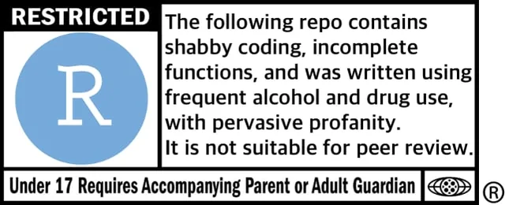
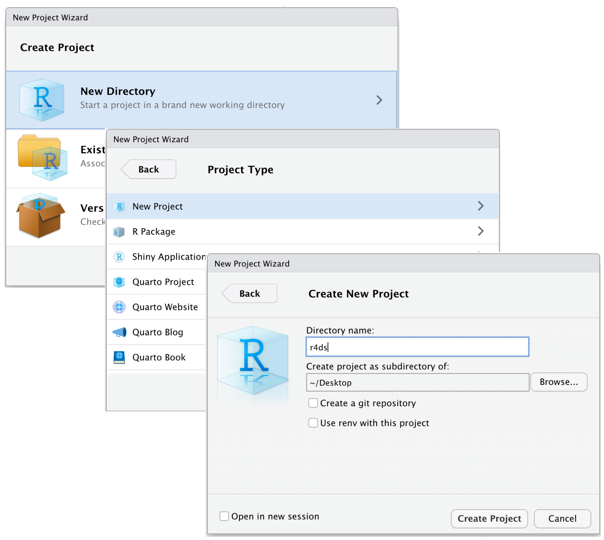

## Why Programming or Coding? (Revisiting)

Coding is about formalizing your thinking about how you treat the data
and automating the formalization task to be done repetitively. It
improves efficiency, enhances reproducibility, and boosts creativity
when it comes to finding new patterns in your data.

Benchmarks for reproducible data and statistical analyses:[^01-intro-1]

[^01-intro-1]: Inspired by the summary provided by Prof [Aaron
    Williams](https://aaronrwilliams.com/about)' course on Data Analysis
    offered at McCourt School. Strongly recommended to learn good coding
    using R

1.  **Accuracy**: Write a code that reduces the chances of making an
    error and lets you catch one if it occurs.
2.  **Efficiency**: If you are doing it twice, see the pattern of your
    decision-making and formalize it in your code. *Difference between
    Excel and coding*
3.  **Replicate-and-Reproduce**: Ability to repeat the computational
    process which reflects your thinking and decisions that you took
    along the way. Improves transparency and forces one to be deliberate
    and responsible about choices during analyses.\
4.  **Human Interpretability**: Writing code is not just about analyzing
    but allowing yourself and then others to be able to understand your
    analytic choices.\
5.  **Public Good**: Research is a public good. And the code allows your
    research to be truly accessible. This means you write a code that
    anyone else who understands the language can read, reuse, and
    recreate without you being present. We essentially ensure that by
    writing a readable and ideally publicly accessible code.

## Guidelines

The article "Ten Simple Rules for Reproducible Computational Research"
by @sandveTenSimpleRules2013 provides guidelines to ensure that
computational research is reproducible, transparent, and robust. Here’s
a summary of the key points:

| Rule | Description | Notes |
|----------------|---------------------------------------|----------------|
| Documentation | Track how results are produced, including all steps in the analysis workflow. | Keep short notes on reults |
| Automation | Minimize manual data manipulation by using scripts and documenting any manual changes. | Make changes to raw data in your scripts |
| Version Control | Use version control systems for all custom scripts to track changes and maintain reproducibility. | Using Github |
| Comprehensive Records | Archive all versions of external programs used, all intermediate results, and exact observation conditions. | Keep notes about data in comments |
| Accessibility | Make raw data, scripts, and results publicly accessible to enhance transparency and replication. | Maintainig good workflow |

## File Management and Workflow

### Understanding Absolute and Relative Paths

When working with files in any programming environment, paths specify
the location of files and folders. These paths can be absolute or
relative, and the choice between them significantly impacts
reproducibility, portability, and ease of collaboration

**Absolute Paths** An absolute path provides the complete address of a
file or folder, starting from the root directory of the file system. It
tells the software exactly where to find a file, regardless of where the
script is run.

Example: C:/Users/YourName/Documents/Project/Data/raw_data.dta

**Relative Paths** A relative path specifies the location of a file or
folder relative to a "base directory" (e.g., the project's working
directory). It does not start from the root directory but instead is
calculated based on the location of the script.

Suppose your working directory is set to:
`C:/Users/YourName/Documents/Project`

Then, a relative path might look like: `Data/raw_data.dta`

::: callout
**Practical Analogy** Think of absolute and relative paths like giving
directions to a house:

Absolute Path: “Go to the main city square, then take the highway north,
turn right at the first traffic light, and find the house at 123 Main
Street.” Works for people starting anywhere, but requires detailed
instructions specific to the city. Relative Path: “From the library,
walk two blocks north, then turn left. The house is the second one on
the right.” Simpler and context-aware, but assumes everyone starts from
the library.
:::

**Key Differences Between Absolute and Relative Paths**

| **Feature** | **Absolute Path** | **Relative Path** |
|------------------|----------------------------------|---------------------|
| **Starting Point** | Starts from the root directory of the file system. | Starts from the current working directory. |
| **Portability** | Not portable—specific to the user's system. | Highly portable—adapts to different systems. |
| **Ease of Sharing** | Harder to share; others must update paths. | Easier to share; no changes needed if structure is consistent. |
| **Use Case** | Best for fixed environments or one-off scripts. | Ideal for collaborative and reproducible projects. |
| **Flexibility** | Breaks if the file is moved or the system changes. | Adapts as long as the folder structure remains consistent. |

## R Projects

We used the `setwd()` command till now to trace the files we need in our
work. As your work expands, projects will have multiple datasets to be
loaded, different subsidiary scripts to be used, and multiple outputs to
be saved.

A first order problem related to both file management and
reproducibility of code is the usage of file paths. Using **absolute
paths**, like `~/User/MyName/Documents/.....` becomes cumbersome and
also inhibits efficiency of reproducibility. Every time someone else
runs the script, they will have to change the file paths in all the
instances in Rscripts or `.qmd` file to locate the related datasets as
well as other objects. Similarly, there would be issues with saving
objects in new places. A partially efficient way we used till now
involved using `setwd()` to direct R to a new working directory; this is
also called usage of **relative paths**

**R Projects** is a built-in mechanism in RStudio for seamless file
management and usage of relative paths.

Let's start by creating a new project. Click `File > New Project`. Name
the new project `govt-8001-dataessay`.

```{r}
#| label: fig-new-project
#| echo: false
#| fig-cap: | 
#|   To create new project: (top) first click New Directory, then (middle)
#|   click New Project, then (bottom) fill in the directory (project) name,
#|   choose a good subdirectory for its home and click Create Project. [source](https://r4ds.hadley.nz/workflow-scripts)


```

::: callout
**Exercise**

1.  Do this process again, this time creating a new project in the the
    existing directory of math camp files. That is, the folder where you
    have been saving R scripts and `.qmd` file associated with math
    camp 2025. Name it `mathcamp2025`

2.  Go to the folder on your system, and click the `.RProj` file.

3.  Start a new `qmd` file like we did before. Delete existing code
    except for YAML. Run `getwd()` command in console and see the
    difference.

4.  Start a new R code chunk (`cmd + option + I`) and load vdem dataset.
    Notice the change in behavior when you press `TAB` inside the
    `readRDS()` function.
:::

### Standardized Folder and File Structure (`here` package)

An efficient file and folder management system is going to be crucial as
we move into working with serious projects. Storing using all the files
associated with a project in a comprehensible folder system is
facilitated in both R and Stata. You would ideally want to create your
own template for folder management that you follow across projects.

An efficient file and folder management system is going to be crucial as
we move into working with serious projects. As stressed earlier, keeping
and using all the files associated with a project in a comprehensible
folder system is facilitated by R Projects. You would ideally want to
create your own template for folder management that you follow across
proejcts. For starters, the folder structure below is the one created
for your data essay assignment in Govt 8001 or Quant 1.

You can use the point-and-click fucntionality in your computers to
create this structure. Later today, we will briefly go through an R
script that do this programmatically.

```         
📦 govt-8001-dataessay
├─ govt-8001-dataessay.RProj
├─ 000-setup.R
├─ 001-eda.qmd
├─ 002-analysis.qmd
└─ 003-manuscript.qmd
├─ Data
│  ├─ Raw
│  │  ├─ Dataset1
│  │  │  ├─ dataset1.csv
│  │  │  └─ codebook-dataset1.pdf
│  │  └─ Dataset2
│  │     ├─ ...dta
│  │     └─ codebook-dataset2.pdf
│  └─ Clean
│     └─ Merged-df1-df2.csv
├─ Scripts
│  ├─ R-scripts
│  │  ├─ plotting-some-variable.R
│  │  └─ exploring-different-models.R
│  ├─ Stata-Scripts
│  │  └─ seeing-variable-labels.do
│  └─ Python-Scripts
│     └─ scraping-data-from-website.py
└─ Outputs
   ├─ Plots
   │  ├─ ...jpeg
   │  └─ ...png
   ├─ Tables
   │  └─ .csv
   └─ Text
      └─ ...txt
```

**Suggested folder structure for a Quant-1 project**

While we learnt how to create or associate an `.RProj` with a folder,
integrating it with `here()` function from the `here` package, makes
workflow smoother. Let's do it with the following exercise.

::: callout
**Exercise**

1.  Go the RStudio window with `mathcamp2024` project. Check the extreme
    upper right corner to see if you are in the right window.

2.  In the qmd file we were working in, add an R chunk.

3.  Load the library `here` with the following code. Run the code line
    by line

```{r}
#| eval: false

library(here)


 # See the output for each of the following lines
here()

here("Datasets-mathcamp","V-Dem-CY-Full+Others-v12.rds")

# syntax is

# here("First subfolder from the root folder", "second subfolder",...., "file")


vdem_new <- readRDS(here("Datasets-mathcamp","V-Dem-CY-Full+Others-v12.rds"))

```

This is a cleaner syntax which when coupled with usage of R projects
saves time in typing file paths and avoids issues when the project is
run on some other computer system.

Note: `here()` always notes the path from the main folder or the root
directory where your `.RProj` file is located.

**Save the files and close the `mathcamp2025` project window**
:::

Make it a habit of using R Projects and `here()` function in your
scripts for writing portable code.

You can read this quick and informative blogpost on using these two
[here](http://jenrichmond.rbind.io/post/how-to-use-the-here-package/).

::: callout
Exercise

1.  Download the `000-setup.R` from
    [here](https://georgetown.app.box.com/file/1629650190568)

2.  Place it in the `govt-8001-dataessay` folder.

3.  Open it in the opened RStudio window.

```{{r}}
# Name: 000-setup.R
# Author: Parushya
# Purpose: Creates main folders, subfolders in the main project directory
# Will also ensure that you have basic packages required to run the repository
# Date Created: 2020/10/07


# Checking if packages are installed and installing


# check.packages function: install and load multiple R packages.
# Found this function here: https://gist.github.com/smithdanielle/9913897 on 2019/06/17
# Check to see if packages are installed. Install them if they are not, then load them into the R session.

check.packages <- function(pkg) {
  new.pkg <- pkg[!(pkg %in% installed.packages()[, "Package"])]
  if (length(new.pkg)) {
    install.packages(new.pkg, dependencies = TRUE)
  }
  sapply(pkg, require, character.only = TRUE)
}

# Check if packages are installed and loaded:
packages <- c("janitor",  "tidyverse", "utils", "here")
check.packages(packages)


# Setting Directories and creating subfolders


# Creating Sub Folders

## Data
dir.create(file.path(paste0(here("Data")))) # Data Folder
dir.create(file.path(paste0(here("Data","Raw")))) # Raw Data sub-folder
dir.create(file.path(paste0(here("Data","Clean")))) # Clean Data sub-folder


# Scripts
dir.create(file.path(paste0(here("Scripts")))) # Scripts Folder
dir.create(file.path(paste0(here("Scripts","RScripts")))) # RScripts  sub-folder
dir.create(file.path(paste0(here("Scripts","Stata-Scripts")))) # Stata Scripts sub-folder
dir.create(file.path(paste0(here("Scripts","Python-Scripts")))) # Python Scripts sub-folder


# Output
dir.create(file.path(paste0(here("Outputs")))) # Outputs Folder
dir.create(file.path(paste0(here("Outputs","figures")))) # Figures sub-folder
dir.create(file.path(paste0(here("Outputs","tables")))) # Tables sub-folder
dir.create(file.path(paste0(here("Outputs","text")))) # Text sub-folder

```

4.  Run the file line-by-line. See the folder structure created in your
    main folder.
:::

## Takeaways

Here's a quick workflow for starting a new project or assignment or
paper.

1.  Make a new folder in your computer with apt name. Ideally,
    `govt-<coursecode>-<project>`.

2.  Start RStudio.

3.  Create a new Rstudio Project by clicking `File > New Project`. Name
    it `govt-<coursecode>-<project`.

4.  Check if now your RStudio Window shows the project name on top right
    corner. If not, go to folder and double-click the `.RProj` file.

5.  Paste the `000-setup.R` file in the main project folder. Open it in
    the same Rstudio window with the project and run the complete file.
    Your folder structure is created.

6.  Copy your raw data in `Data/Raw` folder. Similarly, your scripts in
    `Scripts/RScripts` folder

7.  Start your new `.qmd` file and save it in the main folder.

8.  Remember to use `here()` package extensively in both, scripts and
    quarto files, when loading or saving the data.

9.  You can zip the whole project folder for sharing. The receiver will
    just need to unzip and run the code after starting the associated
    `.RProj` file, without changing file paths on their computer.

# References

