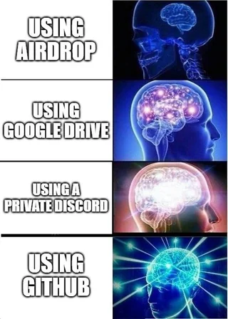
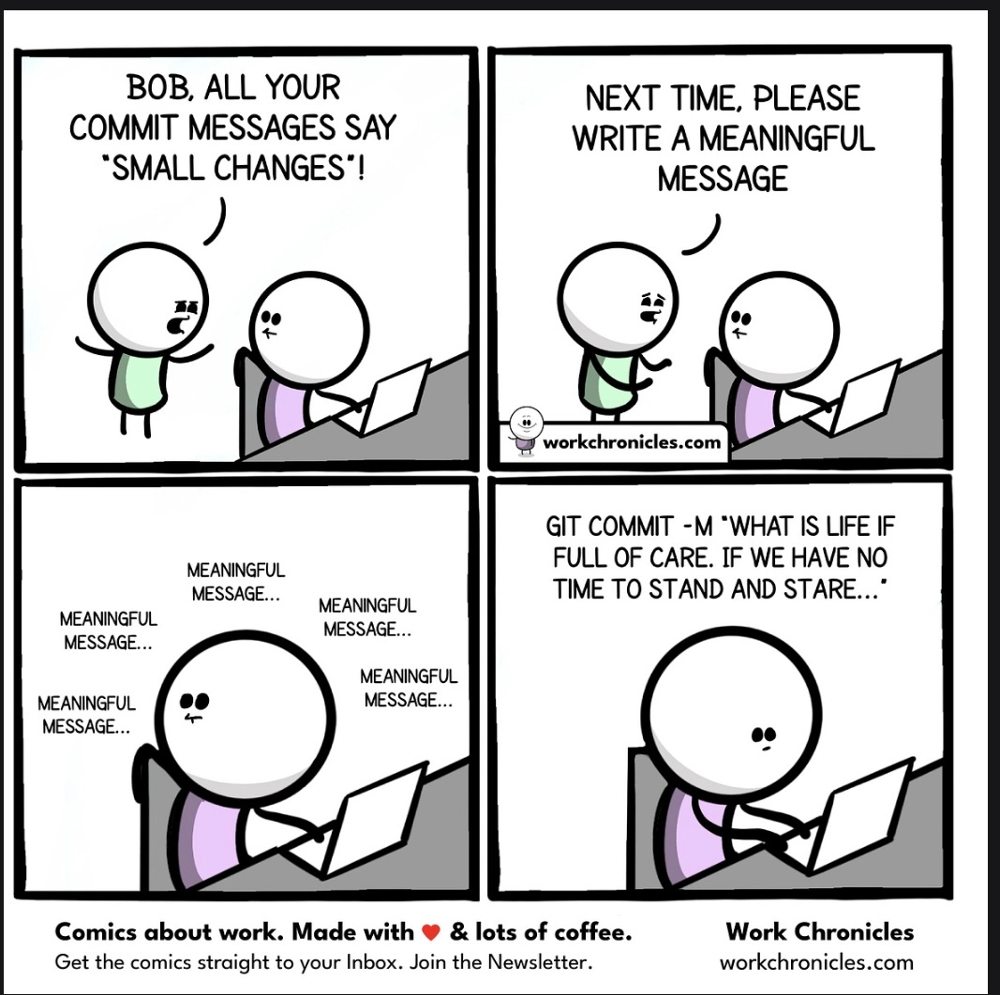
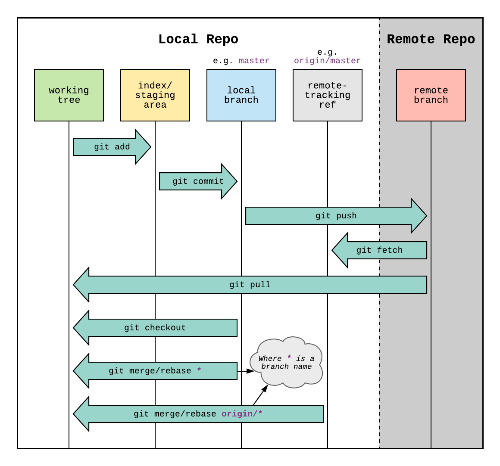

```{r}
#| label: Git
#| echo: false
#| fig-cap: | 
#|    [source](https://www.reddit.com/r/ProgrammerHumor/comments/gtl9qy/git_checkout_memesfolder/)


```

# Version Control with Git and Github {.unnumbered}

## What is Version Control?

Version Control System (VCS) is keeps records of changes made to files/files over time. Using a VCS enables us to revisit and/or restore older version of files, in case we made a mistake or even if we need to revisit our thinking as a process progressed. Think **Google Docs**.  


## Understanding Git

Git is a widely used VCS. A git project stores changes in a local repository. That is, snapshots with metadata and  how the folder system with its files looked like at a particular moment of time looked like is saved locally on your computer.  

```{r}
#| label: How Git Works?
#| echo: false
#| fig-cap: | 
#|   Git thinks of files as snapshots in time. In a git system, different versions of the folder with all the files are stored as snapshot with timestamps attached to them. [source](https://git-scm.com/book/en/v2/Getting-Started-What-is-Git%3F)

knitr::include_graphics("git-vcs.png")
```

Git is a **local** system (mostly). No connection to a server or internet is needed to access older snapshots.  Not just the older version of files, but details of the changes are recorded locally and can be accessed with locally available git commands.  

### The Three States

The key to understanding a git project is to develop clarity about the three states it holds the file in.

1-  **Modified**: Any changes you make and save. Think, saving a word doc.  
2-  **Staged**: Any saved changes are **offered or assembled** on a table to git.  
3-  **Committed**: The staged table is deposited or **committed** to local git repository.  


```{r}
#| label: Git States?
#| echo: false
#| fig-cap: | 
#|   Modification happens in Working Directory (Your Local Folder). Staging happens in Staging Area. Committing saves a snapshot of the staged changes to the local Git repository (stored in the .git directory inside your folder) [source](https://git-scm.com/book/en/v2/Getting-Started-What-is-Git%3F)

knitr::include_graphics("git-stages.png")
```

::: callout-note

### From [Git-book](https://git-scm.com/)
The working tree is a single checkout of one version of the project. These files are pulled out of the compressed database in the Git directory and placed on disk for you to use or modify. This is the case when you *pull* file/s from online reporsitory

The staging area is a file, generally contained in your Git directory, that stores information about what will go into your next commit. Its technical name in Git parlance is the “index”, but the phrase “staging area” works just as well.

The Git directory is where Git stores the metadata and object database for your project. This is the most important part of Git, and it is what is copied when you clone a repository from another computer.

The basic Git workflow goes something like this:

1-  You modify files in your working tree.

2-  You selectively stage just those changes you want to be part of your next commit, which adds only those changes to the staging area.

3-  You do a commit, which takes the files as they are in the staging area and stores that snapshot permanently to your Git directory.
:::

### Using Git

We use command-line program called **Bash** to run git on computer. This essentially means using Terminal on macOS and Git Bash on Windows.

::: callout-note

### Setup


**MacOS**: For mac, open terminal and type `git`. If a list of commands shows up, you have git installed. Else, download and install using the [link here](https://git-scm.com/downloads/mac).  

**Windows**: Install using the [link here](https://git-scm.com/downloads/win). Check all default installations. If installed correctly, upon right-clicking in any folder you should see `open terminal here`.  


Detailed instructions on installation [here](https://git-scm.com/book/en/v2/Getting-Started-Installing-Git)
:::

We need some basic bash commands to get started:

1. `pwd`: prints working directory.  
2.  `ls`: lists all the files in the working directory.  
3.  `cd`: changes directory.  
4.  `mkdir`: Makes a new directory.  

Try these commands in Terminal/Bash on your systems.  

**Git commands**

Commands for git(or any program) start with name of the program. Try the following commands:

`git status`

`git log`

You can also using terminal/bash from `RStudio`. Look at the second button at the bottom left, next to console. It automatically shows bash in the working directory of your project.  

### Local Git Workflow

Git workflow is anchored around **repository**. A repository is a folder where files including data, scripts, and other files are stored along with git log. 

In our workflow, this should ideally be the folder where `.RProj` file is located. 

::: callout-note

#### Practice

Let's practice using an existing folder with scripts and data.  

1-  Open an existing R project. If not available, start a new R Project using File>New Project.   

2-  In the terminal window of Rstudio, type `pwd` to see of the correct working directory is opened.    

3-  Type `git init`. This initializes the git repository for the project. **This step needs to be done only once per folder**.  

4-  Tell git which files are to be tracked and then staged.  Use `git add` followed by filename or tab to add a few files one by one.  

3-  Once added type `git commit -m "first commit"`. This takes a snapshot of staged file/s. ** Do not forget the -m**.

4-  Use `git status` and `git log` to see outputs about the process.

4. Repeat this process after modifications to any script.
:::

**As a norm, avoid hosting raw data files like .csv, .dta, or .xlsx on GitHub. Large or sensitive files should be listed in a .gitignore file to prevent accidental upload. Git is best suited for tracking code and small plain-text files.See more on `.gitignore` [here](https://docs.github.com/en/get-started/git-basics/ignoring-files)**.

Similar to comments in R codes, commit messages should also ideally be brief phrases explaining contextual change rather than being detailed messages.


```{r}
#| label: Commit?
#| echo: false
#| fig-cap: | 
#|    [source](https://programmerhumor.io/git-memes/from-small-changes-to-existential-crisis-neqt)


```


## Using Github

[Github](https://github.com/) is an online hosting service for git based VCS. Git and Github are often confused with one another. It is important to remeber how they are different and that they complement each other. 

The most common workflow involves creating and modifying files locally,intializing local git repo (`git init`), staging files (`git add`) and  committing changes with an informative message (`git commit -m"<message>"`) to local git repository, and then `push` changes to Github.  

::: callout-note

#### Github Practice

1.  Make you account on [Github](https://github.com/) if not already done. Ideally, use personal email id to register.

2.  Make a new RProject on your computer as we had done previously. Name it `my-git-practice`.  

3.  Download and place the [`000-setup.R`](https://georgetown.app.box.com/file/1629650190568) in the folder.

4.  Run the R Project file, if not already done. In the opened Rstudio window, go to terminal at the bottom and check with `pwd`.  Then run `git init`.


5.  On Github.com homescreen, click the green `New` button on top left corner.

6.  Call the new repository `my-git-practice` (same as local repository). Don't make ay other changes on this page. Click `Create repository`.

7.  Copy the code under **…or push an existing repository from the command line**. Note: If you're using an older version of Git or RStudio, your default branch may be master instead of main. You can rename it later or use git branch -M main.

8.  Paste it in the terminal window of Rstudio and press `Enter`.  

**fF any issues pop up here, resolve by talking amongst yourself or google**.  

9.  Refresh the github.com window.  

10. Run `git add 000-setup.R` in terminal.  (Staging state)

11. Run `git commit -m "setup file added"` in terminal.  (Committing state)

12. Run `git push` in terminal. This pushes the local changes from repository to remote (online) repository.

:::


While git is used for version control, Github is additionally used for collaborative work. We are not covering **branching** and collaboration today. Links below can help you with starting these at later stages.  

In addition to git functions, Github adds similar but additional stages. Compare the following flowchart to one in section on understanding git.


```{r}
#| label: Github
#| echo: false
#| fig-cap: | 
#|  The backward arrow represent steps where repositiories are pulled from remote to local directory. This is used mostly when multiple peeople work on different systems on same repository or if your work involves working on different systems. The process is intuitive: Changes are pushed from one sytem to remote and then continued by first fetching or pulling the repository from the remote to local by next user or system.    [Image source](https://imgur.com/oodiCnB)


```

## Additonal Resource

1.  Git [Documentation](https://git-scm.com/doc)

2.  Advanced Git operations [tutorial](https://gitimmersion.com/)

3.  Git [Cheatsheet](https://www.atlassian.com/git/tutorials/atlassian-git-cheatsheet)

4.  Video explainers of git workflow ([here](https://www.youtube.com/watch?v=e9lnsKot_SQ), [here](https://www.youtube.com/watch?v=HMoZ5cYzU4I), and [here](https://www.youtube.com/watch?v=mJ-qvsxPHpY))

5.  [Git Branching](https://git-scm.com/book/en/v2/Git-Branching-Branches-in-a-Nutshell)


