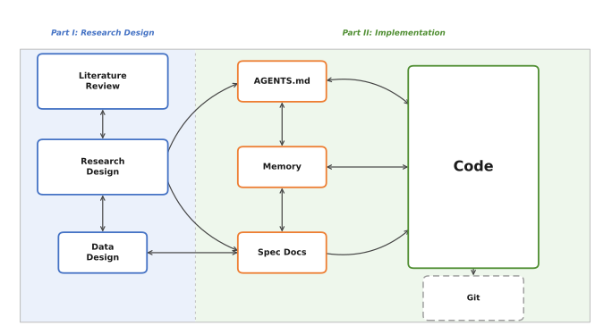
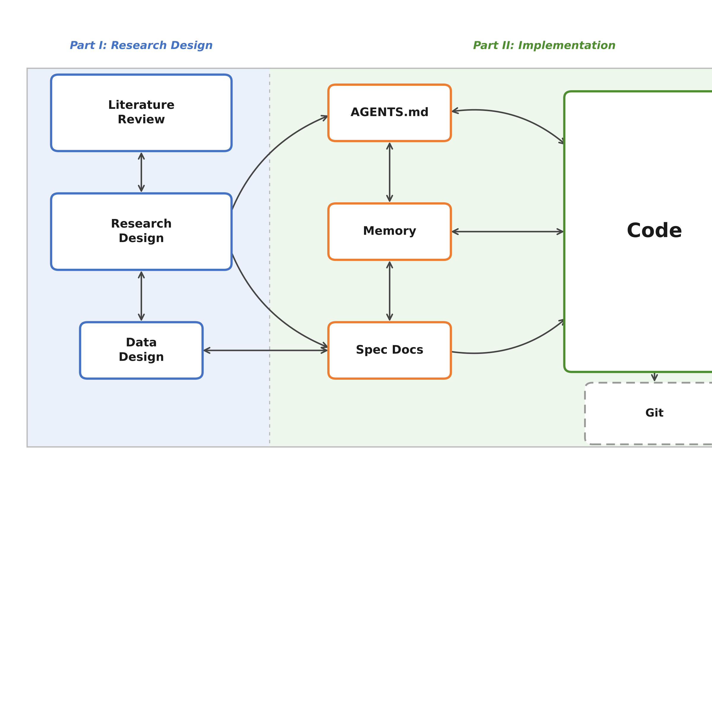
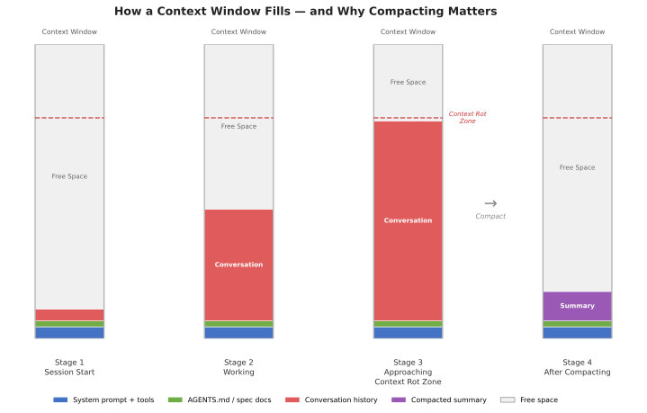
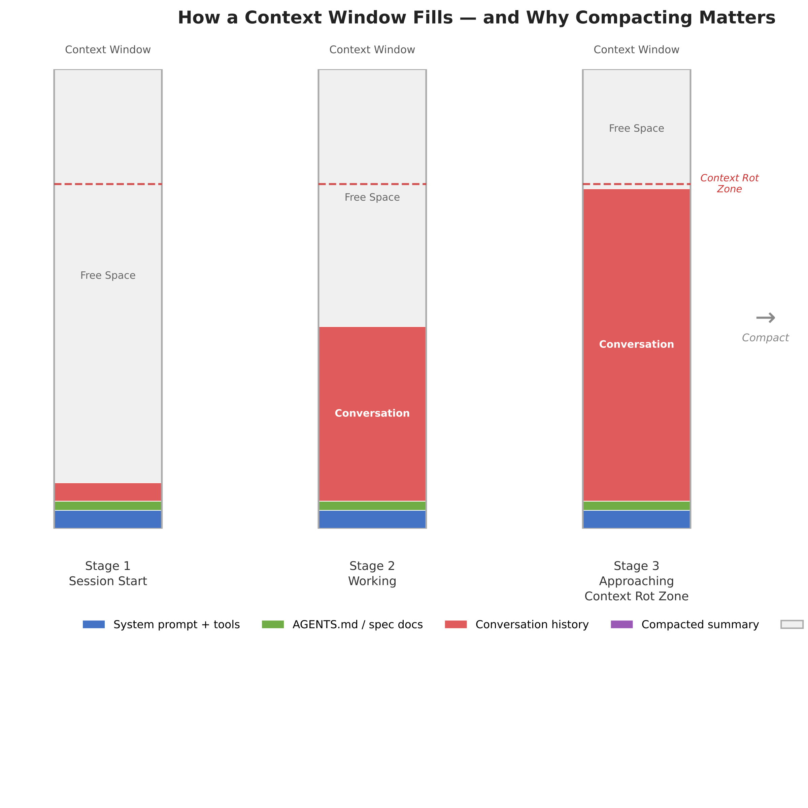
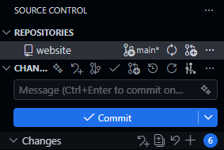
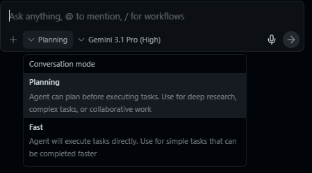
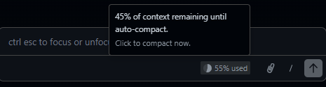

## Introduction

"Vibe coding" has become shorthand for coding via LLM prompt. Up until recently, coding-via-LLM primarily referred to copy-pasting code produced by an LLM in isolation. But since the advent of integrated agentic coding agents in early 2025, a new term was needed to describe workflows where agents can access users' files directly and operate independently. "Vibe research" extends the same logic to employing LLMs in certain stages of academic work like literature review and research design. While LLMs can produce slop when used poorly, AI tool improvement is compounding fast enough for researchers to begin using tools like Claude Code for real social science tasks.^[See @grossmann2026vibe for an interesting interview with Stanford's Andy Hall about the "vibe research" concept and its implications for the future of research.]

This guide covers a complete workflow for integrating LLMs into graduate-level academic research, from initial literature engagement through research design and onto data analysis. It is written for political scientists but generalizes to most social science disciplines. No prior experience with LLMs, coding environments, or command-line tools is assumed, though researchers with existing technical skills might find following along in later sections a bit easier. The approach described here takes seriously the growing body of evidence that LLMs can serve legitimate roles in academic work.^[It feels like every day at this point there is a new preprint about some study on LLMs for social science. See, e.g., @asirvatham2026gpt; @thakkar2026peer.]

This is a methods document. It teaches you how to set up and maintain a productive workflow with an LLM across the lifecycle of a research project. It does not argue that you should abandon traditional research practices; on the contrary, getting the most out of these tools requires you to already know what good research looks like. There is no shortcut here to methodological competence, and the guide will make clear at several points where the temptation to over-delegate frequently entails pretty obvious costs.

### How This Document Is Organized

**Environment Setup** (immediately below) covers getting your machine ready: installing Antigravity, R, and Python, and creating your project workspace. We will work through this together at the start of the session.

**Part I: Vibe Research** covers the conceptual and research phases: understanding how context works, developing literature reviews and research designs, and avoiding common failure modes.

**Part II: Vibe Coding** covers the implementation phase: using Antigravity's agentic coding capabilities, writing specification documents, and translating research designs into working code. An appendix covers the equivalent workflow in VS Code with Claude Code for those who prefer that setup (see Appendix G).

**Appendices** include templates, resources, and the Claude Code/VS Code alternative setup.

::: {.content-visible when-format="html" style="text-align: center"}
{width=100% fig-align="center"}
:::

:::{.content-visible when-format="pdf" style="text-align: center"}
{width=90% fig-align="center" fig-pos="H"}
:::

### How Today's Session Works

I'll be running the demonstration on my own computer, visible to everyone via Zoom and the projector in the room. The document you're currently reading serves as the reference guide for the session; I'll be moving back and forth between it and Antigravity as we go. We'll begin by getting everyone's machines set up (the Environment Setup section below), move through the conceptual material in Part I and how it relates to the workspace/environment, and then transition into live coding in Part II. Toward the end, I will ask for a research question from the room and we will work through the full pipeline together in real time (so come up with a question now if I haven't already asked you to do so or you're reading ahead or whatever). I'll be pasting my exact prompts into the Zoom chat as we go, so if you fall behind or miss a step, you can copy from there and catch up.

---

## Environment Setup: Getting Your Workspace Ready

Everyone needs a working environment. I'll be referring to it as the environment or as the workspace interchangeably. Either way, it refers to a single folder on your computer that serves as the main hub for your entire project. Literature files, living documents (the kinds we will discuss in Part I), code, data, and context files for the agent all live there, directly accessible without copy-pasting between browser windows or hunting across multiple applications. This is a more desktop-oriented setup than many researchers are used to; the payoff is that the agent can read and modify anything in that folder directly, which is what makes the workflows in Parts I and II possible.

### Installing Antigravity

[Antigravity](https://antigravity.google/) is Google's AI-focused [integrated development environment (IDE)](https://en.wikipedia.org/wiki/Integrated_development_environment), built on a fork of Microsoft's [VS Code](https://code.visualstudio.com/). It is free, requires only a Google account, and runs on macOS, Windows, and Linux.

1. Go to [antigravity.google/download](https://antigravity.google/download) and download the installer for your operating system.
2. Run the installer.
3. On first launch, Antigravity will walk you through initial configuration: theme, agent permissions, and account sign-in.

**A note on accounts:** Antigravity requires a personal Google account. Georgetown email addresses (and most institutional Google Workspace accounts) are apparently not currently compatible with Antigravity's sign-in system. If you typically use your Georgetown email for Google services, you will need to sign in with a personal Gmail account instead. If you don't have one (wtf?), creating one is free at [accounts.google.com](https://accounts.google.com).

Since Antigravity is built on a VS Code fork, the interface should feel immediately familiar if you have used VS Code before. All VS Code extensions, themes, and keyboard shortcuts carry over, and if you have an existing VS Code setup, Antigravity will offer to import your settings during initial configuration.

### First-Launch Configuration

During the setup wizard, Antigravity will ask you to choose a development mode. For the purposes of this guide, **Agent-assisted development** is the recommended setting; this keeps you in control while allowing the agent to handle routine automations. You can also set the terminal policy to "Agent Decides," which lets the agent determine when it needs your approval before running a command in the terminal.

Both of these settings can be changed at any time via Antigravity's settings panel (`Cmd+,` on macOS or `Ctrl+,` on Windows/Linux).

### Choosing a Model

Antigravity supports multiple AI models. Select **Gemini 3.1 (High)** as your default; it is included free with generous rate limits and handles the tasks in this guide well. Antigravity also supports Claude Sonnet 4.5 and GPT-OSS, and you can switch between models at any point. For the session today, Gemini 3.1 (High) is what we will be using.

### Installing R

For the implementation portions of this guide, we will primarily work in R. Antigravity can assist with package installation and environment configuration once the language is on your machine, but R itself needs to be installed at the system level first.

1. Go to [cran.r-project.org](https://cran.r-project.org) and download the latest release for your operating system.
2. Run the installer. On Windows, when prompted about 32-bit vs. 64-bit installation, select 64-bit.
3. In Antigravity, open the Extensions panel (the square icon in the left sidebar), search for **R Extension for Visual Studio Code** by REditorSupport, and install it. This gives Antigravity syntax highlighting, code execution, and debugging support for R.

Once R is installed, the agent can handle package installation (`install.packages()`) on your behalf. You do not need to manage this manually.

### Installing Python

Python is worth having available alongside R, particularly for tasks where its ecosystem either has no real R equivalent or where R kinda comparatively sucks like API calls, web scraping, and anything involving LLM APIs or deep learning.

1. Go to [python.org/downloads](https://python.org/downloads) and download the latest stable release for your operating system.
2. Run the installer. On Windows, check the box labeled **"Add Python to PATH"** before clicking install. If you miss this step, Python will install successfully but the terminal won't know where to find it, which creates a small headache to fix afterward.
3. In Antigravity's Extensions panel, search for **Python** by Microsoft and install it.

As with R, once Python is installed, the agent can handle package installation (`pip install`) on your behalf.

### Creating Your Workspace

With Antigravity open, create a new folder for your project and open it. This folder is your workspace; everything related to the project lives here. A reasonable starting structure looks like this:

```text
project-name/
├── AGENTS.md
├── data/
│   ├── raw/
│   └── processed/
├── code/
├── docs/
│   ├── lit-review.md
│   └── research-design.md
└── paper/
```

You can create this structure manually or ask the agent to generate it for you; the latter is typically faster, and the agent will also draft initial versions of AGENTS.md and any template documents you specify. We will return to the specifics of project organization in Section 2.2 and to AGENTS.md in Section 2.3.

### A Note on Operating Systems

Everything in this guide should work on macOS, Linux, and Windows. Antigravity is cross-platform. Windows occasionally presents platform-specific quirks such as path conventions differing (and admin privileges screw things up), but Antigravity's built-in agent is quite good at diagnosing and resolving its own environment issues.

---

## Part I. Vibe Research: Building an LLM-Assisted Research Pipeline

### 1.1 Context: Tokens, Context Windows, Compacting, and Context Rot

Before anything else, we need to discuss how LLMs actually process information. Every practical decision in this guide (how to organize projects, when to start new conversations, how to structure documents, and so on) follows from the mechanics of context; getting this wrong is probably the single most common source of confusion for new users, and it's worth spending some time on before moving to anything else.

#### Tokens and the Context Window

LLMs read tokens. [Tokens](https://en.wikipedia.org/wiki/Large_language_model#Tokenization) are chunks of text that often, but not always, correspond to syllables or common word fragments. The word "methodology" might be split into "method" and "ology." A short sentence might be 10--15 tokens; a full journal article might be 8,000--15,000 tokens.

The [context window](https://en.wikipedia.org/wiki/Context_window) is the total amount of text the model can "see" at any given moment. Think of it as the model's working memory (the analogy is imperfect but useful enough for practical purposes). As of this writing, leading models like Claude Opus 4.6 have context windows of approximately 200,000 tokens, or roughly 150,000 words (the equivalent of several hundred pages of academic text); Gemini 3.1 is comparable. This sounds like a lot, but it fills up faster than you expect. Everything in a conversation occupies space in the context window: your messages, the model's responses, any files it has read, the project's custom instructions, and the full conversation history. You can check the current breakdown at any time by typing `/context` in the agent chat.

::: {style="text-align: center"}
{width=100% fig-align="center"}
:::

#### Compacting

When a conversation approaches the limits of the context window, the model compacts the conversation history. *Compacting* refers to the model summarizing its previous context to a shorter length to make room for new content; the model then deletes the prior, unsummarized material from its working context. This process builds up over time, and eventually the already-summarized information can't be condensed any further, at which point a new conversation will be requested.

Compacting has direct practical consequences. If you gave the agent detailed instructions about your theoretical framework in message three of a conversation, and you're now on message forty, those instructions may have been compacted into something much vaguer. The model will often do its best to infer what transpired earlier in the conversation, but it literally no longer has access to the full version of what you said.

#### Context Rot

*Context rot* is what happens when the cumulative effects of compacting degrade the quality of a conversation over time. The model's understanding of your project becomes progressively less accurate because the compressed summaries it's working from are inherently lossy. You'll notice this as the model starting to drift from your specifications, repeating itself, or making mistakes about things you've already clarified. Context rot is arguably the most important practical challenge in working with current LLMs for sustained research projects, and one that's easy to miss because the degradation is gradual rather than sudden.

Context is obviously also important, so you'll need to balance keeping the context window fresh with keeping the AI focused on the tasks at hand. This is a genuine tradeoff, and getting it right is a core skill you'll develop over time.

::: {.content-visible when-format="html" style="text-align: center"}
{width=100% fig-align="center"}
:::

:::{.content-visible when-format="pdf" style="text-align: center"}
{width=90% fig-align="center" fig-pos="H"}
:::

A few rules of thumb:

- **Start new conversations for new tasks.** Don't ask the agent to switch from editing your literature review to debugging code in the same conversation. The accumulated context from one task will pollute the other.
- **Front-load critical information.** The most important context should be in your project files and custom instructions.
- **Use projects and keep files current.** Organize your files and your conversations using project structures. If your research design has changed, update the document in the project. Don't rely on the model remembering a correction you made conversationally three days ago.

---

### 1.2 From Literature Review to Research Design

The literature review and the research design document are the two foundational living documents in an LLM-assisted research workflow. They are key documents for keeping your agent on track over the course of the research process.

#### The Literature Review as a Working Document

LLMs have two general uses for literature reviews:

1. Exploring a literature you know nothing about.
2. Synthesizing a collection of literature you already know.^[If you use Zotero, a [Zotero MCP](https://github.com/54yyyu/zotero-mcp) integration exists (at least for Claude Code, currently) that lets the model search your personal library directly to check whether a citation exists there; it also has access to Semantic Scholar and can create citation connections naturally through this interface.]

Both entail risks. The former can be useful in a sort of shotgun-blast type of approach for a rough first cut. The latter can be useful for surfacing potential gaps you might have overlooked. They can be used to create outlines or drafts, but I urge caution in doing so, as models still struggle to understand the literature the way a human does. That said, they can be helpful in producing broad summaries (the fewer papers the better).

Outside tools like [Elicit](https://elicit.com/) can produce systematic literature reviews (of varying quality) with long reference lists, and you can export those reports and raw reference datasets directly into your workspace for the model to parse. Some models also have a deep research or web search function that can surface references related to a given prompt; these are useful, but the output tends to be a mixture of good and mediocre literature, and pre-existing familiarity with the field helps considerably with disambiguation.

The model works best as a curator of a living reference guide tracking the project's background literature. I recommend starting with what you know, and loading into the environment the most obviously important texts you've identified before working outward. You can additionally export collection bibliographies as .bib files and load them directly into your workspace. Combining both approaches helps the model parse through long bibliographies and draw rough connections across the literature. The model can read through whole PDFs stored in your project folder. As mentioned, the context window can get overwhelmed quickly if you try to have it read too many documents at once; it is generally better to work through papers in focused batches, processing each group before moving to the next.

#### The Research Design Document

In an LLM-assisted workflow, the research design serves an extra purpose as a persistent context source for the model. A well-written research design document means every subsequent conversation (about literature, methods, or code) starts from a shared and accurate understanding of the project.

A research design document should cover:

**Research question.** Stated precisely. Not "I'm interested in sanctions" but "Under what conditions do targeted economic sanctions lead to democratic transitions in authoritarian regimes?"

**Theoretical framework.** The causal logic connecting your independent and dependent variables. What mechanisms do you propose? What assumptions are you making?

**Hypotheses.** Specific, testable predictions derived from your theory.

**Data.** What data will you use? Where does it come from? What is the unit of analysis? What is the temporal and geographic scope? What are the known limitations? Having a data design document is also a good idea if the data itself or the data collection process are complex.

**Identification strategy.** How will you make causal claims? What is your research design? What are the key assumptions? What are your expected estimands?

**Potential challenges.** What could go wrong? What are the threats to inference? Where might the data be inadequate?

All of the above are helpful in getting the model to understand your project and keep it on track. The more information you can use as guard rails, the more you can trust that the model won't go off and come up with insane ideas that are completely disconnected from the actual project.

The model is particularly useful for pressure-testing. Load a draft into your workspace and ask it to identify unstated assumptions, suggest alternative explanations, flag measurement problems, or evaluate whether your identification strategy fits the question. (Disclaimer: Obviously, this isn't a substitute for methods training; think of it as a tool that can help surface issues you might not have considered.)

Appendix D provides an example template of a research design document for using with an LLM.

#### Keeping Both Documents Alive

Both the literature review and the research design document should be updated as the project evolves. If you change your identification strategy, the design document should reflect that; if you find a new paper and your research question changes, update the literature review. The goal is that at any point in the project, someone (or some model) reading these documents gets an accurate picture of the project's current state.

This is especially important for the transition to coding (Part II). Your research design document is the primary input to the specification documents that will guide the coding agent; if the design document is outdated, the code will implement a design you've already abandoned.

---

### 1.3 Best Practices and Common Problems

#### Best Practices

**Maintain living documents.** Your literature review and research design document should always reflect the current state of the project; update them regularly: after every significant conversation, after every round of new reading, after every design change, etc. These documents are the backbone of your project's context, and treating them as finished products rather than evolving artifacts is probably the most common way this workflow breaks down.

**Audit project files periodically.** Every week or two, review what's in your project. Remove files that are no longer relevant. Update documents that have drifted from the current state of the project. Check that your custom instructions still accurately describe what you're doing. Context window space is finite; don't waste it on outdated material.

**Start new conversations liberally.** There is no cost to starting a new conversation within a project. There is a real cost to continuing a degraded one. If a conversation has gone on for more than 15-20 exchanges, or if you're switching tasks, start fresh.

**Be specific in your instructions.** "Help me with my lit review" is a weak prompt. "I've uploaded three papers on sanctions effectiveness. Identify the main points of disagreement between Smith (1997) and not-Smith (2007) regarding the conditions under which sanctions succeed" is stronger. Specificity reduces the chance of generic or irrelevant output.

**Keep logs.** When the model introduces a citation or makes a factual claim, note it. Verify it later. Over time, you'll develop a sense for which types of claims need immediate checking and which are likely reliable. You can also keep chat histories archived. By default, these are saved to your model's home folder (for Windows, usually in something like `C:\Users\yourname\.claude`), but you can ask them to save those chats to your project folder as markdown files for easy access.

#### Common Problems

**Context drift.** As mentioned, over long conversations, the model's understanding of your project gradually shifts from what you originally specified. Instructions get compressed over time and become vague. Always maintain reference documents that can be used to prompt fresh context windows.

**Over-delegation.** The temptation to let the model do more and more of the intellectual work increases as you become comfortable with the tool. Using the model to help you think through a theoretical framework can be productive, but asking it to generate your theoretical framework wholesale has a lot of problems.

**The yes-man problem.** LLMs are, by design, inclined to be agreeable. If you present a flawed research design and ask for feedback, the model may emphasize strengths and understate problems. One option is to prompt for criticism explicitly: "What are the three weakest aspects of this design?" is more likely to surface real issues than "What do you think of this design?" This tendency extends to statistical analysis. Another option is to write up as a permanent instruction something along the lines of "Push back when my prompts, questions or arguments have problems. Tell me when my ideas are flawed." I personally use something like the second option, and it often does help eliminate the yes-man problem. It does often create situations of what might be described as "artificial devil's advocacy," but if you're confident in your ideas you can largely ignore clearly forced criticism.^[There is some recent work looking at these problems. @ju2026collaborating find that for tasks where creativity mattered (coming up with advertisements), human-AI collaboration produced more text of higher average quality, but that this text was far more homogeneous than it would have been without AI. @shen2026skill found that, in randomized experiments with developers learning a new programming library, continual AI assistance impaired a number of key skills like conceptual understanding, code comprehension, and debugging; participants who fully delegated coding tasks saw productivity gains but at the direct cost of understanding what they were actually doing. @asher2026phack found that while Claude Code and Codex refuse explicit requests to p-hack, prompts reframing p-hacking as "uncertainty reporting" bypassed these guardrails entirely.]

---

## Part II. Vibe Coding: Agentic Coding for Research Implementation

Part II addresses what happens when the project moves from design to implementation. For quantitative work, this means writing code to collect data, cleaning that data, running models using that data, producing visualizations of that data, and then iterating afterward. Agentic coding tools let you delegate these tasks to an AI agent directly from your IDE; the agent reads your project files, writes and modifies code, runs commands in the terminal, and iterates on errors without you copy-pasting anything.

This guide uses Google Antigravity as the primary tool for Part II. Antigravity is free (no subscription required, just a Google account), runs on macOS, Windows, and Linux, and provides full agentic coding capabilities powered by Gemini 3.1 (High). If you prefer to use VS Code with Claude Code (which requires a $20/month Anthropic Pro subscription), Appendix G covers the equivalent setup and workflow in that environment.

This section assumes no prior experience with terminals or version control. If you already use these tools, you can skim the git section and focus on Sections 2.3 and 2.4.

---

### 2.1 Git Essentials

[Git](https://en.wikipedia.org/wiki/Git) is a version control system. It tracks changes to your files over time, letting you revert to earlier versions, see what changed and when, and maintain parallel versions of a project. When an agent works on your project, it reads and writes files directly. Without version control, unwanted changes are permanent; with git, every set of changes is recorded as a labeled "commit," and you can roll back to any previous commit at any time.

Git needs to be installed separately from GitHub. Download it from [git-scm.com](https://git-scm.com/) and run the installer; the defaults are fine for most users. On macOS, you may already have it (check by opening a terminal and typing `git --version`).

For the purposes of this guide, git serves the primary function of making it safe to let the agent modify your files.

#### GitHub

[GitHub](https://en.wikipedia.org/wiki/GitHub) is a hosting service for git repositories. Creating a free account at [github.com](https://github.com) and pushing your repositories there gives you cloud backup, the ability to share your work, and a record of your project's evolution. To connect a local repository to GitHub:

1. Create a new repository on GitHub (do not initialize it with a README if you already have local files).
2. Follow the instructions GitHub provides to connect your local repo.

Antigravity's built-in git support and the GitLens extension make most of this visual and clickable if you prefer not to use the command line for git operations.

::: {style="text-align: center"}
{width=80% fig-align="center"}
:::

#### The Minimum Viable Git Workflow

There are four commands you need to know:

**`git init`** creates a new git repository in your project directory. You run this once, at the beginning of a project.

**`git add .`** stages all current changes for a commit. The period means "everything in this directory."

**`git commit -m "description of what changed"`** saves the staged changes as a labeled snapshot. The message in quotes should be brief but descriptive: "added data cleaning script" or "initial model specification."

**`git push`** uploads your commits to a remote repository (e.g., GitHub). This is optional for version control purposes but important for backup and sharing.

A typical workflow looks like this:

1. Make changes to your project (or have the agent make them).
2. Review what changed.
3. `git add .`
4. `git commit -m "brief description"`
5. Repeat.

Commit frequently. Before asking the agent to make significant changes, commit your current state so you have a clean rollback point.

Since Antigravity is built on VS Code, you can also do all of this through the graphical source control panel in the sidebar (the branch icon on the left). This lets you stage, commit, and push without typing any terminal commands.

#### .gitignore

Not everything in your project directory belongs in the git repository. Large data files, compiled output, system-generated files, etc. should all be excluded. Git and GitHub have repository size limits (GitHub recommends keeping repositories under 100 MB, and realistically you should aim well below that), and tracking large binary files bloats your repository and slows down every operation.

A `.gitignore` file tells git which files and directories to skip. Create a file called `.gitignore` in your project root and list the patterns to exclude. For a typical research project:

```gitignore
# Data (track code, not data)
data/raw/*
data/processed/*

# Output (regenerate from code)
output/*

# System files
.DS_Store
Thumbs.db

# R artifacts
.Rhistory
.RData

# Keep the directories themselves
!data/raw/.gitkeep
!data/processed/.gitkeep
!output/.gitkeep
```

Your code, documentation, context files (more on this in Section 2.3 below), and spec files should be tracked. Your raw data, processed data, and generated output generally should not. Data files are often too large for git, and output should be reproducible from your code anyway. If someone clones your repository, they should be able to obtain the data independently and regenerate all output by running your scripts.

The `.gitkeep` files are an empty-file convention that preserves the directory structure in git even when the directory contents are ignored.

#### What You Can Skip for Now

Branching, merging, pull requests, rebasing, and most of git's collaborative features are not necessary for a solo research project. If you are working with collaborators or contributing to shared code, those become relevant, but they are beyond the scope of this guide.

---

### 2.2 Project Organization

A well-organized project directory makes everything easier for you, for collaborators, and more importantly for AI. When the agent opens your project, it reads the directory structure to understand what exists and where things belong.

#### Recommended Directory Layout

A research project directory might look like this:

```
project-name/ # (The / at the end indicates a folder)
├── AGENTS.md
├── README.md
├── data/
│   ├── raw/           # Original, unmodified data files
│   └── processed/     # Cleaned and transformed data
├── code/
│   ├── 01-clean.R     # Data cleaning
│   ├── 02-analysis.R  # Main analysis
│   └── 03-figures.R   # Visualization
├── output/
│   ├── tables/
│   └── figures/
├── docs/
│   ├── spec.md        # Specification document
│   └── notes/         # Working notes
└── paper/
    ├── manuscript.tex  # Or .md, .docx
    └── references.bib
```

The exact structure will vary. Some important guiding principles in software engineering apply here:

**Separate raw data from processed data.** Ideally, raw data should never be modified. Your cleaning scripts read from `data/raw/` and write to `data/processed/`. This helps keep things organized.

**Number your scripts.** Prefixing scripts with numbers (01, 02, 03) indicates execution order at a glance. Anyone looking at your project can see the pipeline's flow without reading the code.

**Keep output separate from code.** Tables, figures, and other generated output go in their own directory. This makes it easy to regenerate everything by rerunning your scripts, and keeps your code directory clean.

**Documentation lives in the project.** Your AGENTS.md, spec documents, and working notes all belong in the repository. For GitHub, a [README.md](https://en.wikipedia.org/wiki/README) at the root is also a good idea to provide an overview of the project for human visitors. It gets initialized automatically if you create the repo on GitHub first and displays on the repo's main page.

#### Bootstrapping with the Agent

You do not need to create this structure manually. One of the most efficient uses of the agent early in a project is having it set up the workspace for you. Describe your project, the language you plan to use, your directory preferences, any conventions you want to follow, etc., and the agent can generate the directory structure, an initial AGENTS.md, a spec doc skeleton, a .gitignore, and a README.md. This applies equally to the documents discussed in the next section; the agent can draft initial versions of your AGENTS.md and spec files based on a project description.

---

### 2.3 AGENTS.md, Spec Documents, and Memory

These three document types are the bridge between the research work you did in Part I and the implementation work in Part II. They translate your research context and design into a form that the coding agent can act on.

#### AGENTS.md

AGENTS.md is a project context file that the agent reads when it opens your project. It serves as persistent instructions that shape how the agent understands and works within your codebase. The name AGENTS.md has become a cross-tool standard: it is recognized by Antigravity, OpenCode, Codex, Aider, and many other agentic coding tools. (If you use Claude Code instead, the equivalent file is called CLAUDE.md and works the same way; see Appendix G.)

A good AGENTS.md file includes:

- **Project overview.** A brief description of what the project is, what question it addresses, and what stage it is at. Two to three sentences is sufficient.

- **Technical stack.** What language(s) the project uses, what major packages or libraries are involved, and any version requirements. For example: "This project uses R 4.3+ with tidyverse, fixest, and modelsummary. All data manipulation should use dplyr syntax, not base R."

- **Conventions and constraints.** Coding style preferences, naming conventions, and explicit constraints. For example: "Use snake_case for all variable and function names. Do not use `setwd()`. All file paths should be relative to the project root. Use `here::here()` for path construction."

- **Project structure.** A brief description of the directory layout and what lives where. This helps the agent place new files correctly and find existing ones.

- **Current state and known issues.** What has been done, what remains, and any known problems. Update this section as the project progresses.

To reiterate, AGENTS.md is a living document just like the research design doc and the literature review from Part I. As your project evolves, update it to reflect current reality; if you add a new data source, note it; if you change your model specification, update the relevant section. An outdated AGENTS.md produces the same kind of drift as an outdated project file: the agent starts making decisions based on stale information. The value of evolving context documents over static ones has empirical support.^[@zhang2026context find that treating context as an evolving "playbook" that accumulates and refines strategies through iterative updates consistently outperforms static context across agent and domain-specific benchmarks.]

Appendix B provides an example template of an AGENTS.md file.

:::{.callout-warning}
## Context files may not be universally beneficial

@gloaguen2026agents evaluate repository-level context files across multiple coding agents and find that they can actually reduce task success rates while increasing inference cost by over 20%. The key finding is that unnecessary requirements in context files make tasks harder. A bloated context file full of outdated instructions or overly prescriptive rules is worse than no context file at all. (Maybe. All of this literature is really still just sort of trying to figure out things as they come along at this point.)
:::

#### Spec Documents

A specification document (spec doc) translates your research design into concrete implementation instructions. Where the research design document (Section 1.2) says "We use a difference-in-differences design with staggered treatment adoption," the spec doc says something like: "Estimate a two-way fixed effects model using the `fixest` package. The dependent variable is `democracy_score` from the V-Dem dataset. Treatment is defined as the year a targeted sanctions regime begins, identified from the GSDB. Include country and year fixed effects. Cluster standard errors at the country level."

A spec doc should include:

- **Data requirements.** What datasets are needed, where they come from, what variables are relevant, and how they should be linked.

- **Processing steps.** What cleaning, transformation, and merging operations need to happen, in what order, and with what parameters.

- **Analysis specification.** The exact models to estimate, including functional form, variable definitions, fixed effects, and standard error adjustments.

- **Output requirements.** What tables, figures, and summary statistics the project should produce, in what format.

- **Validation checks.** What the code should verify along the way. For example: "After merging the sanctions data with V-Dem, the panel should contain approximately 4,500 country-year observations. If the count is substantially different, flag and investigate."

The spec doc is usually written in natural language. The more precise and specific the spec doc is, the better the output will be; vague specs produce vague code.

Think of the research design docs from Part I and the spec docs in Part II as operating at different levels of abstraction. The research design document describes what you are studying and why, while the spec document describes how to implement that design computationally. In practice, you will often write the spec doc by working through the research design document section by section and asking what each part requires in code.

Appendix C provides an example template of a spec document.

#### Memory Documents

A memory document is a running log of things learned during sessions that don't fit cleanly into the AGENTS.md or spec docs. Where those files describe the project's design and conventions, a memory document captures the accumulated knowledge that builds up as you actually work. Some examples include, but are not limited to: decisions that were made and why, things that were tried and didn't work, quirks in the data, edge cases the spec didn't anticipate, problems with how to connect an API to its source, etc.

A typical entry might look like: "Merge between GSDB and V-Dem produces 4,312 obs, not the expected 4,500. Confirmed this is because GSDB drops microstates; not an error." Or: "Tried clustering at the dyad level; produces implausibly large SEs due to sparse treatment. Back to country-level clustering per spec." These are the kinds of things that are easy to forget between sessions and easy to re-discover the hard way.

Claude Code has a dedicated `memory/` folder for this purpose, and the agent can update it automatically at the end of a session if you ask it to. In Antigravity, a `docs/memory.md` file in your project folder works the same way; you can prompt the agent to append a brief summary of what was done and learned at the end of each session. Either way, the habit of maintaining a memory document becomes more valuable the longer a project runs. Having different types of memory files can also be useful to avoid forcing an agent to load a long, single file every time (again, note the importance of the context window).

One helpful tip is that you can include a command in AGENTS.md that instructs the agent to always update memory documents whenever substantive changes have been made. That way, you always have an up-to-date log of what the agent has done and learned and how the project may have changed along the way.

---

### 2.4 The Research-to-Code Workflow

With your environment set up, your project organized, your AGENTS.md written, and your spec doc in place, the actual workflow of using the agent for research implementation is relatively straightforward.

#### Starting a Session

Open your project folder in Antigravity and open the agent chat panel. Your first instruction in a session should orient the agent to the current task: "I want to work on the data cleaning pipeline described in the spec doc" or "Let's implement the main regression specification from section 3 of the spec." Starting with a clear task statement reduces the chance that the agent goes off in an unanticipated direction.

Antigravity offers two interaction modes worth knowing about. **Plan mode** generates a detailed implementation plan before acting, which is useful for complex, multi-step tasks. **Fast mode** executes instructions immediately, which is better for quick fixes and small changes. For most research coding tasks, plan mode is the safer default.

::: {style="text-align: center"}
{width=80% fig-align="center"}
:::

#### Monitoring the Context Window

As always, recall the context management principles. As a session progresses, the context window fills with your instructions, the agent's responses, file contents it has read, and code it has written.

When the context window is getting full, the best practice is to finish your current task and start a new session. The new session will re-read your AGENTS.md and start with a clean context, informed by whatever updates you have made to your project files.

::: {style="text-align: center"}
{width=80% fig-align="center"}
:::

One trick I like to use is to ask the agent to create a "handover document" (usually just a markdown file) that summarizes the current conversation. This informs the next conversation with the most immediately pertinent information without flooding the AGENTS.md or memory docs with details that are only relevant for the current task.

#### Delegating Tasks Effectively

The quality of the agent's output depends heavily on how you specify tasks. Three principles are worth keeping in mind.

1. **Be specific about scope.** "Write the data cleaning script" is too broad for a complex project. "Write a script that reads the raw GSDB sanctions data from `data/raw/gsdb.csv`, filters to targeted sanctions only, creates a binary treatment indicator by country-year, and saves the result to `data/processed/sanctions_panel.csv`" gives the agent enough detail to produce something useful on the first pass.

2. **Set permission boundaries.** Tell the agent what it should and should not modify. "Create a new file `code/01-clean.R`. Do not modify any existing files" prevents unintended side effects. This is especially important early in a project when you are still establishing trust in the tool's judgment. **Negative instructions (do not do _____ ) are often far more powerful than positive ones.**

3. **Ask for explanations.** When the agent writes complex code, ask it to explain its choices. "Why did you use `feols` instead of `lm` here?" or "Walk me through the merge logic" helps you verify that the implementation matches your intent. If the agent cannot explain its own code clearly, that is a signal to review more carefully. I strongly recommend asking the agent to always produce "explainer documents" that describe the logic of the code it writes, what it does, how it works, etc. Agent-produced code is usually over-commented (and, frankly, over-engineered) unless directly specified, but comments are not a substitute for a good explanation of how the code works. This is especially important when you're also trying to learn the language yourself.

#### Reviewing and Validating Code

Early on, you should review everything the agent produces. Over time, you will develop a sense for which parts of your project you can trust the agent to handle with minimal oversight and which parts require close attention. Routine tasks like file [I/O](https://en.wikipedia.org/wiki/Input/output), data reshaping, and standard visualizations tend to be reliable; model specification, merge logic, and anything involving statistical assumptions often warrant more scrutiny.

Regardless of how much autonomy you grant on any given task, certain validation practices should be habitual. Perhaps most obviously: read the code, especially if it is implementing core tasks. But also, make sure to run it incrementally. I recommend not running an entire pipeline sight unseen on the first try. Execute the code section by section, checking intermediate outputs at each stage:

- Does the cleaned dataset have the expected number of observations?
- Do the variable distributions look reasonable?
- Does the merge produce the right panel structure?

Check statistical output against expectations; results that are wildly different from what you anticipate are not necessarily wrong, but they warrant investigation. Validate edge cases: ask the agent what happens with missing data, extreme values, and observations that fall outside your sample definition, since these are the areas where automated code is most likely to make silent errors.

#### Iterating

Research implementation is rarely a single pass from spec to finished product. You (or the agent you've tasked with reviewing your code) will discover all sorts of issues after a first pass. Iteration helps cut down on this.

The iterative loop looks something like this:

1. Specify a task based on your spec doc.
2. The agent implements it.
3. You review the output.
4. You identify issues or refinements.
5. You update the spec doc (and possibly the research design doc) to reflect what you've learned.
6. You give the agent revised instructions.
7. Repeat.

Each iteration should start with a git commit so you can roll back if needed. Update your AGENTS.md and spec doc as the project evolves. The goal is that at every point in the project, your documentation accurately reflects what exists in the codebase.

#### Common Problems and Solutions

**Overfit specifications.** If your spec doc is extremely detailed about one part of the pipeline and vague about another, the agent will produce polished code for the first part and make questionable assumptions about the second. Aim for consistent specificity across the entire spec.

**Missing edge cases.** Agents tend to write code that handles the expected case well and the unexpected case poorly. Missing data, irregular formatting, encoding issues, and outliers are common sources of silent errors. As always, build validation checks as often as you think is necessary.

**Statistical errors.** The agent can produce code that runs without error... but implements the wrong model or specifies fixed effects incorrectly or uses the wrong clustering level or applies a transformation that changes the interpretation of coefficients. You get the idea. These errors are especially dangerous because the code works and produces output that looks plausible. Provide precise specifications and validate output against established expectations.^[Though this problem is maybe improving? @straus2026replicate find that Claude Code can accurately replicate and extend published political science papers. @xu2026reproducibility go several steps further, creating a large-scale replication tool that achieved 100% reproducibility conditional on accessible data and code. Please read the paper; it is very cool.]

**Scope creep.** Agents are willing to do whatever they think you want, including things you did not ask for. They have a tendency to over-engineer, so always be explicit about what you want and what you do not want.

---

## Appendices

### Appendix A: Setup Checklist

**Before the session (or at the start, working through the Environment Setup section together):**

- [ ] Create a personal Google account if you don't already have one (Georgetown/institutional accounts won't work with Antigravity)
- [ ] Download and install Antigravity from [antigravity.google/download](https://antigravity.google/download)
- [ ] Complete the first-launch setup wizard; select **Agent-assisted development** and sign in with your personal Google account
- [ ] Set your default model to **Gemini 3.1 (High)**
- [ ] Install R from [cran.r-project.org](https://cran.r-project.org) and the R Extension for Visual Studio Code in Antigravity
- [ ] Install Python from [python.org/downloads](https://python.org/downloads) (check "Add Python to PATH" on Windows) and the Python extension in Antigravity
- [ ] Install git if not already present ([git-scm.com](https://git-scm.com/))
- [ ] Create a GitHub account ([github.com](https://github.com))

**Setting up your own project afterward:**

- [ ] Create a project directory with the recommended structure (Section 2.2)
- [ ] Initialize a git repository: `git init`
- [ ] Create a `.gitignore` file (see Section 2.1)
- [ ] Write an initial AGENTS.md (see Section 2.3 and Appendix B)
- [ ] Draft a spec document (see Section 2.3 and Appendix C)
- [ ] Make your first commit: `git add . && git commit -m "initial project setup"`
- [ ] Connect to a GitHub remote and push

---

### Appendix B: Example AGENTS.md Template

```markdown
# Project: [Project Title]

## Overview

[2-3 sentences describing the research question, the core approach, and the current stage of the project.]

## Technical Stack

- Language: [R 4.3+ / Python 3.11+ / etc.]
- Key packages: [list major dependencies]
- Additional tools: [LaTeX, Make, etc. if relevant]

## Conventions

- Naming: [snake_case / camelCase / etc.]
- File paths: [relative to project root, use here::here() / pathlib / etc.]
- Style: [any specific preferences, e.g., tidyverse over base R, black formatting for Python]
- [Any explicit constraints: things the agent should NOT do]

## Project Structure

- `data/raw/` - Original unmodified data files
- `data/processed/` - Cleaned and transformed data
- `code/` - Analysis scripts, numbered by execution order
- `output/tables/` - Generated tables
- `output/figures/` - Generated figures
- `docs/` - Spec doc, working notes
- `paper/` - Manuscript and references

## Current State

- [What has been completed]
- [What is currently in progress]
- [Known issues or open questions]

## Notes

- [Any additional context the agent should know: data quirks, institutional constraints, etc.]
```

---

### Appendix C: Example Spec Document Template

```markdown
# Specification Document: [Project Title]

## 1. Data Requirements

### 1.1 Source Data

- Dataset: [name, source, URL or access method]
- File format: [CSV, Stata .dta, API, etc.]
- Unit of analysis: [country-year, individual-survey wave, etc.]
- Temporal scope: [start year - end year]
- Geographic scope: [global, regional, specific countries]

### 1.2 Key Variables

- Dependent variable: [name, definition, source dataset]
- Independent variable(s): [name, definition, source dataset]
- Controls: [list with brief justifications]
- Fixed effects: [dimensions]
- Moderators/interactions: [if applicable]

### 1.3 Merging and Linking

- [Describe how datasets are joined: keys, expected panel structure, anticipated merge issues]

## 2. Data Processing

### 2.1 Cleaning Steps

- [Step-by-step cleaning operations in order]
- [Inclusion/exclusion criteria]
- [Missing data handling]

### 2.2 Variable Construction

- [Transformations, recoding, index construction]
- [Describe the logic for any non-obvious variables]

### 2.3 Validation Checks

- [Expected observation counts after each major operation]
- [Distribution checks, sanity tests]

## 3. Analysis

### 3.1 Main Specification

- Model: [OLS, logit, fixed effects, etc.]
- Equation: [written out or described precisely]
- Standard errors: [clustering level, robust, bootstrap, etc.]
- Software implementation: [specific function/package, e.g., fixest::feols()]

### 3.2 Robustness Checks

- [Alternative specifications, samples, or estimators]

### 3.3 Sensitivity Analyses

- [Placebo tests, bounding exercises, etc.]

## 4. Output

### 4.1 Tables

- [List each table with its contents and format]

### 4.2 Figures

- [List each figure with its contents and format]

### 4.3 Summary Statistics

- [Describe the descriptive tables needed]

## 5. Open Questions

- [Unresolved design decisions, pending data access, etc.]
```

---

### Appendix D: Example Research Design Document Template

```markdown
# Research Design: [Project Title]

## 1. Research Question

[State the question precisely. What is the causal or descriptive claim you are investigating?]

## 2. Motivation

[Why does this question matter? What gap in the literature does it address? Brief, not a full lit review.]

## 3. Theoretical Framework

[What is the causal logic? What mechanisms connect your independent and dependent variables? What assumptions are you making about how the world works?]

## 4. Hypotheses

- H1: [Specific, testable prediction]
- H2: [If applicable]
- [Null and alternative framings if useful]

## 5. Data

- Sources: [Datasets, access, coverage]
- Unit of analysis: [What is an observation?]
- Scope: [Temporal, geographic, or other boundaries]
- Known limitations: [Coverage gaps, measurement issues, access constraints]

## 6. Identification Strategy

- Design: [DID, RDD, IV, matching, descriptive, etc.]
- Key assumptions: [Parallel trends, excludability, SUTVA, etc.]
- Threats to identification: [What could violate your assumptions?]
- How you will assess assumptions: [Pre-trend tests, falsification, bounding, etc.]

## 7. Potential Challenges

- [Data availability or quality issues]
- [Measurement concerns]
- [Scope conditions or generalizability limits]
- [Ethical considerations if applicable]

## 8. Timeline and Status

- [Current stage of the project]
- [Next steps]
```

---

### Appendix E: Recommended Resources and Further Reading

**Agentic Coding Tools:**

- Google Antigravity: [antigravity.google](https://antigravity.google/)
- Anthropic Claude Code documentation: [docs.anthropic.com/en/docs/claude-code](https://docs.anthropic.com/en/docs/claude-code)
- AGENTS.md standard: [agents.md](https://agents.md/)
- Model Context Protocol (MCP): [modelcontextprotocol.io](https://modelcontextprotocol.io)

**Development Environment:**

- VS Code: [code.visualstudio.com](https://code.visualstudio.com/)
- Git documentation: [git-scm.com/doc](https://git-scm.com/doc)
- GitHub Getting Started: [docs.github.com/en/get-started](https://docs.github.com/en/get-started)

**R and Data Analysis:**

- The `fixest` package: [lrberge.github.io/fixest](https://lrberge.github.io/fixest/)
- `modelsummary`: [modelsummary.com](https://modelsummary.com/)

**Reference Management:**

- Zotero: [zotero.org](https://zotero.org/)
- Zotero MCP server: check the MCP registry at [modelcontextprotocol.io](https://modelcontextprotocol.io) for current implementations

---

### Appendix F: Glossary

**AGENTS.md.** A markdown file in a project repository that coding agents read automatically at the start of each session. Provides persistent project context. The cross-tool standard recognized by Antigravity, OpenCode, Codex, Aider, and others. The Claude Code equivalent is CLAUDE.md.

**Compacting.** The process by which an LLM summarizes earlier parts of a conversation to free space in the context window. Results in lossy compression of prior context.

**Context rot.** The gradual degradation of an LLM's understanding of a project over the course of a long conversation, caused by cumulative compacting.

**Context window.** The total amount of text (measured in tokens) that an LLM can process at one time. Functions as the model's working memory.

**Living document.** A document that is continuously updated to reflect the current state of a project, rather than being written once and left static.

**MCP (Model Context Protocol).** A protocol for connecting LLMs to external tools and data sources, enabling integrations like Zotero library access.

**Spec document.** A specification document that translates a research design into concrete implementation instructions for code generation.

**Token.** The basic unit of text that an LLM processes. Roughly corresponds to a syllable or common word fragment; one word is typically 1--2 tokens.

---

### Appendix G: Alternative Setup -- VS Code with Claude Code

This appendix covers the equivalent of Part II's workflow using VS Code and Claude Code instead of Antigravity. This setup requires an Anthropic Pro subscription ($20/month) but provides access to Claude's models directly in the terminal. The workflow principles (git, project organization, AGENTS.md/CLAUDE.md, spec documents, iterative validation) are identical; only the tooling differs.

#### Installing VS Code

Download VS Code from [code.visualstudio.com](https://code.visualstudio.com/). It is free, open-source, and runs on macOS, Windows, and Linux.

Relevant extensions for academic work:

- **R Extension** (by REditorSupport): syntax highlighting, code execution, and debugging for R.
- **Python** (by Microsoft): the same for Python.
- **LaTeX Workshop** (by James Yu): compilation, preview, and autocomplete for LaTeX.
- **Markdown Preview Enhanced**: improved rendering for markdown files.
- **GitLens**: visual git integration.

#### Installing Claude Code

Claude Code is installed via [npm](https://en.wikipedia.org/wiki/Npm) (Node Package Manager), which requires [Node.js](https://en.wikipedia.org/wiki/Node.js):

1. Download and install Node.js from [nodejs.org](https://nodejs.org/) (use the LTS version).
2. Open your terminal and run `npm install -g @anthropic-ai/claude-code`.
3. Verify the installation with `claude --version`.

Once installed, you launch Claude Code by navigating to your project directory in the terminal and typing `claude`. This opens an interactive session where you can give Claude instructions in natural language, and it reads, writes, and executes code in your project.

#### Terminal Claude Code vs. the VS Code Extension

There are two ways to use Claude Code: directly in the terminal, or through the Claude Code VS Code extension that integrates it into the editor's sidebar.

The **terminal version** is the more flexible option. It works regardless of what editor you use, gives you full control over the session, and is the version documented in most guides and tutorials.

The **VS Code extension** embeds Claude Code into VS Code's sidebar. It offers a more visual experience: you can see your files, the Claude Code conversation, and your code all in one window. For users who are less comfortable with the terminal, this can lower the barrier to entry considerably.

Both versions have access to the same capabilities.

#### The Terminal

The terminal (also called the command line, shell, or console) is a text-based interface for interacting with your computer. Claude Code runs in the terminal. On macOS, the built-in terminal application works. On Windows, you will want to use either PowerShell or Windows Subsystem for Linux (WSL). VS Code has a built-in terminal panel (accessible via `` Ctrl+` `` or `` Cmd+` `` on macOS) that is convenient because it places the terminal directly below your code editor.

You do not need to become proficient with the terminal. You need to know how to open it, navigate to your project directory, and run Claude Code commands; that is genuinely a five-minute learning curve for most people.

#### CLAUDE.md

In Claude Code, the equivalent of AGENTS.md is called CLAUDE.md. It works identically: Claude Code reads it automatically when it opens your project, and it serves as persistent context for the entire session. The template in Appendix B applies directly; just name the file `CLAUDE.md` instead of `AGENTS.md`.

#### Workflow Differences

The workflow in VS Code with Claude Code is essentially the same as described in Part II, with two differences:

1. **Starting a session:** Instead of using the agent chat panel, you navigate to your project directory in the terminal and type `claude`. Claude Code will read your CLAUDE.md and wait for instructions.

2. **Context monitoring:** In the terminal version, context usage is displayed at the bottom of the session interface as a percentage or token count. In the VS Code extension, it is visible in the sidebar panel. When it approaches capacity, finish your task, commit, and start a new session.

Everything else -- git, project organization, spec documents, delegating tasks, reviewing code, iterating -- works the same way.

## Additional Material to Read {.unnumbered}

@dreyfuss2025human study how humans learn to use AI tools over time, finding that early hands-on experience shapes long-run adoption patterns in ways that initial training alone does not.

@gibney2026slop documents the growing problem of low-quality AI-generated content flooding computer science venues, and examines what peer review and editorial processes can do to address it.

@meyerson2025million demonstrate a system that completes a million-step coding task with near-zero errors by combining careful task decomposition with verification at each step --- a useful benchmark for thinking about what reliable agentic workflows actually require.

@rabanser2026reliability propose a framework for measuring and improving the reliability of AI agents in real-world deployments, distinguishing between failure modes that compound versus those that remain bounded.

## References {.unnumbered}
