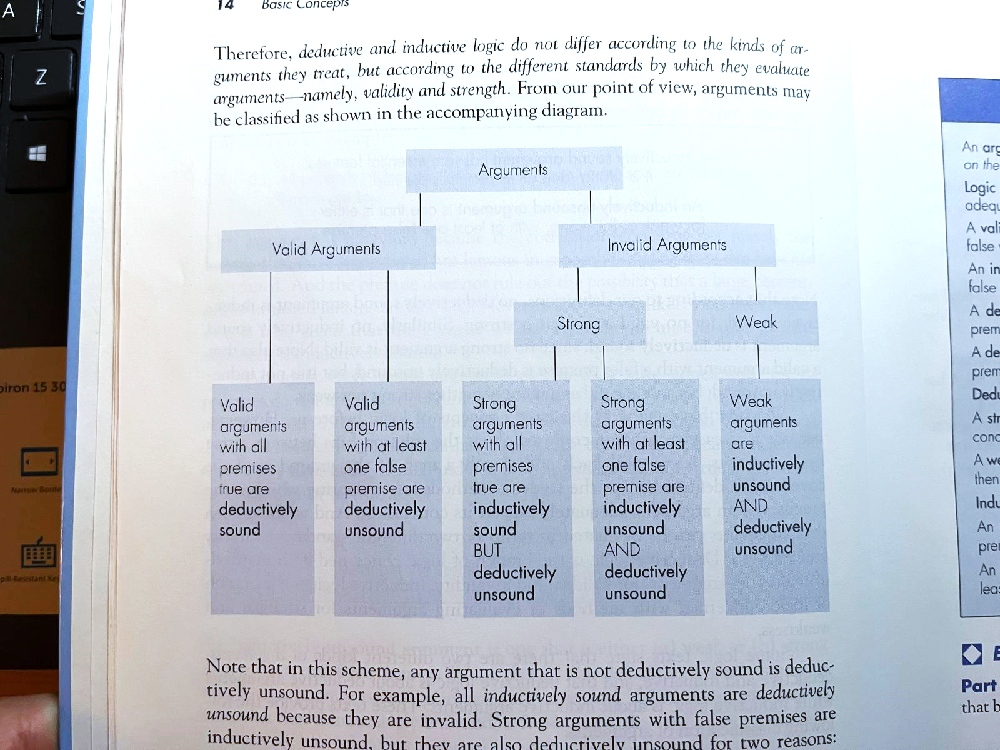
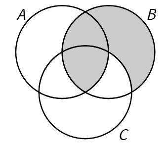
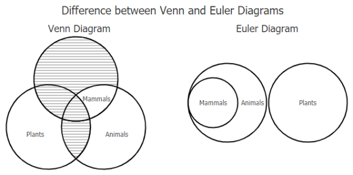
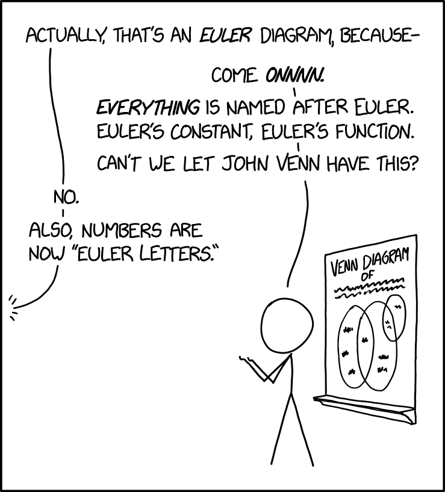
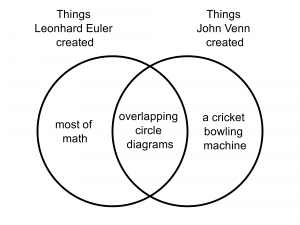
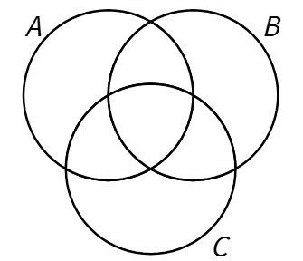
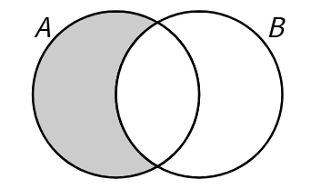
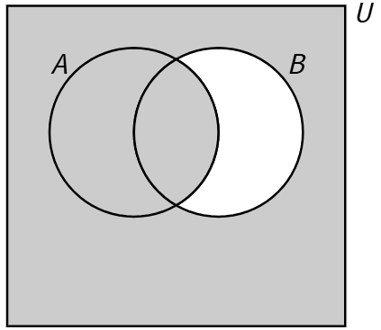
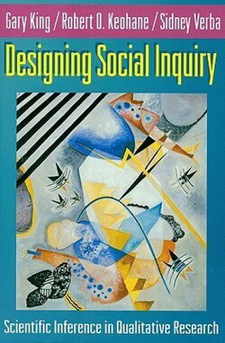
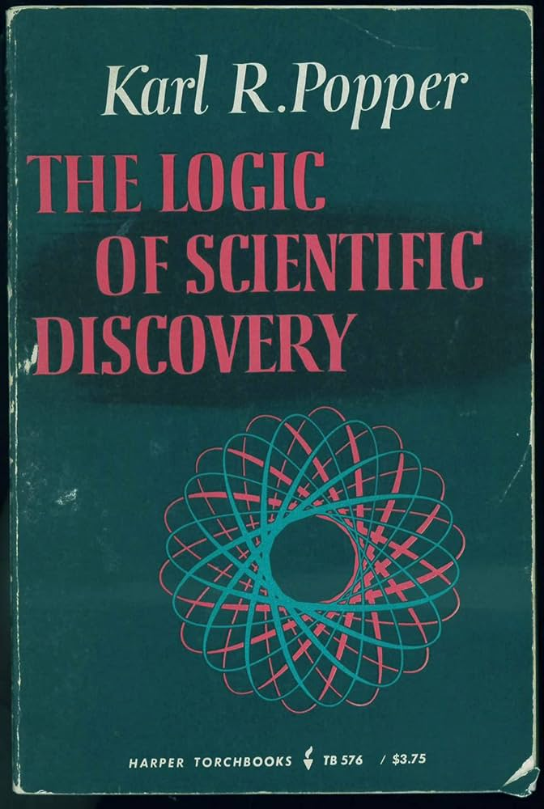

*Today's material is drawn from* The Power of Logic *(Layman 1999), which is a great resource if you want to continue learning after today.*

```{r}
#| include: false
knitr::opts_chunk$set(echo = FALSE, message = FALSE, warning = FALSE)
```

## Agenda for today's session

-   Defining logic and arguments
-   Tools for evaluating arguments
-   Recognizing basic argument forms
-   Handling more complicated arguments
-   Recognizing fallacies in arguments

::: {.callout-note icon=false}
**Prepare for the session:** All you need is a writing utensil, today's worksheet, and your preferred note-taking space.
:::

---

## Logic: what are we doing?

**Logic** is "the study of methods for evaluating arguments" (p. 1).

Even after thousands of years of development, we don't have a complete understanding of logic, and debates still exist — but that which is established is useful enough for our purposes.

**An argument** is a set of interrelated statements, consisting of a conclusion on the basis of the premises that support it.

**A statement** is a sentence that is either true or false.

-   Usually, it posits a relationship between different entities.
-   Questions, commands, and proposals are *not* statements.

By abstracting those relationships between statements, we can apply established rules and principles to evaluate them. Logic is not necessarily the only or best way to form and evaluate arguments, but it is probably the most objective.

---

## Validity and Deductive Soundness

**An argument is valid** if and only if it is impossible for its conclusion to be false while its premises are true, by its very structure.

-   If it is possible for the conclusion to be false while all of the premises are true, then the argument is invalid.
-   "Validity is an all-or-nothing affair" (p. 10).

**A deductively sound argument** is:

1.  one that is valid, and
2.  all of its premises are true.

Deductively unsound arguments may:

-   Be valid but have at least one false premise.
-   Be invalid, with true or false premises.

### What about statements including chance?

**A strong argument** is one where the conclusion is more likely true than false while its premises are true. **A weak argument** is the inverse, where it is not likely that if the premises are true, the conclusion is. The dividing line is simply 50–50%.

We speak of **inductive soundness** for strong and weak arguments. An inductively sound argument is one that is strong and all of its premises are true.

```{r}
#| out.width: "80%"
#| fig-align: "center"
#| fig-cap: "Classification of arguments by validity and strength (Layman 1999, p. 14)."

```

---

## Exercise 1 {.unnumbered}

*Classify the given arguments as: Valid or Invalid; Strong or Weak; Deductively Sound or Unsound; Inductively Sound or Unsound. The sorting diagram above (p. 14) may be helpful.*

1.  No circles are squares. All circles are figures. So, no figures are squares.
2.  90% of Americans speak Chinese. Harrison Ford is an American. So, Harrison Ford speaks Chinese.
3.  Every serial killer is a psychopath. Some criminals are not psychopaths. So, some criminals are not serial killers.
4.  Ninety percent of the cars in the parking lot were vandalized. Your car was in the parking lot. Therefore, your car was vandalized.
5.  30% of students at Reed College are from the Northwest. Sally is a student at Reed College. So, Sally is from the Northwest.

---

## Abstracting into Argument Forms

An **argument form** is "a pattern of reasoning" (p. 23).

-   The argument form can be abstracted into statements about letter variables, or filled in with entities/terms/statements to make an equivalent argument.
-   Filling in the form with such details is called a **substitution instance** of the form.

Sometimes it's hard to understand an argument form in the abstract. You can:

-   Make a **diagram** to visually represent the relationship.
-   Formulate a **counterexample** in the same form to show its flaws.

A **counterexample** is a (correctly matching) substitution instance with well-established truths for premises but a well-established falsehood for a conclusion.

The value of this: an argument is valid if any of its forms are valid. Constructing counterexamples must be done "with due sensitivity to its key logical words and phrases"; otherwise, if you get too general, anything can be made into an invalid form.

### Example: argument form and counterexample

| | **Given argument** | **Argument form** | **Counterexample** |
|---|---|---|---|
| Premise 1 | No capitalists are good people. | No A are B. | No dogs are cats. |
| Premise 2 | All good people are altruists. | All B are C. | All cats are animals. |
| Conclusion | So, no capitalists are altruists. | So, no A are C. | So, no dogs are animals...? |

The counterexample has true premises but a false conclusion — which proves the form is **invalid**.

```{r}
#| out.width: "35%"
#| fig-align: "center"
#| fig-cap: "Venn diagram: does 'No A are B, All B are C, So no A are C' hold?"

```

## Two classic diagrams for logic

**Euler diagrams:** shapes are drawn to reflect the overlapping relationships. Helpful for depicting especially complex or hierarchical arguments with 4 or more terms.

**Venn diagrams:** all circles are drawn overlapping, and non-existent/empty sets are shaded. Helpful for mapping an argument as we read each statement.

> "Some" statements ("there are some A", "some A are B") are typically diagrammed by marking an X in the relevant area.

```{r}
#| out.width: "80%"
#| fig-align: "center"
#| fig-cap: "Venn vs. Euler diagrams compared."

```

It is not super important that you distinguish these two kinds of logic diagrams — but it would be best if you could be consistent when you draw them.

```{r}
#| layout-ncol: 2
#| fig-cap:
#|   - "xkcd on the Euler/Venn naming confusion."
#|   - "A Venn diagram of what Euler and Venn each created."


```

An interactive Venn diagram tool is available at: <https://demonstrations.wolfram.com/InteractiveVennDiagrams/>

---

## Exercise 2 {.unnumbered}

*Demonstrably test whether these arguments are valid or invalid. You can use a Venn or Euler diagram or a counterexample, whichever is more helpful.*

```{r}
#| out.width: "30%"
#| fig-align: "center"

```

1.  No rock is sentient. Some mammals are sentient. Thus, no mammal is a rock.
2.  Every rockstar is cool. No nerd is a rockstar. Thus, no nerd is cool.
3.  All destructive acts are evil. Some wars are evil. Thus, some wars are destructive acts.
4.  No wines are distilled liquors. Some beers are not distilled liquors. Thus, some beers are not wines.

*These examples adapted from Layman (1999, p. 28).*

---

## Translating Language into Argument Forms

A **conditional statement** can be framed as an "if-then" statement.

-   The "if-" clause is the **antecedent**; the "then-" clause is the **consequent**.
-   Scientific hypotheses are often framed as "if-then" statements.

In English, several sentence constructions express a conditional:

| Construction | Example |
|---|---|
| "If ..., then ..." | "If it is raining, then the ground is wet." |
| "Given that ..." | "Given that it is raining, the ground is wet." |
| "Assuming that ..." | "Assuming that it is raining, the ground is wet." |
| "... if ..." | "The ground is wet if it is raining." |
| "... given that ..." | "The ground is wet given that it is raining." |
| "... only if ..." | "It is raining only if the ground is wet." |

Note: **"only if"** can be tricky — it introduces a *consequent*, like "then."

---

## Basic Argument Forms

```{r}
#| out.width: "40%"
#| fig-align: "center"
#| fig-cap: "A conditional: if A then B."

```

### Valid argument forms

**Modus Ponens** (Affirming the Antecedent)

> If A, then B.
> A.
> So, B.

**Modus Tollens** (Denying the Consequent)

> If A, then B.
> Not B.
> So, not A.

### Invalid argument forms (logical fallacies)

**Denying the Antecedent**

> If A, then B.
> Not A.
> So, not B...?

**Affirming the Consequent**

> If A, then B.
> B.
> So, A...?

### Three more valid basic argument forms

**Hypothetical Syllogism**

> If A, then B.
> If B, then C.
> So, if A, then C.

**Disjunctive Syllogism**

> Either A or B. (inclusive sense of "or")
> Not A.
> So, B.

**Constructive Dilemma**

> Either A or B.
> If A, then C.
> If B, then D.
> So, either C or D.

```{r}
#| out.width: "50%"
#| fig-align: "center"
#| fig-cap: "Venn diagram for the disjunctive syllogism: B is the universe minus A."

```

---

## Exercise 3 {.unnumbered}

*Classify the given arguments by what form they match, then assess their validity.*

1.  If the zygote lacks a brain, then the zygote lacks a soul. If the zygote lacks a soul, then killing the zygote is permissible. So, if the zygote lacks a brain, killing the zygote is permissible.
2.  Kidnapping is wrong if society disapproves of it. Kidnapping is wrong. So, society disapproves of it.
3.  Either James Watt was Scottish or he was French. Watt was not French. So, he was Scottish.
4.  Either God cannot prevent suffering, or God does not want to prevent suffering. If God cannot prevent suffering, then God is not omnipotent. If God does not want to prevent suffering, then God is not perfectly good. Therefore, either God is not omnipotent or God is not perfectly good.

---

## Formal Logic's Implications for Science

It is much more rigorous to properly *disprove* a hypothesis with contrary evidence than it is to properly *prove* a hypothesis with affirming evidence.

```{r}
#| layout-ncol: 2
#| fig-cap:
#|   - "King, Keohane & Verba (1994) — on scientific inference."
#|   - "Popper — on falsification as the logic of scientific discovery."


```

Consider the two forms side by side:

| | **Modus Tollens** (VALID) | **Affirming the Consequent** (INVALID) |
|---|---|---|
| Premise 1 | If A, then B. | If A, then B. |
| Premise 2 | Not B. | B. |
| Conclusion | So, not A. | So, A...? |

Disproving via contrary evidence maps onto **Modus Tollens** — a valid form. Proving via confirming evidence maps onto **Affirming the Consequent** — an invalid form. This, presumably, is the logic-based mechanism for why falsification and falsifiability are the right modes for science, according to Popper and Keohane.

---

## Handling Real-World Arguments

Valid arguments must be made up of valid parts; invalid arguments must rely on some relationship between statements being invalid. More complicated arguments can be broken down into their interrelated premises and conclusions to show what depends on what.

Since more arguments appear in conventional language, rigorously mapping and breaking them down relies on recognizing their components.

**Premise indicators** include: "because," "since," "for," "as," "based on the fact that" ...

**Conclusion indicators** include: "so," "therefore," "hence," "thus," "consequently" ...

Some rhetorical elements do not actually contribute to the argument itself:

-   **Discounting clauses** like "although" anticipate potential objections but are not premises.
-   **Hedging** like "I think" should be cut out, and rhetorical questions made into statements.

### Putting arguments into "textbook form"

1.  Identify the premises and the conclusion.
2.  Eliminate excess verbiage (e.g., discounts, repetition, assurances, hedges).
3.  Employ uniform language.
4.  Be fair and charitable in interpreting an argument.
5.  Do not confuse subconclusions with final conclusions (p. 64).

"It is quite common for the conditional premise of the modus ponens or modus tollens forms to be left unstated" (p. 87). An **enthymeme** is an argument with an unstated premise and/or conclusion. You must make these terms explicit in textbook form, then put them in [brackets]. You must take care not to misrepresent arguments by adding parts in bad faith.

### Example: representing an argument

*Given argument:*

> "The rich will get richer if the Republicans win. And taxes will increase if the Democrats win. Hence, either the rich will get richer or taxes will increase." (p. 85)

*Textbook form:*

> [Either the Republicans win or the Democrats win.]
> If the Republicans win, then the rich will get richer.
> If the Democrats win, then taxes will increase.
> So, either the rich will get richer or taxes will increase.

*Argument form:*

> Either R or D.
> If R, then G.
> If D, then T.
> So, either G or T.

*Symbolic representation:* `[ (R ∨ D) ] · (R → G) · (D → T) · ∴ (G ∨ T)`

This matches the **Constructive Dilemma** — a valid form.

---

## Exercise 4 {.unnumbered}

*Represent the arguments in textbook form. Indicate if it matches with one of our given argument forms. To save laborious writing, you can use capital letters (like variables) to stand in for the statements comprising the arguments, but you must be consistent.*

1.  You do not love art, for you love art only if you love Cézanne's paintings. And you do not love Cézanne's paintings. But either you love art or you are uncultured. It follows that you are uncultured.

2.  It is wrong to risk one's life unnecessarily. Given this, it is wrong to race cars. So, it is wrong to race cars. If it is wrong to race cars, then the Indy 500 race should be banned, even though most Americans enjoy watching it. Therefore, the Indy 500 should be banned.

3.  Either the defendant should be executed, or he should be permanently hospitalized. For either the defendant is guilty or he is insane. And assuming he is guilty, he should be executed. But assuming he is insane, he should be permanently hospitalized. Now, the defendant should not be executed if the evidence is less than compelling. And the evidence is less than compelling. So, the defendant should not be executed. Thus, the defendant should be permanently hospitalized.

---

## Recognizing Fallacies

A **fallacy** is an "error in reasoning" (p. 165).

-   A **formal fallacy** "involves the explicit use of an invalid form" (p. 165), such as the "Affirming the Consequent" and "Denying the Antecedent" forms discussed above.
-   **Informal fallacies** do not involve the explicit use of an invalid form (p. 166).

This text sorts the most common informal fallacies into four groups:

1.  Fallacies involving irrelevant premises
2.  Fallacies involving insufficient evidence
3.  Fallacies involving ambiguity
4.  Fallacies involving unwarranted premises

### Fallacies involving irrelevant premises

*The premises of these arguments may seem relevant but do not actually bear on the truth of the conclusion (Layman 1999, p. 173).*

| # | Name | Description |
|---|---|---|
| 1 | **Ad hominem (abusive)** | Attacking the character or personal traits of the person making the argument rather than addressing the argument itself. |
| 2 | **Ad hominem (circumstantial)** | Dismissing an argument by pointing to the arguer's special circumstances or self-interest rather than the argument's merits. |
| 3 | **Tu quoque** ("you too") | Responding to a criticism by charging that the critic commits the same fault; deflects rather than refutes. |
| 4 | **Straw man** | Misrepresenting an opponent's position in order to make it easier to attack. |
| 5 | **Appeal to the people (ad populum)** | Attempting to persuade by appealing to popular opinion, mass sentiment, or emotion rather than by giving relevant reasons. |
| 6 | **Appeal to force (ad baculum)** | Using the threat of force or negative consequences as a reason to accept a conclusion. |

### Fallacies involving insufficient evidence

*The premises of these arguments are (or at least can be) relevant to their conclusions, but the premises do not provide sufficient evidence to establish the conclusions (Layman 1999, p. 182).*

| # | Name | Description |
|---|---|---|
| 7 | **Appeal to ignorance (ad ignorantiam)** | The claim that a statement is true (or may be believed true) simply because it has not been proven false; or that a statement is false simply because it has not been proven true. |
| 8 | **Appeal to unreliable authority (ad verecundiam)** | An appeal to authority when the reliability of that authority may reasonably be doubted. |
| 9 | **False cause** | Occurs when one possible cause of a phenomenon is assumed to be *the* cause, although reasons are lacking for excluding other possible causes. |

### Fallacies involving ambiguity

*These fallacies rest on double meanings or a confusion between two closely related concepts (Layman 1999, p. 192).*

| # | Name | Description |
|---|---|---|
| 10 | **Equivocation** | An inference that is invalid because of its dependence on an ambiguous word or phrase. |
| 11 | **Amphiboly** | An inference that is invalid because of its dependence on an ambiguous sentence structure. |
| 12 | **Composition** | An invalid inference from the nature of the parts to the nature of the whole, or from the nature of the members to the nature of the group (or collective). |
| 13 | **Division** | An invalid inference from the nature of the whole to the nature of the parts, or from the nature of the group (or collective) to the nature of the members. |

### Fallacies involving unwarranted premises

*These fallacies involve not invalid or weak inferences, but the use of premises that are unwarranted or unjustified given the purpose or context of the argument (Layman 1999, p. 193).*

| # | Name | Description |
|---|---|---|
| 14 | **Begging the question (petitio principii)** | Assuming the point to be proved — the conclusion is smuggled into the premises. |
| 15 | **False dilemma** | Using a premise that unjustifiably reduces the number of alternatives to be considered. |

---

## Exercise 5 {.unnumbered}

*Identify whether there is a fallacy in each argument, and if so, which kind.*

*(See accompanying worksheet.)*

---

## Further Directions

There is a **symbolic representation system** (like algebra) for statement logic:

> `( A → B ) · ~B · ∴ ~A`

There are several **equivalence rules** used to convert parts of structured arguments into alternatively-phrased equivalent forms:

> `( A ↔ B ) :: ( ( A · B ) ∨ ( ~A · ~B ) )`

**Logic proofs** often apply equivalence rules to convert more complex arguments into ones matching our basic forms to better assess their validity.

Complex arguments can also be evaluated with **truth tables**, which test every true/false value of each lettered statement to see if the argument is valid. Recall, an argument is invalid if it is possible for every premise to be true but the conclusion to still possibly be false.

---

*Today's material drawn from:* Layman, C. Stephen. 1999. *The Power of Logic*. Mountain View, CA: Mayfield.
