```{r}
#| include: false
knitr::opts_chunk$set(fig.align = "center", out.width = "100%")
```

Welcome to this week's methods brown bag seminar on Geographic Information Systems (GIS) and spatial data analysis. 

## Concepts in Spatial Data

We will walk through some of the main concepts that you want to remember.

Many thanks to Professor [Yuri M. Zhukov](https://zhukovyuri.github.io) for allowing me to use his lecture materials for this session!

### Introducing GIS

GIS are especially useful if we want to know and monitor *what* political/social/economic events (attributes) happen *in where* (locations) and *to whom*.

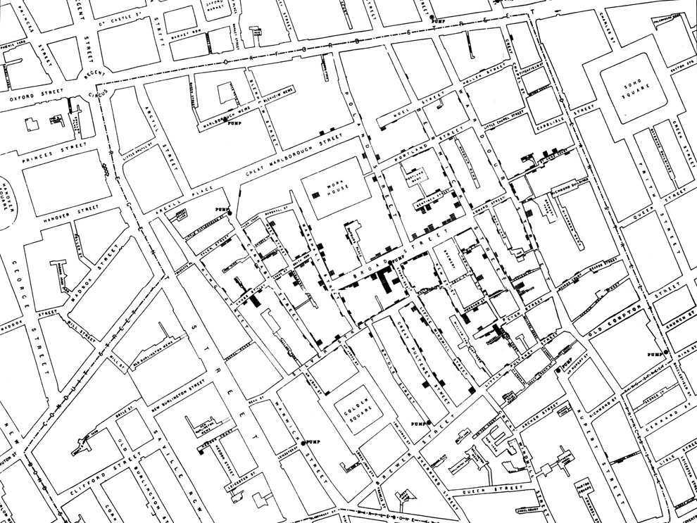{width="460"}

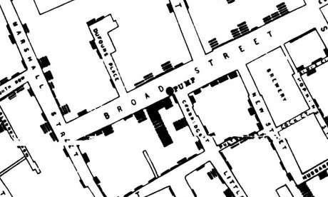

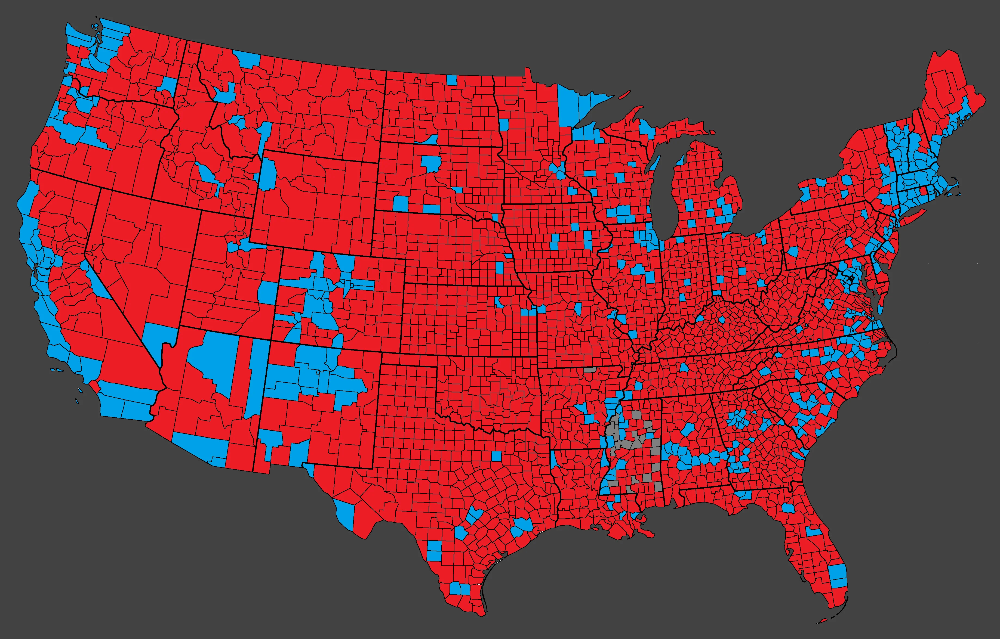

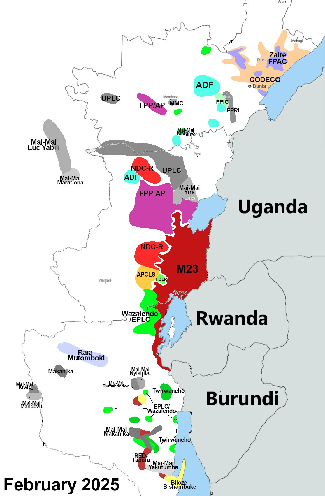{width="419"}

### Why GIS in Political Science?

Some research questions cannot be answered without GIS-based spatial data analysis. For example, you may be interested in geographic variation of terrorist activities, electoral cycles and forest loss rates, extreme weather and conflicts, and so on. Having such geographical dimensions in your research questions, you would need to deal with maps before moving on to regression analysis, survey experiments, and other methods.

### Types of Spatial Data

**Geospatial** means something is situated in geographical space. Here, **space** is more than geography; it refers to any dimension for which a notion of distance between objects can be defined. Specifically, **geographical space** refers to Earth's surface and near-surface.

**Geospatial data** contains information on both "what" (properties, features, and/or attributes of events) and "where" (absolute/relative locations of those events, including latitude, longitude, elevation, etc.). You could add temporal dimensions here as well, which then will be called **spatio-temporal data**.

**Vector data** uses discrete objects (e.g., points, lines, polygons) in space to represent well-defined features. It is structured as coordinates (x, y) that define those objects within given dimensions. Vector data can be ideally used for discrete and distinct objects (e.g., roads, districts).

**Raster data** consists of pixels (or cells) that represent certain value and/or presence/absence of some quality within continuous space. It is structured based on a matrix of cells where each of them has value. Raster data can be ideally used for continuous data that varies across a landscape (e.g., forest cover).

::: {.callout-tip}
## Exercise
*Vector or Raster (or Both)?*
:::

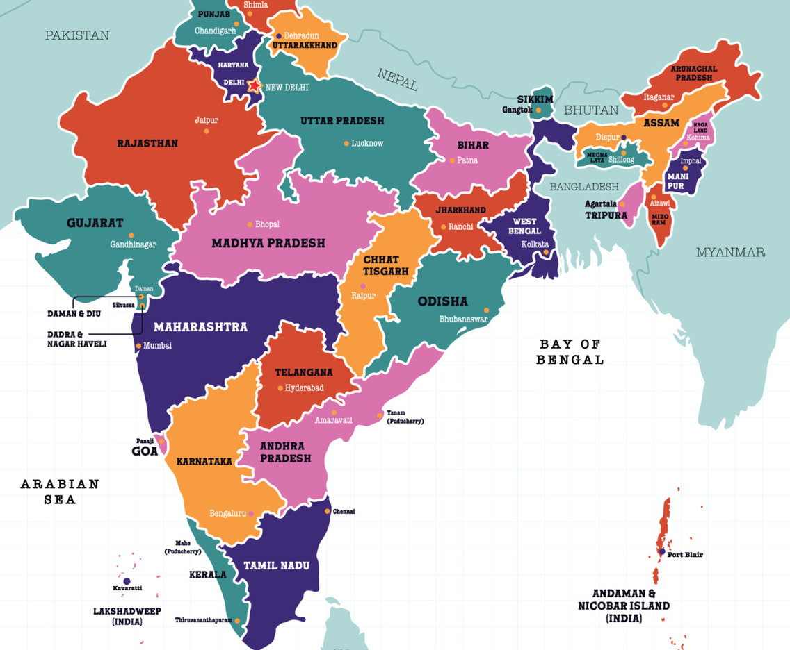


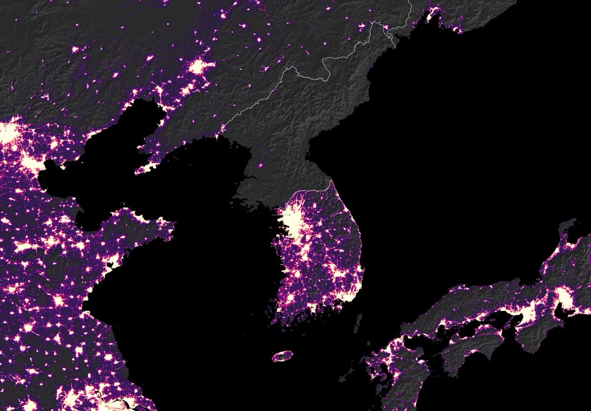

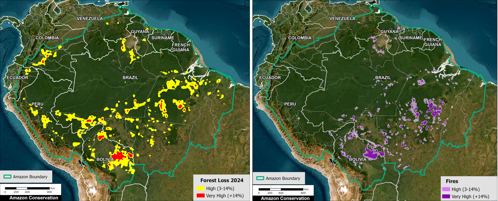

### Building Maps

*Where are we now?* To answer this question, we use two types of coordinates: latitude (vertical) and longitude (horizontal). **Latitude** is defined as angle between equator and straight line from Earth's center to a certain location. It has a positive value in Northern hemisphere and a negative value in Southern hemisphere. **Longitude** is defined as angle between Prime Meridian (Royal Observatory Greenwich, London, United Kingdom) and straight line from Earth's center to a certain location. It has a positive value for east side of Prime Meridian (UTC+0, or Coordinated Universal Time) and a negative value for west side of Prime Meridian.

::: {.callout-tip}
## Exercise
*Find where these coordinates lead you to, and tell me why it is important: (38.906556, -77.070500)*
:::

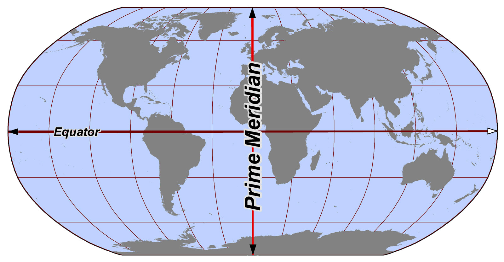

*How does Earth look like?* Different theories consider Earth's exact shape, size, and gravity field.

1.  **Geoid**: Representing the point on which gravitational strength is constant. Contains irregular physical surface. Normally used to represent (elevations above) sea levels.
2.  **Ellipsoid**: Approximation of a 3-dimensional ellipse shape that depicts Earth a bit better. Perfectly smooth shape. Used to establish coordinates (latitude/longitude). Big challenge as "finding ellipsoids that most closely approximates geoid."
3.  **World Geodetic System (WGS) 1984**: Most widely-used international standard for global positioning and satellite navigation systems. Developed by the U.S. Department of Defense (DoD) for military purposes. Not perfectly correct due to Earth being ellipsoidic (i.e., distortion of Northern/Southern poles – e.g., Greenland versus Africa). Default in GIS.

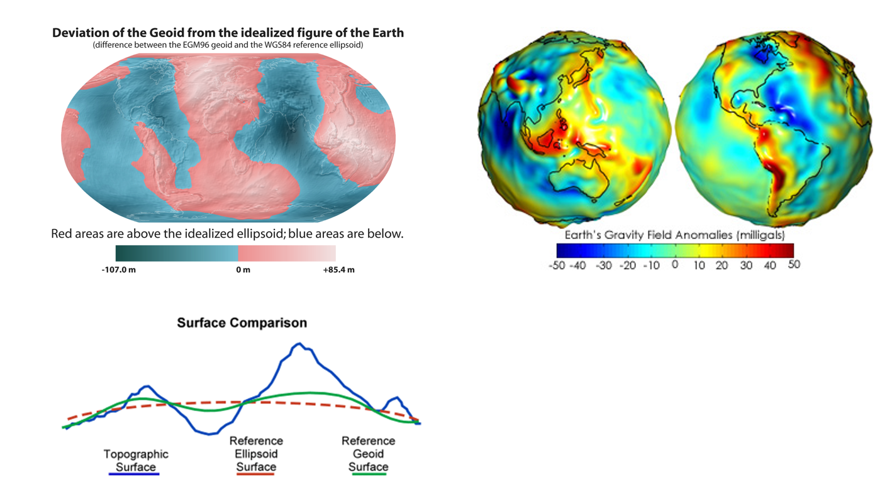

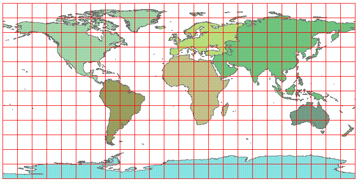

### Map Projection

*How can we transform Earth's 3-dimensional surface to 2-dimensional plane, while minimizing distortion?* There are a few ways to do this **projection**, including: Azimuthal, Conic, and Cylindrical.

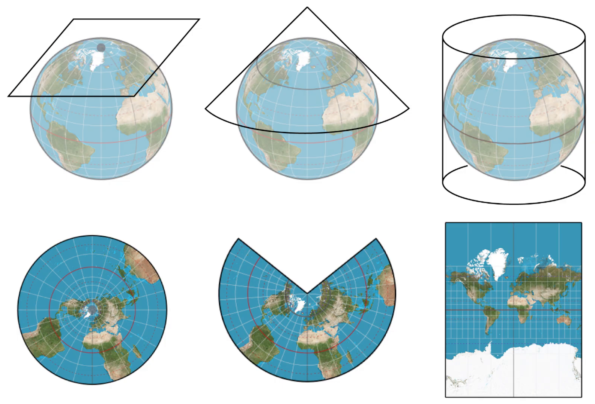

Whatever projection method we choose, we cannot completely avoid distortion (NO free lunch!). Thus, the key is to reduce it as best as we can.

Some common projection systems include: Universal Transverse Mercator (UTM), Military Grid Reference System (MGRS), and State Plane Coordination Systems (for the U.S. plane system).

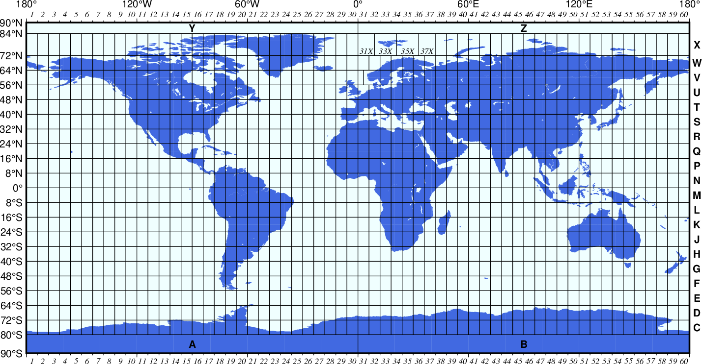

In QGIS, you can set how you want your maps to be coordinated in the bottom-right corner. For WGS 1984, the code for the geographic coordinates (not projected!) is **EPSG 4326**. Remember this number!

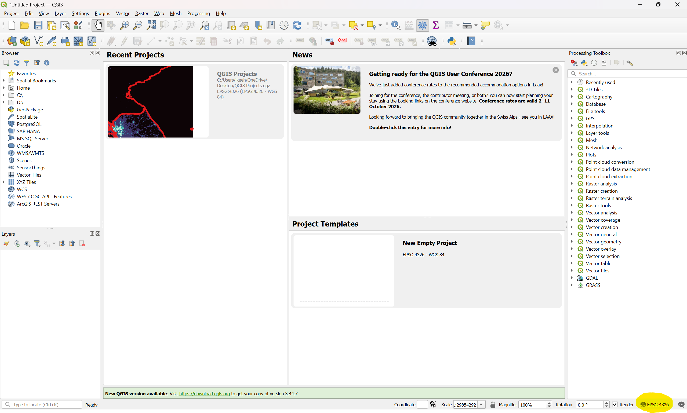

### Map Overlay

**Overlaying** means to combine multiple layers of spatial data within the same unit, with each layer representing some features of the world, to reveal different patterns and relationships between them.

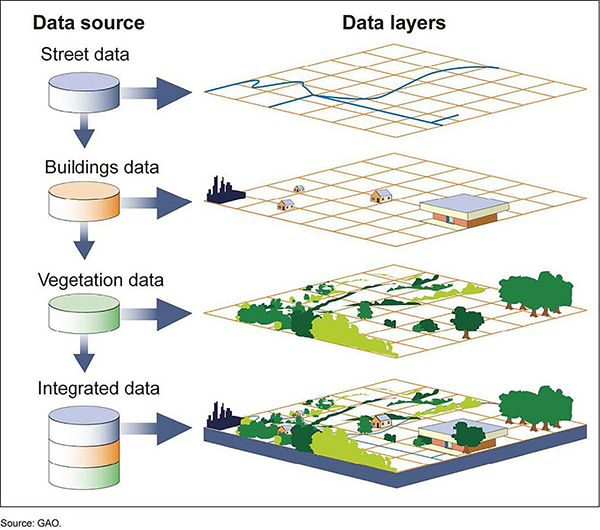{width="528"}

Before overlaying, all layers must be on the same coordination system (whichever you choose), otherwise it will be done weirdly!

**What is a "good" map?** It should clearly and directly communicate information of primary interest, while using distinctive colors/shades and not being too complicated.

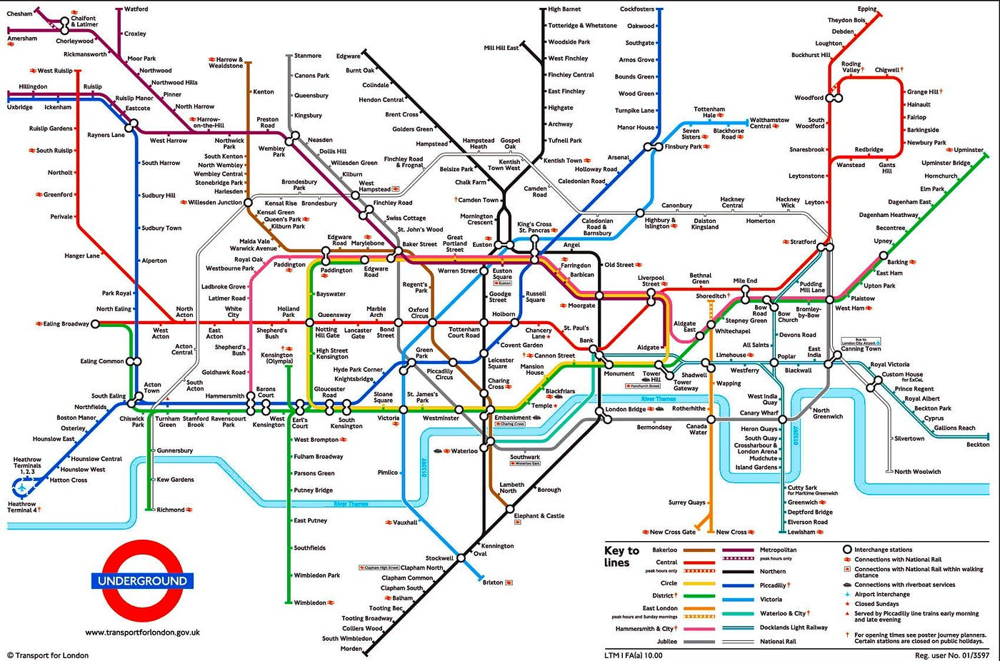{width="565"}

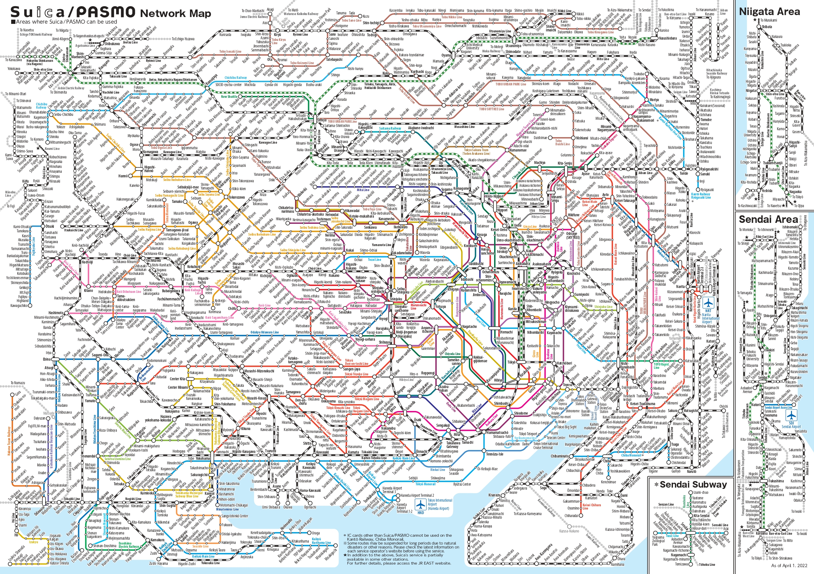{width="564"}

### Analyzing Spatial Data

**Spatial analysis** refers to any method that includes the use of data on objects' locations and attributes.

The key here is to extract information from maps for your analysis. It could be just simple spatial queries (i.e., descriptive statistical analysis), or something more complicated.

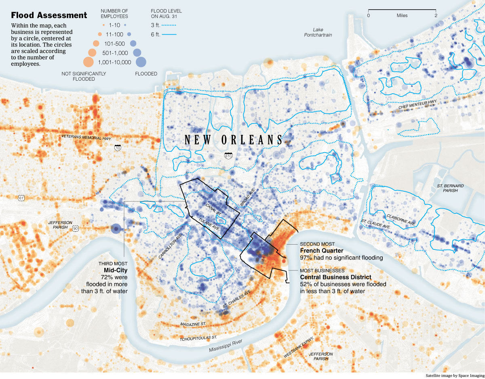

**Geoprocessing** refers to all tools and activities used to manipulate, create, manage, and analyze spatial datasets.

What is **transformation**? As key part of geoprocessing, it allows you to transform one data format into another and/or to create new spatial objects based on objects' attributes.

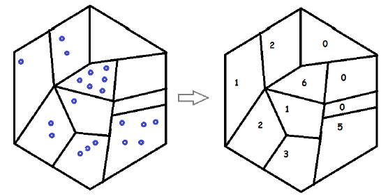

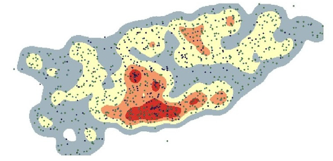

Geospatial datasets can be joined by either attributes or locations.

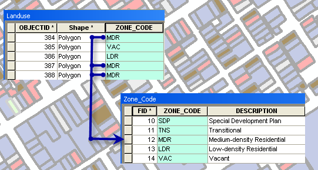

**Modifiable Areal Unit Problem (MAUP)**: As a key source of statistical bias, this problem happens when point-based measures (e.g., events, people) are aggregated into zonal units (e.g., districts, provinces). Any aggregated measure depends on geographical units they choose to measure, i.e., how boundaries are drawn.

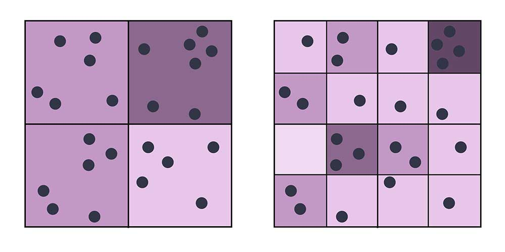

The logic is similar to ecological fallacy; electoral gerrymandering is a good example here. You may be tempted to cherry-pick geographical units to support your arguments (e.g., electoral constituencies), which might not be wrong per se but must be justified by the literature and your theory.

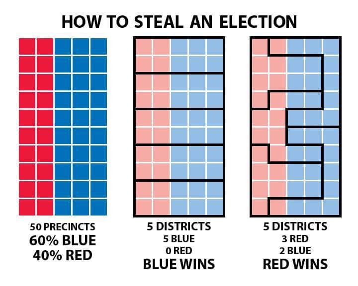

### Turning Maps into Data

Data that we want to use for our analysis will be trapped in maps, and often they are valuable ones that you cannot obtain otherwise. Thus, extracting those out of maps and converting them into workable datasets will be an important move for you to answer more questions.

**Georeferencing**

By **georeferencing** data, you are assigning geographic objects (e.g., digital map images, satellite photos, military maps, historical maps) to geographic locations (i.e., geocoordinates) on the ground.

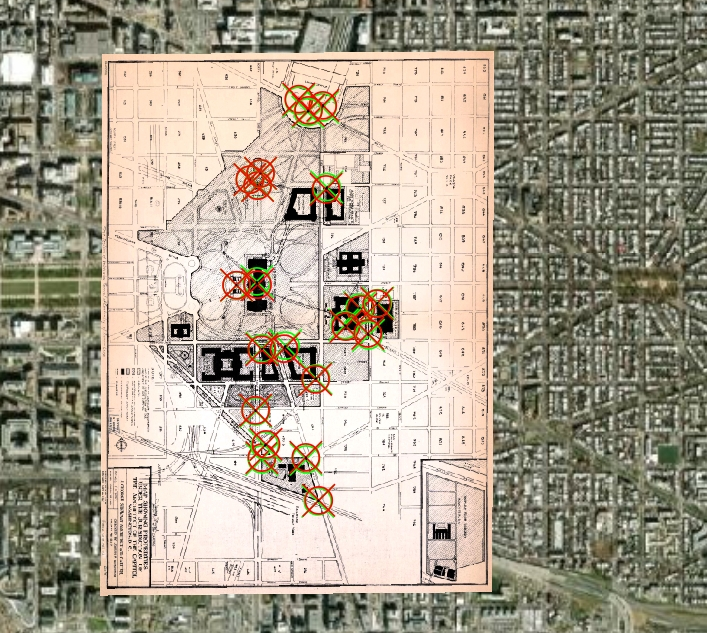

*How can we georeference?* Load your map, select ground control points (GCPs), and transform the map to align with chosen coordination systems so that it matches with spatial locations on the ground. This can be done through R, though you should use QGIS if you are working with (often) historical maps without coordination systems.

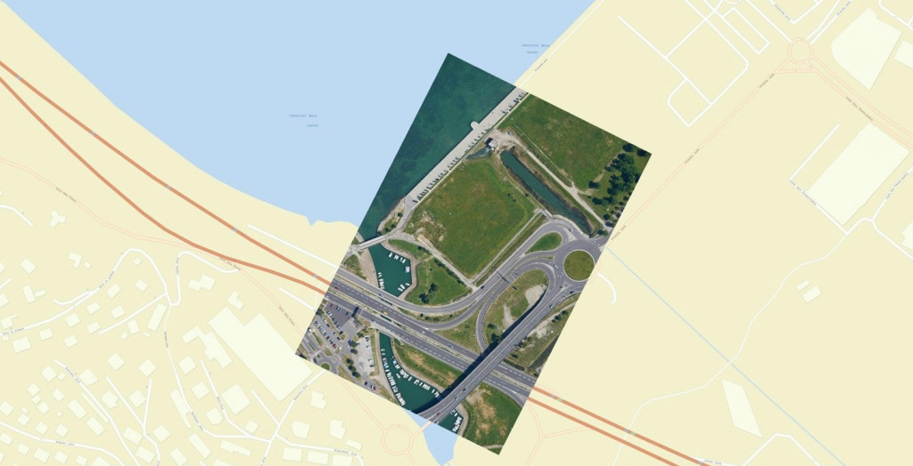

**Vectorization**

Here we are trying to convert georeferenced raster images into vector images (FYI, the opposite is called rasterization, which is much easier).


*Why should we vectorize?* Vectors consist of standard data structures that social scientists are interested in (e.g., events, provinces, countries), rather than cells in raster data. Practically speaking, vector datasets are usually smaller in size and thus better enable us to combine with multiple attributes.

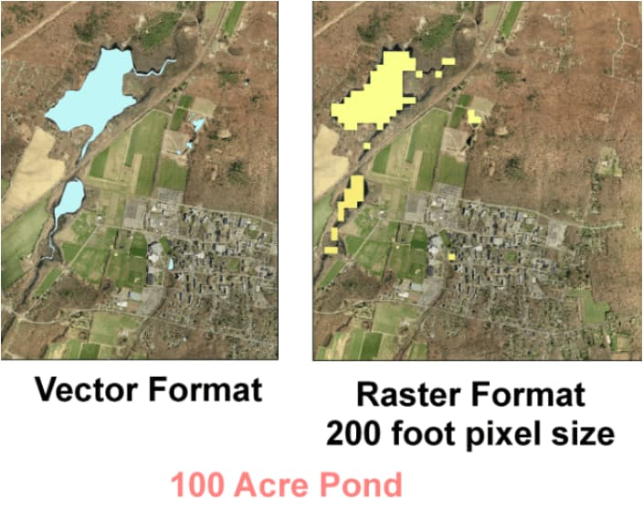

*How can we vectorize?* You can either trace images (manually or via computer algorithm) or computer-based operations (machine learning).

### Turning Data into Maps

**Geocoding**

By **geocoding** data, we are assigning geographical codes (coordinates) to descriptive location data.


*How can we geocode?* Let's go over key steps (focus more on the logic here):

1.  Query input (e.g., address, building, postal codes): be as precise and clear as possible here

    {width="391"}

2.  Pre-processing: standardization of input into a format/syntax compatible with the dataset; remove capitalization, punctuation, non-alphabetical numerics, overlapping terms, etc.; this step is crucial to prevent errors, especially with raw/messy/vague texts

    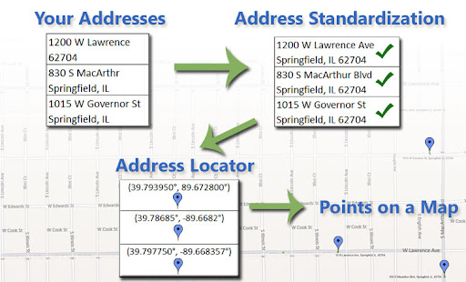{width="399"}

3.  Matching: user input –\> exact locations; finding best matching pairs would depend on researchers' judgment calls (e.g., exact vs fuzzy match, tie-breaking rules, what to do with no match, etc.)

    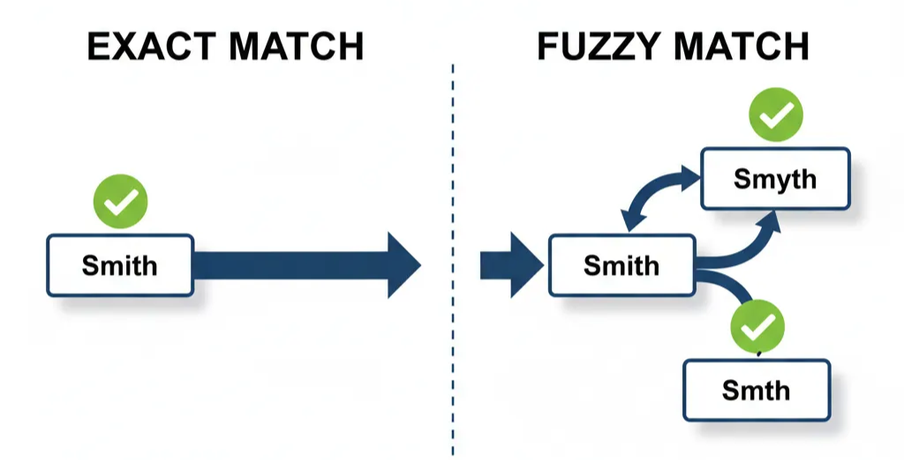{width="420"}

    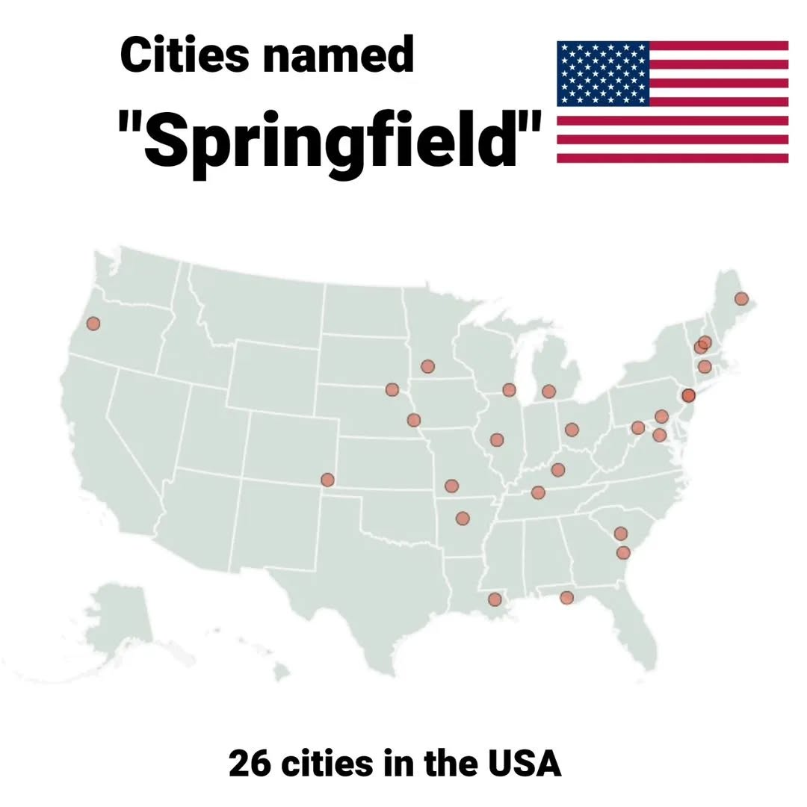{width="400"}

4.  Reference data: geographically-coded foundational data sources containing location attributes (that consist of points, lines, polygons, etc.) with which you match your input (i.e., text addresses); some common types of these data include gazetteer, crowd-sourced, etc.

    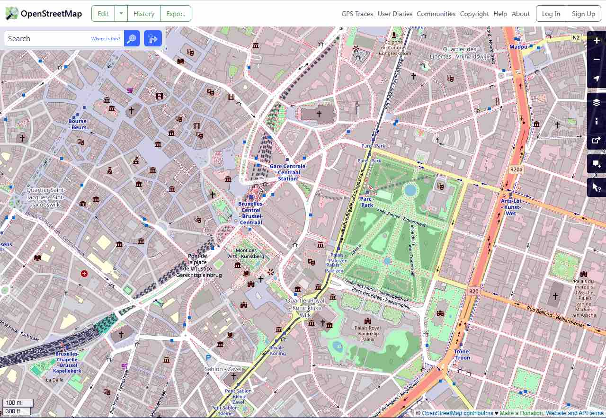{width="430"}

5.  Data output: any geographically referenced information (e.g., geocoordinates, line/polygon features, etc.) that you consider as an outcome (e.g., Google Maps)

    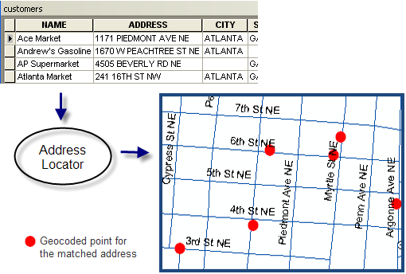

### Additional Topics

**Remote Sensing**

-   Method of obtaining information about Earth's surface (raw imagery) through long-ranged observations (usually done by satellites these days)

-   Advantageous if working on areas that are inaccessible and/or without reliable data; also (often) cheaper for researchers, compared to direct observations

-   Not all raster data are driven from remote sensing, but all remote sensing data are raster data (by definition)

-   Remote sensing (raster) data were not initially built for social scientists (since we have the "vector view" of the world), but research projects using such data have increased

**Spatial Regression**

-   Statistical technique to make spatial-data-driven models while accounting for spatial autocorrelation and using spatial weight matrix

-   Extension of traditional OLS models by modeling how neighboring observations (spatial lag) or errors (spatial error) influence one another

-   Often used to understand *spatial patterns* of many social science issues (e.g., air pollution)

### Publicly Available Geospatial Data Sources

[OpenStreetMap](https://www.openstreetmap.org/)

[Free GIS Datasets](https://freegisdata.rtwilson.com/)

[VIIRS Nighttime Light](https://eogdata.mines.edu/products/vnl/)

[Global Forest Change](https://glad.earthengine.app/view/global-forest-change#dl=1;old=off;bl=off;lon=20;lat=10;zoom=3;) (a.k.a. "Hansen data" or "UMD data")

[Geocomputation with R](https://r.geocompx.org/)


## Creating Maps in R

This second part of the session will walk you through a number of important practical lessons about spatial data visualization.

### Data Shapes and Storage Formats

::: {.callout-tip}
## Refresher Exercise
*Do you remember the differences between vector and raster data?*
:::

Because vector data is easier to work with, we will only use vector data in this coding session, specifically polygons and points.

**Polygons** are closed shapes defined by a sequence of connected coordinates. They represent areas with boundaries, such as countries, states, census tracts, or land parcels. Each polygon typically corresponds to one observational unit in the attribute data.

**Points** are single coordinate locations defined by an x and y value (e.g., longitude and latitude). They represent specific locations such as cities, schools, survey responses with geocodes, or event occurrences.

Vector data is often represented in the form of the data format **shapefile**, which can store both geometric and attribute data (i.e. it stores both the mapping/location data as well as any number of characteristics associated with a polygon or point).

### Working with Shape Files

There are a number of packages that are useful for plotting maps in R, including `sf`, `tmap`, `leaflet`, and even base R.

For static maps without interactive elements, I personally prefer `sf`. sf stands for “simple features”, which is a standard for consistently representing spatial vector data.

Before we can begin, let's install and load the sf package:

```{r}
#install.packages("sf")
library(sf)
```

In addition to this, we'll also need the `tidyverse` package for general data wrangling and `ggplot2` for plotting figures.

```{r}
#install.packages("pacman")
pacman::p_load(tidyverse,
               ggplot2)
```

Shapefiles of any geographic boundaries or points and at different levels of aggregation are often available online for free. Just type your unit of interest alongside the term "shapefile" into the Google search bar, and you'll often find many results for download.

When you are downloading shapefiles, they come in a folder with other files. Don't delete the other files and don't remove them from the folder! They need to stay in the same folder to work.

#### Loading and Exploring the Data

In this session, we will plot different maps of Washington DC. The various data files for this are stored in this chapter's asset folder, `chapters/keeheon_sara/data/`. Paths in the code below are written relative to `chapters/`, which is where knitr runs during a book render.

::: {.callout-tip}
## Exercise
*Open one of the subfolders in `keeheon_sara/data/` and have a look at the files you see.*
:::

Once you had a look, let's read in a shapefile that contains polygons for the Washington DC quadrants using the `st_read` function.

Open the quadrant file (downloaded from [here](https://opendata.dc.gov/datasets/02923e4697804406b9ee3268a160db99_11/about)) in the viewer or print the content of the first few rows with the `head` function. 

```{r}
# DC quadrant shapefile
quadrants <- st_read("keeheon_sara/data/DC_Quadrants/DC_Quadrants.shp")
```

Each row represents a polygon feature, corresponding to a quadrant. In the columns, we have various attributes (for this dataset, no interesting attributes are included), and in the last row, we have the geometry (column name: `geometry`).

```{r}
#| eval: false
View(quadrants)
```

This last row stores the location information required to plot the polygons as a map. Importantly, the column also indicates whether a dataset consists of points or polygons.

To look at the attributes in the `quadrant` data, use the `summary` functions as follows:

```{r}
#| eval: false
summary(quadrants)
```

To determine the number of geographic features, we can use the `dim` function:

```{r}
dim(quadrants)
```

4 is the number of polygons (four quadrants) and 11 is the number of attributes stored in this dataset.

To check the Coordinate Reference System ([CRS](https://datacarpentry.github.io/organization-geospatial/03-crs)), we can use the `st_crs` function:

```{r}
#| eval: false
st_crs(quadrants)
```

The most common projection is WGS 84 / Pseudo-Mercator, as previously discussed.

### Mapping Polygon Shapes

Once you are comfortable with the data format, we can start to create a first simple map using our quadrant dataset. The `sf` package can be used in combination with `ggplot2`, which makes it much easier to start making maps when you're starting out.

```{r}
# install.packages("ggplot2", repos="http://cran.us.r-project.org")
library(ggplot2)
```

#### Simple Plot of Polygon Boundaries

As a first step, let's plot the simple shape of the quadrants. We can use the `geom_sf` function to draw the polygons.

For this first plot, I will not include the predefined theme, so you can see what the bare bones default plot theme looks like.

```{r}
ggplot(data = quadrants) +
  geom_sf() +
  ggtitle("Fig. 1: Quadrants of Washington DC")
```

Note that if you want a different level of aggregation (e.g. the census tracts, or state-/district-level), this often requires a different shape-file, unless the aggregation level you want to plot is included as a polygon/row itself.

#### Personalized Plot Theme (Optional)

I am using a personalized theme that specifies background colors, font and font sizes, margins, and more. That's not necessary at all, it just makes the plots look prettier. :)

You can either use this theme or exclude it from all plots below by commenting it out.

```{r}
# theme for maps on laptop
predefined_theme <- theme_minimal(
  base_family = "serif",
  base_size   = 10) %+replace%
  
  theme(
    axis.text.x = element_text(
      angle = 45, # Rotate x tick
      hjust = 1,  # Right-align rotated text
      vjust = 1), # Nudge vertically so text sits nicely

    axis.title = element_blank(), # Remove axis titles

    panel.background = element_rect(
      fill  = "white",   # Panel interior background
      color = "gray80"), # Outline around panel
    panel.grid.major = element_line(
      linewidth = 0.1,   # Major grid lines
      colour    = "grey80"),
    panel.grid.minor = element_line(
      linewidth = 0.1,   # Minor grid lines
      colour    = "grey80"),

    axis.line = element_line(
      color = "gray20"), # Axis lines
    axis.ticks = element_line(
      color = "gray20"), # Tick mark color
    axis.ticks.length = unit(0.9, "mm"), # Tick mark length

    legend.position = "right", # Legend on the right
    legend.text = element_text(
      size = 10), # Legend label font size
    legend.key.height = unit(6, "mm"), # Legend key height
    legend.key.width  = unit(5, "mm"),  # Legend key width
    legend.spacing.y  = unit(4, "mm"),  # Vertical spacing between legend items
    legend.box.spacing = unit(5, "mm"), # Space between legend and plot panel
    legend.background = element_rect(
      fill      = "#f5f1e8", # Legend background
      color     = "#f5f1e8", # Same color = no border
      linewidth = 0.5),

    plot.title.position = "plot", # Align title to full plot area
    plot.title = element_text(
      size   = 15,       # Title font size
      margin = margin(b = 8)), # Space below title

    plot.background = element_rect(
      fill  = "#f5f1e8", # Overall plot background
      color = "gray70"), # Border around entire plot
    plot.margin = margin(5, 8, 5, 8, "mm"), # Top, right, bottom, left margins

    strip.background = element_rect(
      fill = "#dfd6cd"), # Facet strip background
    #strip.text.x = element_blank(), # Hide facet strip text (x direction)
    panel.spacing = unit(1, "lines") # Spacing between facet panels
  )

```

```{r}
#| include: false

# prepare map theme PRESENTATION/HTML
predefined_theme <- theme_minimal(
  base_family = "serif",
  base_size   = 16) %+replace%
  
  theme(
    axis.text.x = element_text(
      angle = 45, # Rotate x tick
      hjust = 1,  # Right-align rotated text
      vjust = 1), # Nudge vertically so text sits nicely

    axis.title = element_blank(), # Remove axis titles

    panel.background = element_rect(
      fill  = "white",   # Panel interior background
      color = "gray80"), # Outline around panel
    panel.grid.major = element_line(
      linewidth = 0.1,   # Major grid lines
      colour    = "grey80"),
    panel.grid.minor = element_line(
      linewidth = 0.1,   # Minor grid lines
      colour    = "grey80"),

    axis.line = element_line(
      color = "gray20"), # Axis lines
    axis.ticks = element_line(
      color = "gray20"), # Tick mark color
    axis.ticks.length = unit(0.9, "mm"), # Tick mark length

    legend.position = "right", # Legend on the right
    legend.text = element_text(
      size = 16), # Legend label font size
    legend.key.height = unit(14, "mm"), # Legend key height
    legend.key.width  = unit(8, "mm"),  # Legend key width
    legend.spacing.y  = unit(8, "mm"),  # Vertical spacing between legend items
    legend.box.spacing = unit(8, "mm"), # Space between legend and plot panel
    legend.background = element_rect(
      fill      = "#f5f1e8", # Legend background
      color     = "#f5f1e8", # Same color = no border
      linewidth = 0.5),

    plot.title.position = "plot", # Align title to full plot area
    plot.title = element_text(
      size   = 23,       # Title font size
      color = "black",
      margin = margin(b = 12)), # Space below title

    plot.background = element_rect(
      fill  = "#f5f1e8", # Overall plot background
      color = "gray70"), # Border around entire plot
    plot.margin = margin(9, 14, 7, 14, "mm"), # Top, right, bottom, left margins

    strip.background = element_rect(
      fill = "#dfd6cd"), # Facet strip background
    #strip.text.x = element_blank(), # Hide facet strip text (x direction)
    panel.spacing = unit(1, "lines") # Spacing between facet panels
  )

```

#### Adding Colors and Themes

Adding colors, titles, and themes works very much like other types of ggplot plots:

```{r}
ggplot(data = quadrants) +
  geom_sf(fill = "#ebcc71", #polygon color 
          color = "#333333", # boundary color
          lwd = 0.2, # boundary linewidth
          alpha = 0.8) + # level of opacity
  ggtitle("Fig. 2: Quadrants of Washington DC") +
  predefined_theme # our predefined theme
```

The argument `fill` defines the fill color of the polygons, while `color` confusingly refers to the border color. The thickness of the boundary lines is regulated through the `linewidth` (or `lwd`) argument. `alpha` defines the opacity of the fill.

::: {.callout-tip}
## Exercise
*Play around with the colors and especially with the linewidth argument to see how the code works.*
:::

### Plotting Attributes: Simple Choropleth Maps

So far we didn't actually plot any substantive data; the maps only showed the geographic boundaries. Let's now talk about plotting data values. A **choropleth map** is a thematic map that uses shaded or colored polygons, such as countries, states, or counties, to represent the average value of a statistical variable per unit area. 

For this, we will use a different, more spatially granular dataset that includes some attributes that might be of interest to social scientists. The American Community Survey (ACS) contains geographic information as well as different indicators at the census tract level. The data includes 5-year estimates of indicators related to demographics, employment and income, housing, and more. It can be downloaded as separate modules here:

-   [Economic Characteristics](https://opendata.dc.gov/datasets/DCGIS::acs-5-year-economic-characteristics-dc-census-tract/about)

-   [Demographic Characteristics](https://opendata.dc.gov/datasets/DCGIS::acs-5-year-demographic-characteristics-dc/about)

To simplify things for us, I downloaded the economic and the demographic modules and merged them ahead of the lesson. The resulting dataset is stored in the data folder under the folder name `ACS_combined`. You can load it through the code chunk below.

If you want to see how to merge spatial data in R, check out the appendix section [here](#sec-merging-spatial-datasets).

Let's load the datasets:

```{r}
# acs data
acs <- st_read("keeheon_sara/data/ACS_combined/ACS_combined.shp")

```

Let's first plot the boundaries as before, this time using a different color to distinguish the datasets.

```{r}
ggplot() +
  geom_sf(data = acs,
          fill = "#290419",
          color = "#d4cac1",
          alpha = 0.7) +
  ggtitle("Fig. 3: Census Tracts of DC") +
  predefined_theme

```

#### Choropleths with One Layer

Now, let's try to plot the median household income by census tract as a single-layer choropleth map. This attribute for census tracts is captured by `DP03_0062E` in the data.

Note that to be able to create a legend from a layer, it needs to be mapped inside an `aes` function (unlike in the previous map, where we only plotted boundaries)! By setting the fill aesthetic to variable of interest, `DP03_0062E`, the polygons are colored based on the median income.

If we just plot income without specifying a color scale, we get the following:

```{r}
ggplot() +
  geom_sf(data = acs,
          aes(fill = DP03_0062E),
          color = "#d4cac1") +
  ggtitle("Fig. 4: Spatial Distribution of Income by Census Tract") +
  predefined_theme

```

Unfortunately, without an adaptation of the color scale, this is not a very helpful or legible graph. Some of the reasons for this are that:

-   The order of the default color scale is not always intuitive to read

-   Skewed data can often make it difficult to distinguish different values

-   Data might be topcoded (especially relevant for income)

To improve the legibility, let's introduce a color scale with intuitive color ordering (higher income = darker color) and three different colors for increased contrast. We'll also specify for which values we want ticks on the color legend and what the labels for these ticks are.

It helps to pick colors that are far apart. The color ''spacing'' can also slightly make up for skewed data.

```{r}
ggplot() +
  geom_sf(data = acs,
          aes(fill = DP03_0062E),
          color = "#d4cac1") +
  ggtitle("Fig. 5: Spatial Distribution of Incomes in DC") +
  # legend title
  labs(fill = "Median HH Income\n(in 2022 USD)") +
  # color gradient of multiple colors
  scale_fill_gradientn(
    colours = c("#e6c895", "#6b3a3a", "#290419"),
    na.value = "#bab4a9",
    # breaks = ticks
    breaks  = c(0, 50000, 100000, 150000, 200000, 250000),
    # labels for ticks
    labels = c("0", "50,000", "100,000", "150,000", "200,000", "250,000+")
  ) +
  predefined_theme

```

The number of colors specified is flexible and so is the number of breaks/ticks in the legend.

The ticks we show on the legend do not affect the color scale. Accordingly, there's no need to space apart the breaks equally and we can label them with whatever is helpful to visualize the data.

`\n` creates a line break in titles and labels.

::: {.callout-tip}
## Exercise
*Change the number and position of ticks on the legend.*
:::

Below, I plot an alternative legend. As you see, the color gradient does not change from Fig. 5 to Fig. 6.

```{r}
ggplot() +
  geom_sf(data = acs,
          aes(fill = DP03_0062E),
          color = "#d4cac1") +
  ggtitle("Fig. 6: Spatial Distribution of Incomes in DC") +
  labs(fill = "Median HH Income\n(in 2022 USD)") +
  scale_fill_gradientn(
    colours = c("#e6c895", "#6b3a3a", "#290419"),
    na.value = "#bab4a9",
    breaks  = c(50000, 100000, 200000),
    # random ticks
    labels = c("Still higher\nthan our stipend", "Still high income", "Very high income")
  ) +
  predefined_theme
    
```

#### Transforming the Continuous Scale to a Categorical One

Another way to improve effective visualization is to transform our continuous fill variable (income) and instead show categorical values of different income ranges.

We can do so by binning the median income variable into quantile bins. This is especially helpful when the data is skewed to one side and the polygons are all colored in a very similar color.

The code below first identifies the threshold points for quintiles in the income variable and subseqeuntly places the values for each polygon in the correct quintile bin. Note that we want to have a factor variable to plot. The code can be applied to any other data with minimal changes to produce quintile buckets.

```{r}
#| warning: false
# scales is used for dollar()
#install.packages("scales")
library(scales)

# 1. computing quintile cutpoints (quantiles at 0%, 20%, 40%, 60%, 80%, 100%) of the income variable
  qs <- quantile(acs$DP03_0062E,
                 probs = seq(0, 1, 0.2), # from 0 to 1 in steps of 0.2
                 na.rm = TRUE)

  # round cutpoints to nearest $1,000 for clean visualization
  qs_round <- round(qs / 1000) * 1000
  
  # ensure the first breakpoint is not above true minimum income
  qs_round[1] <- min(qs_round[1], 
                     min(acs$DP03_0062E, 
                         na.rm = TRUE))

  # ensure non-decreasing cutpoints (important!)
  # i.e. check that 2nd cutpoint > 1st cutpoint etc. after rounding
  qs_round <- cummax(qs_round)
  
  # ensure the top incomes are not excluded due to rounding
  qs_round[length(qs_round)] <- max(
  qs_round[length(qs_round)],
  max(acs$DP03_0062E, na.rm = TRUE))

# 2. sort income values into created quintile buckets
  acs <- acs %>%
    mutate(
      # cut the variable up into the quintiles
      income_q5 = cut(
        DP03_0062E,
        breaks = qs_round,
        include.lowest = TRUE,
        right = TRUE), # intervals are right-closed
      # make income_q5 a factor variable
      income_q5 = factor(
        income_q5,
        # create category labels that include the dollar range
        labels = paste0(
          dollar(qs_round[-6]), "–", dollar(qs_round[-1]))
      )
    )

```

Now let's plot this categorized version of income by census tract. For this, we no longer use `scale_fill_gradientn` given that our variable of interest is categorical. Instead, we can use `scale_fill_manual` and specify the number of colors according to the number of quantiles we have chosen (five in our case).

The last line of code reverses the order of the legend, but this is not strictly required.

```{r}
# plot
ggplot() +
  geom_sf(data = acs, 
          aes(fill = income_q5),
          color = "#d4cac1") +
  ggtitle("Fig. 7: Spatial Distribution of Incomes in DC") +
    labs(fill = "Median HH Income\n(in 2022 USD)") +
  # categorical variable
  scale_fill_manual(
    values = c("#e6c895", "#a68153","#70433e", "#4d1f32", "#290419"),
    na.value = "#bab4a9",
    na.translate = TRUE) +
  predefined_theme +
  # reverse order of legend, so high income is on top
  guides(fill = guide_legend(reverse = TRUE))

```

As you see, the fact we determined the buckets/categories according to the data distribution, we naturally have a better split of colors accross the shown map, which increases ease of interpretation. In other words, by using quantile cutpoints, we ensure that we have similar numbers of polygons colored in each color.

This is especially useful as a solution for skewed data that can be applied without requiring a great deal of tweaking (which can be time-intensive).

::: {.callout-tip}
## Bonus Exercise
*Can you get the NA value to appear at the bottom of the legend?*
:::

### Plotting Attributes: Choropleths with Multiple Layers

Let's now turn to maps that include multiple layers. For this, we will use the package `ggnewscale` to assign multiple color scales.

```{r}
library(ggnewscale)
```

#### Multiple Layers of Different Kinds

Instead of plotting a second continuous variable on top of income, we can also plot a dichotomous attribute. To distinguish the layers, we can use pattern fills for the top layer.

For adding layers that include pattern fills, we also need the package `ggpattern` to color polygons with a pattern.

```{r}
library(ggpattern)
```

On top of the income values, I would like to plot a binary indicator that shows census tracts that are majority Caucasian-identifying. I create it below from the variables `DP05_0069E` (total population) and `DP05_0033E` (population of white or white among other races individuals).

```{r}
# create majority white binary variable
acs <- acs %>% 
  mutate(share_white = as.numeric(DP05_0069E/DP05_0033E, 
                               na.rm = T)) %>% 
  mutate(white_maj = as.numeric(share_white > 0.5, 
                               na.rm = T))

```

Let's plot both income and majority white regions on top of each other, each as a separate layer:

```{r}
ggplot() +
  # the original layer
  geom_sf(data = acs,
          aes(fill = DP03_0062E),
          color = "#d4cac1",
          alpha = 0.9) + # lower opacity
  ggtitle("Fig. 8: Spatial Distribution of Income in\nWhite-Majority and Other Census Tracts") +
  labs(fill = "Median HH Income\n(in 2022 USD)") +
  scale_fill_gradientn(
    colours = c("#e6c895", "#6b3a3a", "#290419"),
    na.value = "#bab4a9",
      breaks  = c(0, 50000, 100000, 150000, 200000, 250000),
      labels = c("0", "50,000", "100,000", "150,000", "200,000", "250,000+")) +
  # ggnewscale allows a second independent fill mapping
  # necessary because the income layer already uses `fill`
  ggnewscale::new_scale_fill() +
  # layer with pattern for white-majority tracks
  geom_sf_pattern(
    # essentially doesn't really plot the value
    # but instead uses the binary indicator to subset what is shown
    data = dplyr::filter(acs, !is.na(white_maj), white_maj == 1),
    aes(pattern_fill = "Yes"), # constant category label for legend
    fill = NA, # do not override base income fill
    color = "#d4cac1", # boundary color
    pattern = "circle", # type of pattern
    pattern_colour = NA, # no circle outline/background
    pattern_spacing = 0.02, # space between dots
    pattern_density = 0.6, # dot size
    pattern_angle = 45, # angled dot array
    # hide pattern aesthetic legend, keep pattern_fill legend
    show.legend = c(pattern = FALSE, 
                    pattern_fill = TRUE)) +
  # add legend for white-majority indicator
  scale_pattern_fill_manual(
    values = c("Yes" = "#5e4607"), # dot color
    breaks = "Yes",
    name = "White Majority",
    na.translate = FALSE,
    # ensure legend key shows the pattern
    guide = guide_legend(
      override.aes = list(pattern = "circle"))) +
  predefined_theme

```

Essentially, what the second part of this code does is not to plot the value of the binary variable itself. Instead, it uses the binary variable to subset the data to only white majority census tracts and then plots the boundaries of those white-majority tracts (more similar to the plots we made earlier in the session).

::: {.callout-tip}
## Bonus Exercise
*If you want to know how to plot two layers of the same type over each other, consult the appendix* [*here*](#sec-multiple-layers-same-type).
:::

### Plotting Attributes: Point Geometries

We can also add point data such as the location of metro stations as a second layer. For this, we will load an additional dataset.

```{r}
# metro stations
metro <- st_read("keeheon_sara/data/Metro_Stations_in_DC/Metro_Stations_in_DC.shp")
```

Point geometries can also be plotted with the `geom_sf` function, using `shape` instead of `fill` as an argument. Note that for the metro legend here, we use the `scale_shape_manual` function, given that we are plotting a point.

Let's keep income as a base layer and add the metro stop locations on top of it:

```{r}
ggplot() +
  geom_sf(data = acs,
          aes(fill = DP03_0062E),
          color = "#d4cac1") +
  ggtitle("Fig. 9: Spatial Distribution of Income in\nWhite-Majority and Other Tracts") +
  labs(fill = "Median HH Income\n(in 2022 USD)") +
  scale_fill_gradientn(
    colours = c("#e6c895", "#6b3a3a", "#290419"),
    na.value = "#bab4a9",
      breaks  = c(0, 50000, 100000, 150000, 200000, 250000),
      labels = c("0", "50,000", "100,000", "150,000", "200,000", "250,000+")) +
  ggnewscale::new_scale_fill() +
  # dots for metro stations
  geom_sf(data = metro,
          aes(shape = "Metro station"), # use shape, not fill
          color = "#1c1004",
          alpha = 0.85,
          size = 5) + # size of the symbol
  # legend for metro stations
  scale_shape_manual(
    values = c("Metro station" = 18), # 18 = shape type
    name = "")+
  predefined_theme

```

Here, I chose a diamond shape (shape number 18) as a symbol. There are many other symbols you could use. If it's easier to see what the code plotting the metro stops does, remove the first income layer temporarily.

Note that different datasets can be used in the same plot without issues.

::: {.callout-tip}
## Exercise
*What other shapes can you plot?*
:::

::: {.callout-tip}
## Bonus Exercise
*Instead of a shape, you can also show a picture for the point symbols. It's a bit more tricky than plotting a simple shape, because ggplot2 doesn't inherently support this, but* [*here*](#sec-pictures-as-point-shapes) *is an example of a plot that includes the metro sign as a point symbol.*
:::

### Adding Text and Highlight Colors

To see how to add different types of text to the map, let's move back to the quadrants dataset, which contains more meaningful polygon labels than the census tracts.

#### Adding ID/Name of Polygons as Text

We can add the polygon names/IDs as text on top of the shapes. This can be useful if the polygons show socially meaningful boundaries. The column `NAME` tends to be the polygon title/name in most shapefiles, but it might be different for your data.

```{r}
ggplot(data = quadrants) +
  geom_sf(fill = "#ebcc71", 
          color = "#333333",
          alpha = 0.8) +
  ggtitle("Fig. 10: Quadrants of Washington DC") +
  # text ID for each polygon
  geom_sf_text(data = quadrants,
    aes(label = NAME), # label to display
    size = 5) + # size of text
  predefined_theme
```

Depending on how many polygons our data has, we might also only want to show only a subset of names.

```{r}
# list polygon names to show
label_names <- c("Northwest", "Northeast")

# plot
ggplot(data = quadrants) +
  geom_sf(fill = "#ebcc71", 
          color = "#333333",
          alpha = 0.8) +
  ggtitle("Fig. 11: Quadrants of Washington DC") +
  # text ID for each polygon
  geom_sf_text(
    data = subset(quadrants, NAME %in% label_names),
    aes(label = NAME),
    size = 5) +
  predefined_theme

```

Notice how the order of layers matters. If you add the polygon fill color on top of `geom_sf_text`, the text is covered up by it.

::: {.callout-tip}
## Bonus Exercise
*How would you selectively add a different color to the labelled polygons (i.e. Northwest and Northeast)? You can find the solution* [*here*](#sec-selectively-coloring-polygons) *in the appendix.*
:::

#### Adding Text in Manually Selected Locations

We can also add text in a specific location of which we know the coordinates. For this, we just need to make sure that we transform the longitude and latitude values to the projection used by our data.

Remember, whenever we specify the longitude and latitude of a location (inherently in degrees), this is done using a geographic coordinate system (CRS = 4326).

However, when we want to align this location with a projected system, we have to do so using the same projection as the shapefile is in. In our example, we see the projection is "PROJCRS["WGS 84 / Pseudo-Mercator"", which refers to EPSG:3857.


```{r}
#| output: false
# check projection of quadrants to verify
st_crs(quadrants)
```

```{r}
# Georgetown University: longitude: −77.0723, latitude: 38.9076
georgetown <- st_sfc(
  st_point(c(-77.0723, 38.9076)),
  crs = 4326)

# then, transform to the CRS used by quadrants dataset
georgetown <- st_transform(georgetown, st_crs(quadrants))

ggplot() +
  geom_sf(data = quadrants,
          fill = "#290419",
          color = "#d4cac1",
          alpha = 0.85) +
  ggtitle("Fig. 11: Location of Georgetown") +
  geom_sf_text(
    data = georgetown,
    label = "ICC",
    size = 8,
    color = "white") +
  predefined_theme

```

### Facet Plots

Facet Plots are a neat way to display multiple plots at once without arranging them next to each other.

#### Facet by Geography

with the function `facet_wrap`

The variable by which we are facetting needs to be a factor for the plot to work. Therefore, we make the variable a factor before plotting and also arrange the order of the factor levels in an intuitive way:

```{r}
# set order of quadrants in factor variable
quadrants$QUADRANT <- factor(
  quadrants$QUADRANT,
  levels = c("NW", "NE", "SW", "SE"))
```

Then, we can plot:

```{r}
ggplot() +
  geom_sf(data = quadrants,
          fill = "#ebcc71", 
          color = "#333333",
          alpha = 0.8) +
  ggtitle("Fig. 12: Census Boundaries of DC") +
  # facets for each quadrant
  facet_wrap(~ QUADRANT) +
  predefined_theme

```

::: {.callout-tip}
## Bonus Exercise
*Other than creating facets, we can filter/subset by geography in different ways, depending on what we want to show and by which criteria we want to subset the data.* [*Here*](#sec-subsetting-by-geography) *are some different ways to subset by geography.*
:::

#### Facet by Value

We can also do facets by the values/levels of a particular variable, such as the share of the population living under the national poverty threshold.

With this dataset, this isn't super substantively helpful, but especially if you have data for multiple time periods, facetting by time period can be very helpful to spatially visualize some comparative statistics relevant to your research question.

First, we create the binary indicator as a factor variable again. To simplify the plotting labels, let's directly code the binary values of the factor variable as helpful labels.

```{r}
# create binary indicator for less than 10% of pop. in poverty
acs <- acs %>%
  mutate(high_poverty = factor(
      if_else(DP03_0128P >= 10, "≥ 10% in Poverty", "< 10% in Poverty"),
      levels = c("< 10% in Poverty", "≥ 10% in Poverty")))
```

Now, let's add the variable as a facet:

```{r}
# plot
ggplot() +
  geom_sf(data = acs,
          aes(fill = DP03_0062E),
          color = "#d4cac1",
          alpha = 0.9) +
  ggtitle("Fig. 13: Median Income by Poverty Incidence") +
  labs(fill = "Median HH Income") +
  scale_fill_gradientn(
    colours = c("#e6c895", "#6b3a3a", "#290419"),
    na.value = "#bab4a9",
      breaks  = c(0, 50000, 100000, 150000, 200000, 250000),
      labels = c("0", "50,000", "100,000", "150,000", "200,000", "250,000+")) +
  # facets for each quadrant
  facet_wrap(~ high_poverty) + # the facet
  predefined_theme

```

### Mapping with Leaflet

The package `leaflet` is useful for interactive maps or maps with a satellite picture background.

::: {.content-visible when-format="pdf"}
Leaflet produces an interactive HTML widget, so the two maps in this section
cannot be reproduced in print. The code is shown below; read this section in the
[web version of the book](https://govtmethods.github.io/methodsbrownbag/chapters/07-spatial-data-maps.html#mapping-with-leaflet)
to pan and zoom the maps themselves.
:::

```{r}
#| eval: !expr knitr::is_html_output()
# install.packages("leaflet", repos = "http://cran.us.r-project.org")
library(leaflet)
```

While we won't go too deep into mapping with leaflet, here is a simple plot using the `leaflet` package:

```{r}
#| eval: !expr knitr::is_html_output()
#| output: false
# check the CRS before transforming
st_crs(acs)
```

```{r}
#| eval: !expr knitr::is_html_output()
# transform data
#longitude-latitude data
acs_ll <- st_transform(acs, 4326)

map <- leaflet(data = acs_ll) %>%
  addTiles() %>%
  addPolygons(weight = 1, opacity = 1, color = "black")
map

```

We can also create choropleths in `leaflet`:

```{r}
#| eval: !expr knitr::is_html_output()
# create color palette
pal <- leaflet::colorNumeric(
  palette  = c("#e6c895", "#6b3a3a", "#290419"),
  domain   = acs_ll$DP03_0062E,
  na.color = "#bab4a9")

# map
pal <- colorNumeric(
  palette  = c("#e6c895", "#6b3a3a", "#290419"),
  domain   = acs_ll$DP03_0062E,
  na.color = "#bab4a9")

leaflet(acs_ll) %>%
  addProviderTiles(providers$CartoDB.Positron) %>%
  addPolygons(
    fillColor   = ~pal(DP03_0062E),
    fillOpacity = 0.9,
    color       = "#d4cac1",
    weight      = 1) %>%
  addLegend(
    position = "bottomright",
    pal      = pal,
    values   = ~DP03_0062E,
    title    = "Median HH Income<br>(2022 USD)",
    opacity  = 0.9)
```

### Bonus Exercises

#### Selectively Coloring Polygons {#sec-selectively-coloring-polygons}

One way to selectively highlight particular polygons works as follows:

```{r}
  # list polygon names to show
  label_names <- c("Northwest", "Northeast")

  # plot
  ggplot(data = quadrants) +
    geom_sf(fill = "#ebcc71", 
            color = "#333333",
            alpha = 0.8) +
    ggtitle("Census Boundaries of DC") +
  # highlight only polygons that will be labeled
  geom_sf(
    data = subset(quadrants, NAME %in% label_names),
    fill = "#290419",  # highlight color
    color = "#333333",
    alpha = 0.8
  ) +
  # text ID for each polygon
  geom_sf_text(
    data = subset(quadrants, NAME %in% label_names),
    aes(label = NAME),
    size = 5,
      color = "white") +  # text color
  predefined_theme

```

#### Multiple Layers of the Same Type {#sec-multiple-layers-same-type}

```{r}
# in case not loaded yet
library(ggnewscale)

# 1) Join attributes (keep geometry from the economic layer)
dc_bivar <- acs %>%
  mutate(DP03_0062E = as.numeric(DP03_0062E),
    share_white = as.numeric(share_white))

# 2) Create 3 buckets (tertiles) for each variable
q_inc  <- quantile(dc_bivar$DP03_0062E, 
                   probs = seq(0, 1, length.out = 4), 
                   na.rm = TRUE)
q_white <- quantile(dc_bivar$share_white, 
                    probs = seq(0, 1, length.out = 4), 
                    na.rm = TRUE)

dc_bivar <- dc_bivar %>%
  mutate(inc_q = cut(DP03_0062E, 
                     breaks = q_inc, 
                     include.lowest = TRUE),
    white_q = cut(share_white, 
                  breaks = q_white, 
                  include.lowest = TRUE),
    group = paste(as.numeric(inc_q), "-", as.numeric(white_q)))

# 3) Bivariate color scale (9 colors for the 3x3)
bivar_scale <- tibble::tibble(
  `1 - 1` = "#f0ebd8", # low income, low share white
  `2 - 1` = "#855966", # mid income, low share white
  `3 - 1` = "#4a1c36", # high income, low share white

  `1 - 2` = "#8b98a1", # low income, mid share white
  `2 - 2` = "#353242", # mid income, mid share white
  `3 - 2` = "#3b2a36", # high income, mid share white

  `1 - 3` = "#2b3943", # low income, high share white
  `2 - 3` = "#27293b", # mid income, high share white
  `3 - 3` = "#1f132b") %>% # high income, high share white
  tidyr::pivot_longer(
    cols = everything(),
    names_to  = "group",
    values_to = "fill")
#"#662a42" "#333333""#1e494a""#5b94de""#25295c""#5b94de" "#AEAEEA"

# 4) Attach the hex color to each tract based on its bivariate group
dc_bivar <- dc_bivar %>%
  left_join(bivar_scale, by = "group")

# 5) Plot (single polygon layer with bivariate fill)
map <- ggplot(dc_bivar) +
  geom_sf(aes(fill = fill), 
          color = "#d4cac1") +
  scale_fill_identity(na.value = "#bab4a9") +
  ggtitle("Median Income and Ethnic Identity by Census Tract") +
  predefined_theme

# 6) Build bivariate legend (geom_tile)
legend_df <- bivar_scale %>%
  separate(group, into = c("income", "white"), 
           sep = " - ") %>%
  mutate(income = as.integer(income),
    white  = as.integer(white))

legend <- ggplot(legend_df) +
  geom_tile(aes(x = income, 
                y = white, 
                fill = fill)) +
  scale_fill_identity() +
  coord_fixed() +
  labs(x = "Higher median HH income →",
       y = "Higher share White →") +
  theme_minimal(base_family = "serif",
                base_size = 7) +
  theme(panel.grid = element_blank(),
    axis.title = element_text(size = 7),
    axis.text  = element_blank(),
    axis.ticks = element_blank())

# adjust for predefined theme
legend_inset <- legend +
  theme(
    plot.background  = 
      element_rect(fill = "#f5f1e8", color = NA),
    panel.background = 
      element_rect(fill = "#f5f1e8", color = "gray80"),
    legend.position = "none")

# 6) Combine map and legend
  library(patchwork)
  
  patchwork::wrap_plots(map, legend_inset, 
                        nrow = 1, 
                        widths = c(4, 1))
  

```

#### Pictures as Point Shapes {#sec-pictures-as-point-shapes}

To plot a picture as the shape for point data, we can use the `ggimage` package, as ggplot doesn't support images. The plotting takes a few tricks (and adding a legend that shows the chosen image is even harder), but the code below can be used to show metro stations with metro symbols on top of the income choropleth.

```{r}
#install.packages("ggimage")
library(ggimage)

ggplot() +
  geom_sf(data = acs,
          aes(fill = DP03_0062E),
          color = "#d4cac1") +
  ggtitle("Spatial Distribution of Income and\nMetro Stations") +
  labs(fill = "Median HH Income\n(in 2022 USD)") +
  scale_fill_gradientn(
    colours = c("#e6c895", "#6b3a3a", "#290419"),
    na.value = "#bab4a9",
      breaks  = c(0, 50000, 100000, 150000, 200000, 250000),
      labels = c("0", "50,000", "100,000", "150,000", "200,000", "250,000+")) +
  ggnewscale::new_scale_fill() +
  geom_image(
    data = metro,
    aes(x = st_coordinates(geometry)[,1],
        y = st_coordinates(geometry)[,2]),
    image = "keeheon_sara/data/wmata.png",
    size = 0.035
  ) +
  predefined_theme +
  # remove axis for image
  theme(axis.title.x = element_blank(),
        axis.title.y = element_blank())

```

#### Subsetting by Geography {#sec-subsetting-by-geography}

There are different ways to subset the plottet data. You could:

-   Subset by the coordinates that are plotted
-   Subset by the window of coordinates that is shown in the plot
-   Pick specific polygons to plot

To show the different options, 

```{r}
# downtown DC box
downtown_bbox <- st_as_sfc(
  st_bbox(c(
    xmin = -77.045,  # west
    xmax = -76.995,  # east
    ymin = 38.885,   # south
    ymax = 38.905    # north
  ), crs = 4326)
)

# v1/v2: subset plotted polygons
# note: st_intersects() picks any polygons that overlap with the area
# st_within picks only polygons fully within the area

# v1: subset plotted polygons overlapping with box
downtown_v1 <- acs %>% 
  # need to transform if using long/lat!
  st_transform(4326) %>% 
  dplyr::filter(
    as.logical(st_intersects(geometry, downtown_bbox, sparse = FALSE))
  ) 

# plot v1: restrict plotted by geo region
v1 <- ggplot(data = downtown_v1) +
  geom_sf(fill = "#ebcc71", 
          color = "#333333",
          alpha = 0.99) +
  ggtitle("2: Polygons Overlapping w/ Region") +
  predefined_theme
v1

# v2: subset plotted polygons completely contained within box
downtown_v2 <- acs %>% 
  # need to transform if using long/lat!
  st_transform(4326) %>% 
  dplyr::filter(
    as.logical(st_within(geometry, downtown_bbox, sparse = FALSE))
  )

# plot v2: restrict plotted by geo region
v2 <- ggplot(data = downtown_v2) +
  geom_sf(fill = "#ebcc71", 
          color = "#333333",
          alpha = 0.99) +
  ggtitle("2: Polygons Within Region") +
  predefined_theme
v2

# v3: restrict window through coordinates
# transform housing data so I can restrict by longitude & latitude
downtown_v3 <- acs %>% 
  st_transform(4326)

# plot v3
v3 <- ggplot(data = downtown_v3) +
  geom_sf(fill = "#ebcc71", 
          color = "#333333",
          alpha = 0.99) +
  ggtitle("3: Select Geographic Window") +
  coord_sf(xlim = c(-77.05, -76.99), ylim = c(38.88, 38.91)) +
  predefined_theme
v3

# v4: manual selection of polygons
manual_selection <- c("11001005802",
                      "11001005801",
                      "11001008301",
                      "11001004702",
                      "11001005900")
# plot v4
v4 <- ggplot(data = acs %>%  
                dplyr::filter(GEOID %in% manual_selection)) +
  geom_sf(fill = "#ebcc71", 
          color = "#333333",
          alpha = 0.99) +
  ggtitle("4: Manually Selected Polygons") +
  predefined_theme
v4

```

### Other Additonal Materials and Topics

#### Merging Spatial Datasets {#sec-merging-spatial-datasets}

We can merge/join spatial datasets just like we merge other types of dataset. HOWEVER, some additional checks are required before merging different multiple spatial datasets.

When performing spatial joins, it is important to first ensure that the two data frames share the same Coordinate Reference System ([CRS](https://datacarpentry.github.io/organization-geospatial/03-crs)).

Check this using the `st_crs` function:

```{r}
#| output: false
# 1. Load relevant datasets as shapefiles
  
  # demographics
  #https://opendata.dc.gov/datasets/DCGIS::acs-5-year-demographic-characteristics-dc/about
  demographics <- st_read("keeheon_sara/data/ACS_5-Year_Demographic_Characteristics_of_DC_Census_Tracts/ACS_5-Year_Demographic_Characteristics_of_DC_Census_Tracts.shp")
  
  # economics
  #https://opendata.dc.gov/datasets/DCGIS::acs-5-year-economic-characteristics-dc-census-tract/about
  economics <- st_read("keeheon_sara/data/ACS_5-Year_Economic_Characteristics_DC_Census_Tract/ACS_5-Year_Economic_Characteristics_DC_Census_Tract.shp")
  
# 2. Check the CRS
  st_crs(demographics$geometry)
  st_crs(economics$geometry)

```

All three datasets use the same CRS of WGS 84 / Pseudo-Mercator. This corresponds to CRS = 3857 (this is not the same as the CRS = 4326, which refers to geographic (not projected!) coordinates. 

If the datasets to be joined are not the same, we can transform the CRS using the `st_transform` function:

```{r}
#| eval: false
st_transform(economics, 3857)
```

We also want to make sure the geometry is unique for each dataset and that each dataset contains the same number of features:

```{r}
# check if geometry is unique for each dataset
  anyDuplicated(economics$GEOID)
  anyDuplicated(demographics$GEOID)

```

Now we can join the datasets:

```{r}
#| eval: false
# merge files
  acs <- economics %>%
    left_join(demographics %>% 
                st_drop_geometry() %>%
                select(-TRACTCE, -NAME, -SE_ANNO_CA, -SHAPEAREA), by = "GEOID")

  # sanity check: same number of rows?
  nrow(economics)
  nrow(acs)

# 4. save as shapefile
  
  # create folder to save data in
  dir.create("keeheon_sara/data/ACS_combined", recursive = TRUE, showWarnings = FALSE)
  
  # save
  st_write(acs, "keeheon_sara/data/ACS_combined/ACS_combined.shp", append = FALSE)

```

#### Visualizing Skewed Spatial Data

When the distribution of your data is skewed one way or another, it can be difficult to create a scale that effectively shows differences in values. This is especially relevant for maps, where colors become more important.

There are different ways to deal with hard to visualize spatial data. Some of them are explained below.

Let's use a housing module of the ACS (downloaded from [here](https://opdatahub.dc.gov/datasets/DCGIS::acs-5-year-housing-characteristics-dc-census-tract/about)) for this:

```{r}
# loading housing data
housing <- st_read("keeheon_sara/data/ACS_5-Year_Housing_Characteristics_DC_Census_Tract/ACS_5-Year_Housing_Characteristics_DC_Census_Tract.shp")

```

If you look at the distribution of the rent variable, `DP04_0134E`, it is highly skewed, which makes it difficult to plot it as a choropleth.

##### Increase Contrast

The simplest thing you can do to increase visual constrast when plotting unevenly distributed data is to increase the contrast between the two colors. This is mostly helpful if the skew is not too extreme.

```{r}
ggplot() +
  geom_sf(data = housing,
          aes(fill = DP04_0134E), 
          color = "#d4cac1",
          alpha = 0.99) +
  ggtitle("Spatial Distribution of Rent") +
  labs(fill = "Gross Rent") +
  scale_fill_gradient(low = "#e6c895", 
                      high = "#290419", 
                      na.value = "#bab4a9",
                      breaks  = c(0, 1000, 2000, 3000),
                      labels = c("0", "1,000", "2,000", "3,000+")) +
  predefined_theme

```

##### Increase Contrast + Choose Skewed Midpoint

A midpoint that is closer to the long tail (here: high rents) of the data can add to the increased contrast.

```{r}
ggplot() +
  geom_sf(data = housing,
          aes(fill = DP04_0134E),
          color = "#d4cac1",
          alpha = 0.99) +
  ggtitle("Spatial Distribution of Rent") +
  labs(fill = "Gross Rent") +
  scale_fill_gradientn(
    colours = c("#e6c895", "#6b3a3a", "#290419"),
    na.value = "#bab4a9",
    breaks  = c(0, 1000, 2000, 3000),
    labels = c("0", "1,000", "2,000", "3,000")
  ) +
  predefined_theme

```

##### Topcode Values

If the skew is mostly due to a long tail with extreme outliers, while the rest of the data is relatively symmetrically distributed, you can also topcode values above (for high outliers) or below (for low outliers) a certain threshold.

If the mean of your measure is higher than the median (lots of Social Science data), your variable is is right- or positively skewed and has a longer right tail. If your mean is lower than your median, your data is left- or negatively skewed.

```{r}
# look at data
summary(housing$DP04_0134E)

# topcode values above 2,500 USD
housing <- housing %>% 
  dplyr::mutate(rent_tc = if_else(DP04_0134E > 3500, 3500, DP04_0134E))

# plot
ggplot() +
  geom_sf(data = housing,
          aes(fill = rent_tc),
          color = "#d4cac1",
          alpha = 0.99) +
  ggtitle("Spatial Distribution of Rent") +
  labs(fill = "Gross Rent") +
  scale_fill_gradientn(
    colours = c("#e6c895", "#6b3a3a", "#290419"),
    na.value = "#bab4a9",
    breaks  = c(0, 500, 1000, 1500, 2000, 2500, 3000, 3500),
    labels = c("0", "500", "1,000", "1,500", "2,000", "2,500", "3,000", "3,500+")
  ) +
  predefined_theme

```

##### Plot Rounded Quintiles As Categorical Variable Instead

We already did this in the main session, but here a reminder of this:

```{r}
library(scales)

# quintile cutpoints
qs <- quantile(housing$DP04_0134E,
               probs = seq(0, 1, 0.2), # steps of 0.2
               na.rm = TRUE)

# round cutpoints to nearest $50
qs_round <- round(qs / 50) * 50
qs_round[1] <- min(qs_round[1], min(housing$DP04_0134E, na.rm = TRUE))

# ensure strictly increasing breaks (important!)
qs_round <- cummax(qs_round)

# ensure the top rent levels are not excluded due to rounding
  qs_round[length(qs_round)] <- max(
  qs_round[length(qs_round)],
  max(housing$DP04_0134E, na.rm = TRUE))

# create quintile buckets
housing <- housing %>%
  mutate(
    q5 = cut(
      DP04_0134E,
      breaks = qs_round,
      include.lowest = TRUE,
      right = TRUE
    ),
    q5 = factor(
      q5,
      # create labels that include the dollar range
      labels = paste0(
        dollar(qs_round[-6]), "–", dollar(qs_round[-1])
      )
    )
  )

# plot
ggplot() +
  geom_sf(data = housing, aes(fill = q5),
          color = "#d4cac1", alpha = 0.99) +
  ggtitle("Spatial Distribution of Rent") +
  labs(fill = "Rent Quintiles") +
  # categorical variable
  scale_fill_manual(
    values = c("#e6c895", "#a68153","#70433e", "#4d1f32", "#290419"),
    na.value = "#bab4a9"
  ) +
  predefined_theme

```
