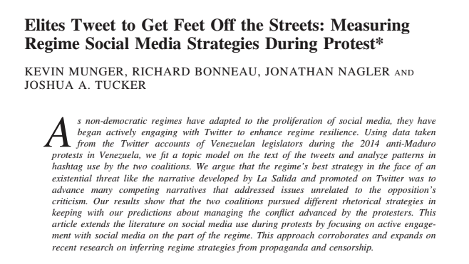
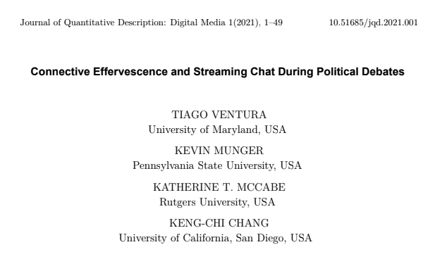
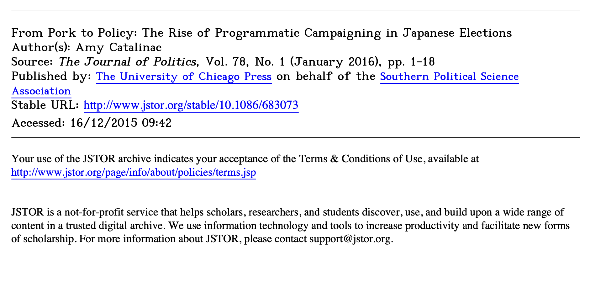
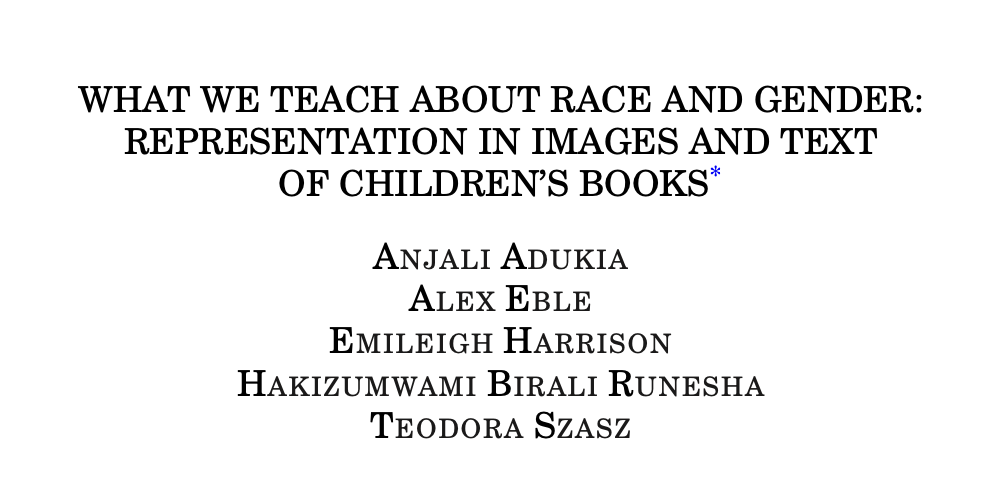
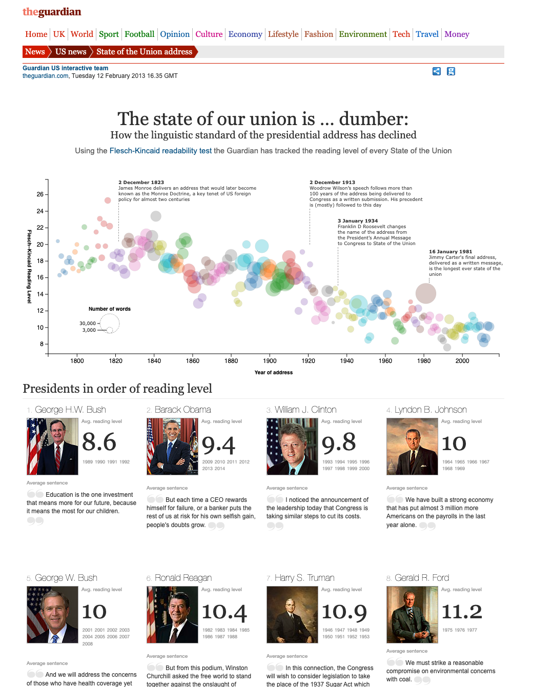
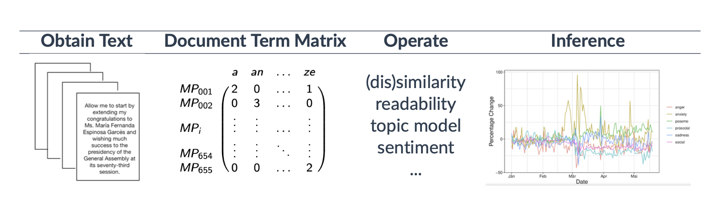
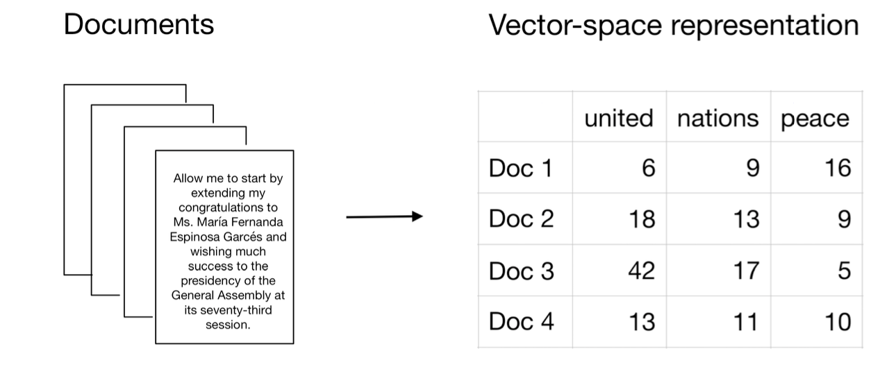

```{r}
#| include: false
knitr::opts_chunk$set(
  message = FALSE,
  warning = FALSE
)
```

## Introduction: "Text" as Data

Text as data focuses on using text as a form of data to make inferences about the world around us. Recently, there has been a dramatic change in the cost of analyzing large collections of text. Text data is abundant, and text has also become much easier to acquire. Computational power has also increased and can now handle much more. LLMs have also helped increase interest and made access easier to text analysis.

There are a lot of texts available for political science research. Examples of textual data include:

-   Official Documents : congressional speeches, bills, press releases, transcripts

-   News, comments, blogs, social media

-   UNGA, political speeches, conference documents, party manifestos, tweets…

### Some interesting works using TaD

```{r}
#| echo: false
#| out.width: "350px"


```

```{r}
#| echo: false
#| out.width: "350px"


```

```{r}
#| echo: false
#| out.width: "350px"


```

```{r}
#| echo: false
#| out.width: "350px"


```

```{r}
#| echo: false
#| out.width: "350px"


```

### A Classic Example: Mosteller and Wallace (1963)

**Mosteller, F., & Wallace, D. L. (1963). Inference in an authorship problem. *Journal of the American Statistical Association*, 58(302), 275–309.**

The disputed Federalist Papers had long been claimed by both James Madison and Alexander Hamilton (12 papers were contested). Mosteller and Wallace used function word frequencies — small, common words like "upon," "whilst," "enough," "also" — as the data, reasoning that authors unconsciously use these at characteristic rates regardless of topic. Their key findings:

-   Madison strongly preferred "whilst" while Hamilton preferred "while."
-   Madison used "upon" far less than Hamilton.

Using Bayesian statistical analysis on these word frequencies, they concluded all 12 disputed papers were almost certainly written by Madison.

It was groundbreaking for a few reasons. It was one of the first serious applications of statistical/computational methods to a humanities question, and it used a genuinely clever insight — that stylistic fingerprints hide in the boring little words, not the content words. It also made sophisticated use of Bayesian inference at a time when that wasn't common in applied work. The study has been revisited many times with more modern NLP methods, and the conclusion (Madison) has held up consistently.

## Text, text, text

What do you mean by using **"text" as evidence in political science research?** What are some things we should keep in mind going into this?

```{r}
#| echo: false
#| out.width: "350px"


```

### Overview of TaD methods

-   **Representing text : turn text into data**

    -   Bag-of-Words

    -   TF-IDF

    -   Vector space model

-   **Describing text : summarize patterns**

    -   word frequencies

    -   diversity and complexity

    -   similarity/distance

-   **Predicting or classifying text (supervised) : predict labels or positions**

    -   dictionaries

    -   classification

    -   scaling

-   **Discovering structure (unsupervised) : Find patterns without labels**

    -   Topic models(LDA)

    -   Clustering

    -   Embeddings

-   **Generating and interpreting text**

    -   Embeddings

    -   LLMs

### Obtain/build your corpus

-   corpus : a large set of texts or documents for analysis

-   **KNOW YOUR DATA**

    -   The key point is that text data is produced in **institutional contexts, for audiences, and often with strategic intent**.

### Biases in Text Data

-   **Resource bias**: groups with more resources generate and preserve more text.

-   **Incentive bias**: actors can be strategic and may hide, omit, or destroy costly records.

-   **Medium bias**: platform/genre (speech, memo, social media) shapes expression.

-   **Retrieval bias**: keyword-based or hand-curated corpus selection can miss important text.

-   Leah C. Windsor (2022), "Bias in Text Analysis for International Relations Research," *Global Studies Quarterly* 2(3).

    -   corpus selection often skews heavily toward English-language sources

    -   information deficiencies

    -   underdeveloped software for low-resource languages

-   Later...

    -   annotation bias: human-labeled data often reflects subjective interpretation and coding decisions

    -   model bias: models inherit and amplify biases from data and modeling choices

### Characteristics and Challenges in Text Analysis

#### Data properties

-   Many **unstructured data sources** (e.g., web scraped data, social media datasets) are flexible and abundant, but require preprocessing to extract meaningful insights.

-   Text is (extremely) **HIGH-DIMENSIONAL data.**

    -   Curse of dimensionality! : most traditional statistical techniques struggle with large vocabularies and sparse representations.

        -   Text representation converts text into numerical form while reducing complexity. Today's session (preprocessing and bag-of-words) focuses on this step.

-   **Dependence**

    -   Many statistical methods assume observations are independent, but this assumption is often violated in text data.

    -   Dependence arises at multiple levels:

        -   **Within documents**: words and sentences are structured and correlated.

        -   **Within actors**: texts from the same speaker share vocabulary and framing.

        -   **Over time**: language responds to events and evolves dynamically.

        -   **Across actors**: texts are often strategic responses to others.

    -   As a result, text data are rarely independent observations, which has important implications for inference and model evaluation.

#### From Theory to Measurement

-   Most social science theories involve relatively low-dimensional concepts

    -   To test these theories, we need to construct measures from high-dimensional and unstructured text:

        -   we must construct measures that map text into these concepts

        -   e.g., classifying a person's posts as conservative, centrist, or liberal.

    -   This involves working in a **latent space**, where:

        -   the concepts are not directly observed (e.g. ideology, sentiment, political stance)

        -   but inferred from textual patterns

#### Modeling Perspective

-   Although the process is iterative, determining whether a model is the "right" one depends heavily on the research question. Therefore, the iteration should still be guided by the research question.

    > "Yet even the most theoretically well-developed methods have few theorems that relate the performance of the method back to natural language as it is spoken or tie performance to particular social science tasks. We always work with representation of the text, rather than the spoken language itself. So, even if we assume that there are structural parameters that govern how text is constructed, the statistical properties are prove conditioning on a (generally very simplified) representation of the text and are relevant to tasks that may not quite align with our uses in the social sciences." @grimmer2022

#### Ethical/legal constraints

-   privacy and personal data

-   informed consent

-   platform policy

-   data storage and sharing

### From Text to Numerical Representation

```{r}
#| echo: false
#| out.width: "350px"


```

Document Term Matrix (*document-feature matrix, DFM in quanteda package*)

:   A matrix where rows = documents; columns = terms (words or tokens). Each cell contains the frequency or weight of a term within a document.

    The simplest and most foundational representation.

    Each cell stores the count of a feature in a document. In a bag-of-words representation, word order is ignored, and most cells are zero, so you can imagine the matrix is typically very sparse.

doc 1: "We study TAD"

doc 2: "TAD is fun"

-   Identify features (extract unique words/tokens to form matrix columns)

    -   vocabulary : (We, study, TAD, is, fun)

-   Construct DTM (Counts per Feature)

    | Document | We  | study | TAD | is  | fun |
    |----------|-----|-------|-----|-----|-----|
    | Doc 1    | 1   | 1     | 1   | 0   | 0   |
    | Doc 2    | 0   | 0     | 1   | 1   | 1   |

## PDF vs Text Files

Working with PDF sources requires additional preprocessing. See [I Tested 7 Python PDF Extractors So You Don't Have To (2025 edition)](https://onlyoneaman.medium.com/i-tested-7-python-pdf-extractors-so-you-dont-have-to-2025-edition-c88013922257) for a practical comparison of extraction tools.

## Exercises

Think about your research question before preprocessing. For example, in the Hamilton vs. Madison authorship case or sentiment analysis using emojis and exclamation marks, stopwords may be crucial.

-   The order of preprocessing steps matters.

-   Preprocessing choices affect the results of downstream analyses, so it is useful to try different combinations.

You can download the dataset used in this session: [`toy_dataset_100.csv`](Minha%20Kim%20and%20Samirah/toy_dataset_100.csv)

### Preprocessing (R)

```{r, message=FALSE, warning=FALSE}
# NB: `quanteda` is not the only package to work with text in R. Other competitors are tm, text2vec, and even base R.
# These packages follow a similar logic for processing text data.
pacman::p_load(readr, quanteda, dplyr, tidytext, stringr, quanteda.textstats)
```

Let's explore the data! For demonstration purposes, we made a toy dataset with just 100 tweets for now, but for much larger datasets, you can use `glimpse()` to check where the text is stored in your dataset. You can also first sample the dataset to explore.

```{r}
#| results: "hide"
tweets <- read_csv("Minha Kim and Samirah/toy_dataset_100.csv")
head(tweets)
```

```{r}
#| results: "hide"
# Length of a string
length(tweets$text)

# Length of the string
nchar(tweets$text[1:10]) # counts number of characters in each tweet

# Mathematical functions
max(nchar(tweets$text[1:10]))  # longest tweet
min(nchar(tweets$text[1:10]))  # shortest
mean(nchar(tweets$text[1:10])) # average
```

If you would like to combine your text into ONE string,

```{r}
#| results: "hide"
#paste0(tweets$text[1:10], collapse = "\n") # inserts \n (newline) between each
paste("one", "two")  # default: adds a space between elements
paste0("one", "two") # no separator

# you can use this to go back and forth between sentence-level / paragraph-level / full document
```

You can do a bit of detection tasks with the stringr package.

```{r}
#| results: "hide"
#?stringr
# Detect patterns: `str_detect()`
str_detect(tweets$text, regex("trump", ignore_case = TRUE)) # does this tweet contain 'trump'?

# Count occurrences: `str_count()`
str_count(tweets$text[1:10], "trump") # counts how many times 'trump' appears in each tweet

# Extract handles
str_extract_all(tweets$text[1:100], "@[0-9_A-Za-z]+", simplify = TRUE) # str_extract() returns first match

# Extract hashtags
str_extract_all(tweets$text[1:100], "#(\\d|\\w)+", simplify = TRUE)
# \\w = "word character"; you can actually just write "#\\w+" for both handles and hashtags because it includes all letters, digits and underscore
```

Or with tidyverse:

```{r}
#| results: "hide"
# Detect all tweets that mention Trump
tweets %>%
  mutate(trump = str_detect(str_to_lower(text), "trump")) %>%
  filter(trump == TRUE)
```

Creating a corpus:

```{r}
#| results: "hide"
# Convert to a corpus. You need to identify the text field
tweets_corpus <- corpus(tweets, text_field = "text")

# See the output
summary(tweets_corpus, n = 5)
class(tweets_corpus)
```

With quanteda, preprocessing is applied to the tokenized version of the text. So the corpus stays as the original text collection, and you do cleaning steps on tokens or later on the dfm.

Tokenization:

```{r}
#| results: "hide"
tweets_tokens <- tokens(tweets_corpus)
tweets_tokens
length(tweets_tokens[[1]]) # how many tokens are in the first doc
str(tweets_tokens)         # the internal structure of the token object
```

For demonstration purposes, this process is applied to only a single tweet below:

```{r}
#| results: "hide"
cat("Original:\n")
tokens(tweets_corpus[[2]]) # lets see the first tweet tokenized, without much cleaning
# Note that these are not cumulative unless you pipe
# Remove punctuation
cat("\nNo punctuation:\n")
tokens_clean_1 <- tokens(tweets_corpus[[2]], remove_punct = TRUE)
tokens_clean_1

# Remove numbers
cat("\nNo punctuation + numbers:\n")
tokens_clean_1 <- tokens(tweets_corpus[[2]], remove_punct = TRUE, remove_numbers = TRUE)
tokens_clean_1
# Convert to lowercase
tokens_clean_1 <- tokens(tweets_corpus[[2]], remove_punct = TRUE, remove_numbers = TRUE) %>%
  tokens_tolower()
tokens_clean_1

#str_remove_all("http\\S+|www\\S+") %>%   # remove URLs
#  str_remove_all("@\\w+") %>%             # remove mentions
#  str_remove_all("\\brt\\b") %>%          # remove RT
#  str_remove_all("[^\\x00-\\x7F]+") %>%   # remove emojis
#  str_squish()                            # fix whitespace
```

Stopwords

```{r}
#| results: "hide"
# What are stopwords?
stopwords("english")

# Stopwords in other languages?
stopwords("german")

tokens(tweets_corpus[[1]], remove_punct = TRUE, remove_numbers = TRUE) %>%
  tokens_tolower() %>%
  tokens_remove(stopwords("en"))

# Add custom stopwords
tokens(tweets_corpus[[1]], remove_punct = TRUE, remove_numbers = TRUE) %>%
  tokens_tolower() %>%
  tokens_remove(c(stopwords("en"), "rt", "amp"))
```

Stemming

```{r}
#| results: "hide"
tokens(tweets_corpus[[1]], remove_punct = TRUE, remove_numbers = TRUE) %>%
  tokens_tolower() %>%
  tokens_remove(c(stopwords("en"), "rt", "amp")) %>%
  tokens_wordstem()

# Stemming is available in multiple languages:
tokens_wordstem(tokens("esto es un ejemplo"), language = "es")
tokens_wordstem(tokens("isso é um exemplo"), language = "pt")
tokens_wordstem(tokens("c'est un exemple"), language = "fr")

# Lemmatization reduces words to their dictionary base form, and is linguistically more accurate.
# You can use textstem for lemmatization in R.
# More advanced lemmatization is available through tools like udpipe.
```

For n-grams, let's use the full tweet corpus.

```{r}
#| results: "hide"
# First, create token object for the full tweet corpus without punctuation
tokens_nopunc <- tokens(tweets_corpus, remove_punct = TRUE)

# Create bigrams instead of unigrams
tokens_bigrams <- tokens_ngrams(tokens_nopunc, n = 2)
tokens_bigrams

custom_bigrams <- list(c("united", "states"), c("white", "house"), c("house", "of", "representatives")) # trigram
tokens_custom <- tokens_compound(tweets_tokens, pattern = custom_bigrams) # Unlike tokens_ngrams(), tokens_compound() combines only the phrases you specify. Very useful!
tokens_custom
```

```{r}
#| results: "hide"
tokens(tweets_corpus, remove_punct = TRUE, remove_numbers = TRUE) %>%
  tokens_tolower() %>%
  tokens_remove(c(stopwords("en"), "rt", "amp")) %>%
  tokens_ngrams()
```

Identifying meaningful n-grams

```{r}
#| results: "hide"
pacman::p_load(quanteda.textstats)
# Pre-process tokens once
t_tweets <- tokens(tweets_corpus, remove_punct = TRUE, remove_numbers = TRUE) %>%
  tokens_tolower() %>%
  tokens_remove(c(stopwords("en"), "rt", "amp"))

# Create bigrams
tokens_ngrams(t_tweets, n = 2) # converts the tokens into sequences of words (n-grams)

# Identify collocations: which words appear together more often than expected by chance?
textstat_collocations(t_tweets) %>%
  arrange(-lambda) %>%
  slice(1:5)

# Compound selected multiword expressions
tokens_ex <- t_tweets %>%
  tokens_compound(list(c("high", "school"), c("press", "conference")))

# Check if it works
str_subset(unname(unlist(tokens_ex)), "high_school|press_conference")
```

You can also reduce complexity by removing words that are very rare (or sometimes, very common). In quanteda, frequency-based trimming must happen AFTER creating the DFM.

```{r}
#| results: "hide"
# Create document-feature matrix
dfm_tweets <- dfm(t_tweets)

# Remove rare and overly common words
dfm_trimmed <- dfm_trim(
  dfm_tweets,
  min_docfreq = 2
)

# Compare size
nfeat(dfm_tweets)
nfeat(dfm_trimmed)
```

#### Packages for different languages in R

-   Chinese : jiebaR, quanteda

-   German, French, Spanish : quanteda, stopwords, SnowballC

-   Russian/Arabic/Swahili : udpipe (useful for cross-language)

**Some things to note when doing research in different languages:**

-   In English, distinct words are separated using whitespace → tokenization involves splitting the text up by whitespace

    -   In Chinese, for example, when I wanted to study "人权(human rights)",

        -   in the documents there were: "起诉人权利(plaintiff's rights)," "债权人权益(creditor's rights/interests)," "辩护人权某某((defense counsel Quan...)"

-   There is nothing about these methods that is inherently "English," but there are assumptions about how words "work"

    -   Chinese: no spaces between words (Stanford word segmenter for Chinese)

    -   Arabic and Hebrew: right-to-left text

    -   German: compound words

    -   Cyrillic scripts: variations in encoding

    -   etc.

    -   You need to rely on your own knowledge of the specific language and explore using open science resources and GitHub.

### Bag of Words (R)

The **bag-of-words** approach represents text as a vector of word counts. It ignores grammar, word order, and sentence structure — treating a document simply as a "bag" of words. For example, "America supports climate policy" and "climate policy supports America" produce the same representation. Although more advanced techniques exist, bag-of-words remains widely used because it is simple, interpretable, and computationally efficient.

-   Bag-of-Words assumes word order does not matter, words are independent, and meaning comes from frequency.

-   Very sensitive to preprocessing choices, because each unique token becomes a feature.

-   Even though more advanced methods exist, they all rely on representing text as vectors.

    -   Wordfish, Wordscores, Topic modeling (LDA) use bag-of-words representations

    -   Embeddings (Word2Vec, BERT) move beyond bag-of-words (but still vector representations)

```{r}
#| results: "hide"
# Example documents
docs <- c(
  "The United States supports climate policy",
  "Climate policy matters for the United States",
  "Congress debates climate legislation"
)

# Create a corpus
docs_corpus <- corpus(docs)

# Tokenize
docs_tokens <- tokens(docs_corpus, remove_punct = TRUE, remove_numbers = TRUE) %>%
  tokens_tolower()

docs_tokens

# Create document-feature matrix
docs_dfm <- dfm(docs_tokens)
docs_dfm

# See the vocabulary (features: all unique words used across the corpus)
featnames(docs_dfm)

# Convert to a regular matrix if we want to use general statistical or machine learning tools
convert(docs_dfm, to = "matrix")
```

With our tweet corpus:

```{r}
#| results: "hide"
# Create DFM from cleaned tweet tokens
dfm_tweets <- dfm(t_tweets)
dfm_tweets

# Show feature names
featnames(dfm_tweets)

# Convert to matrix
tweets_bow <- convert(dfm_tweets, to = "matrix")
tweets_bow[1:5, 1:10]
```

### Text Similarity (R)

After converting text into vectors, we can compare documents mathematically. Two common methods are cosine similarity and Euclidean distance.

#### Cosine Similarity

```{r}
#| results: "hide"
# Cosine similarity using quanteda
textstat_simil(dfm_tweets, method = "cosine")
#matrix version (optional)
#cos_sim <- textstat_simil(dfm_tweets, method = "cosine")
#as.matrix(cos_sim)[1:5, 1:5]
```

#### Euclidean Distance

```{r}
#| results: "hide"
textstat_dist(dfm_tweets, method = "euclidean")
```

## Python Exercises

The exercises below mirror the R workflow above, implemented in Python using `gensim`, `spaCy`, and `scikit-learn`. Run them in the [Colab environment](https://colab.research.google.com/drive/1CzvVGQdJZbfAwgGSzIq7umDXe71-4nVZ?usp=sharing); upload `toy_dataset_100.csv` when prompted.

### Setup and Data Loading

```python
import pandas as pd

# Upload toy_dataset_100.csv to Colab, then load it
file_path = "/content/toy_dataset_100.csv"
df = pd.read_csv(file_path)
df.head()
```

### Preprocessing

Text data preprocessing should generally follow this order: noise removal (HTML, URLs) → case normalization (lowercase) → tokenization (split into words) → punctuation/stop-word removal → stemming/lemmatization.

Note: **whitespace** characters — spaces, tabs, and newlines — play a critical role in how text is stored, interpreted, and processed.

#### Using Gensim

**Gensim** is a Python library for analyzing large collections of text. It provides efficient tools for tasks like topic modeling (e.g., LDA) and learning semantic word relationships through embeddings such as Word2Vec and Doc2Vec. It is particularly useful when working with large corpora because it processes text in a memory-efficient way.

```python
import pandas as pd
import re
import gensim

from gensim.parsing.preprocessing import (
    strip_punctuation,
    strip_multiple_whitespaces,
    strip_numeric
)

# Extract tweets
texts = df["text"].astype(str).to_list()

# Function to clean tweets
def clean_tweet(text):
    text = text.lower()                          # lowercase
    text = re.sub(r"http\S+|www\S+", "", text)  # remove URLs
    text = re.sub(r"@\w+", "", text)            # remove @mentions
    #text = re.sub(r"#(\w+)", r"\1", text)       # remove hashtag symbol but keep word
    #text = re.sub(r"[^\x00-\x7F]+", "", text)   # remove emojis
    text = strip_punctuation(text)              # remove punctuation
    text = strip_numeric(text)                  # remove numbers
    text = strip_multiple_whitespaces(text)     # fix whitespace
    return text.strip()

# Apply cleaning
clean_text = [clean_tweet(t) for t in texts]

# Tokenize
tokenized_docs = [t.split() for t in clean_text]

# Compare before and after
print("ORIGINAL:")
print(texts[2])
print("\nCLEANED:")
print(clean_text[2])
print("\nTOKENIZED:")
print(tokenized_docs[2])
```

```python
for i in range(3):
    print(f"--- Tweet {i+1} ---")
    print("ORIGINAL:", texts[i])
    print("CLEANED:", clean_text[i])
    print("TOKENS:", tokenized_docs[i])
    print()
```

#### Dimension Reduction and Frequency Screening

```python
from collections import Counter

# Flatten the list of tokenized tweets
all_words = []
for doc in tokenized_docs:
    all_words.extend(doc)

# Count word frequencies
word_freq = Counter(all_words)

# Show the 20 most common words
word_freq.most_common(20)
```

#### Using spaCy

**spaCy** is a full NLP library focused on linguistic structure, providing tools for tokenization, part-of-speech tagging, named entity recognition, and lemmatization. In practice, spaCy is often used for **cleaning and annotating text**, while Gensim is used for **analyzing patterns and representations in large text corpora**.

```python
import spacy
from spacy.lang.en.stop_words import STOP_WORDS

nlp = spacy.load("en_core_web_sm")
```

You can prevent country names from being treated as stop words using the `pycountry` library:

```python
import pycountry

countries = {country.name.lower() for country in pycountry.countries}
extra_countries = {"usa", "u.s.", "us", "uk", "america"}
countries = countries.union(extra_countries)

for country in countries:
    STOP_WORDS.discard(country)
    nlp.vocab[country].is_stop = False
```

You can also add custom stop words:

```python
new_stopwords = {"move"}

for word in new_stopwords:
    STOP_WORDS.add(word)
    nlp.vocab[word].is_stop = True
```

Preprocessing tweets with spaCy (tokenization, lemmatization, stop-word removal):

```python
def preprocess_tweet_spacy(text):
    text = text.lower()
    text = re.sub(r"http\S+|www\S+", "", text)   # remove URLs
    text = re.sub(r"@\w+", "", text)             # remove mentions
    text = re.sub(r"\brt\b", "", text)           # remove RT
    text = re.sub(r"#(\w+)", r"\1", text)        # keep hashtag word
    text = re.sub(r"[^\x00-\x7F]+", "", text)    # remove emojis
    return text

clean_docs = []

for doc in nlp.pipe([preprocess_tweet_spacy(t) for t in texts]):
    tokens = [
        token.lemma_.lower()
        for token in doc
        if not token.is_stop
        and not token.is_punct
        and not token.like_num
        and token.is_alpha
    ]
    clean_docs.append(tokens)

print("ORIGINAL:")
print(texts[2])
print("\nSPACY TOKENS:")
print(clean_docs[2])
```

### N-Grams

An **n-gram** is a sequence of *n* consecutive words in a text. A **unigram** is a single word, a **bigram** is a two-word phrase, and a **trigram** is a three-word phrase. While unigrams capture individual word frequency, n-grams help identify meaningful phrases that carry more context. For example, the words *"united"* and *"states"* separately may not reveal much, but the bigram *"United States"* represents a specific political actor. In political text analysis, n-grams are useful for detecting recurring concepts, slogans, or policy phrases such as *"climate change"* or *"border security."*

```python
from nltk.util import ngrams

# Filter for US-related tweets
us_tweets = df[
    df["text"].str.contains(r"\b(?:US|U\.S\.|USA|United States)\b", case=False, na=False)
]["text"].head(5)

# Clean and tokenize the 5 US-related tweets
us_tokenized = [clean_tweet(t).split() for t in us_tweets]

# Use the first tweet as the example
example_tokens = us_tokenized[0]

unigrams = [" ".join(g) for g in ngrams(example_tokens, 1)]
bigrams  = [" ".join(g) for g in ngrams(example_tokens, 2)]
trigrams = [" ".join(g) for g in ngrams(example_tokens, 3)]

print("UNIGRAMS:")
print(unigrams[:10])
print("\nBIGRAMS:")
print(bigrams[:10])
print("\nTRIGRAMS:")
print(trigrams[:10])
```

#### Top N-Grams from All Tweets

```python
from collections import Counter
from nltk.util import ngrams

def get_top_ngrams(docs, n=1, top_k=10):
    all_ngrams = []
    for doc in docs:
        all_ngrams.extend(list(ngrams(doc, n)))
    counts = Counter(all_ngrams)
    return [(" ".join(gram), count) for gram, count in counts.most_common(top_k)]

print("Top unigrams:")
print(get_top_ngrams(clean_docs, n=1, top_k=10))
print("\nTop bigrams:")
print(get_top_ngrams(clean_docs, n=2, top_k=10))
print("\nTop trigrams:")
print(get_top_ngrams(clean_docs, n=3, top_k=10))
```

#### Matching Multi-Word Entities

```python
from spacy.matcher import PhraseMatcher

phrases = ["United States", "House of Representatives", "Supreme Court"]

matcher = PhraseMatcher(nlp.vocab, attr="LOWER")
patterns = [nlp.make_doc(text) for text in phrases]
matcher.add("POLITICAL_PHRASES", patterns)

def merge_phrases(text):
    doc = nlp(text)
    matches = matcher(doc)
    with doc.retokenize() as retokenizer:
        for match_id, start, end in matches:
            retokenizer.merge(doc[start:end])
    return doc

# Test
text = "The United States and the House of Representatives are debating climate change policy."
doc = merge_phrases(text)
[token.text for token in doc]
```

#### Multilingual NLP

Several libraries support non-English text analysis:

-   **spaCy** — pretrained models for Spanish, German, French, Chinese, and more; supports tokenization, POS tagging, and NER.

-   **NLTK** — multilingual corpora and basic text processing tools; primarily useful for teaching.

-   **Stanza (Stanford NLP)** — supports 60+ languages with tokenization, POS tagging, and dependency parsing.

-   **Hugging Face Transformers** — multilingual transformer models (mBERT, XLM-RoBERTa) covering dozens to hundreds of languages.

### Bags of Words (Python)

The bag-of-words approach represents text by counting how often each word appears in a document. It ignores grammar, word order, and sentence structure. For example, "America supports climate policy" and "climate policy supports America" produce the same bag-of-words representation because they contain the same words.

```python
from sklearn.feature_extraction.text import CountVectorizer

# Example tweets
docs = [
    "The United States supports climate policy",
    "Climate policy matters for the United States",
    "Congress debates climate legislation"
]

vectorizer = CountVectorizer()
bow_matrix = vectorizer.fit_transform(docs)

print("Vocabulary:")
print(vectorizer.get_feature_names_out())
print("\nBag of Words Matrix:")
print(bow_matrix.toarray())
```

### Text Similarity (Python)

Text similarity measures how similar two documents are based on their word representations. After converting text into vectors, we can compare documents mathematically. Two common methods are cosine similarity and Euclidean distance.

#### Cosine Similarity

Cosine similarity measures the similarity between two documents by comparing the angle between their vectors. It ranges from 0 to 1, where 1 = identical documents and 0 = completely different. It focuses on word patterns, not document length.

Returning to Mosteller & Wallace: **cosine similarity** ignores the length of the vectors and only cares about their direction (the angle between them). Two documents that use "upon" and "whilst" in the same ratio will point in the same direction, even if one is twice as long. This is why it is preferred in most text analysis — you are comparing style, not volume.

```python
from sklearn.metrics.pairwise import cosine_similarity

similarity = cosine_similarity(bow_matrix)
print("Cosine Similarity Matrix:")
print(similarity)
```

#### Euclidean Distance

Euclidean distance measures the straight-line distance between two document vectors. Smaller values indicate more similar documents, while larger values indicate greater differences. Unlike cosine similarity, Euclidean distance is influenced by document length and word counts.

In the Mosteller & Wallace context, **Euclidean distance** is the straight-line gap between two points on a scatter plot of word frequencies. The disputed paper lands close to Madison's cluster and far from Hamilton's. The limitation: it is sensitive to document length. A longer document will have higher raw counts on every word, pushing points further from the origin even if the style is identical.

```python
from sklearn.metrics.pairwise import euclidean_distances

distance = euclidean_distances(bow_matrix)
print("Euclidean Distance Matrix:")
print(distance)
```

## References

::: {#refs}
:::

### Special Thanks

The authors of this document would like to express special thanks to Professor Tiago Ventura and Nejla Asimovic of Georgetown University, and YaoYao Dai of the University of Pittsburgh. This document and the Colab code draw on materials from their lectures.
