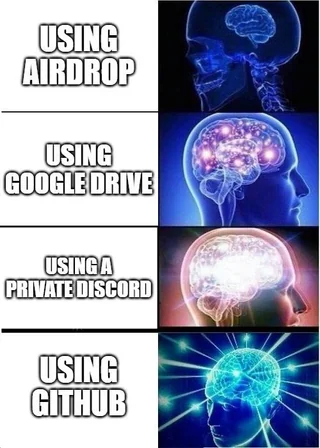
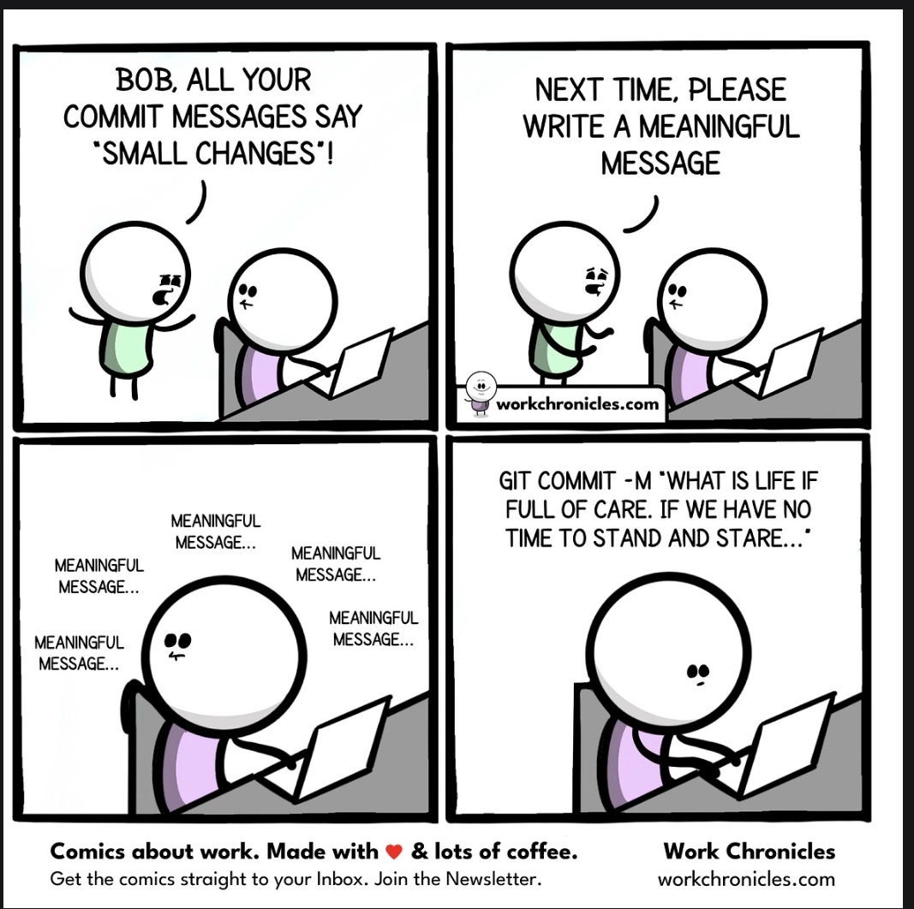

A project has to survive two journeys: **across time**, so that the you of next
November can re-run what the you of this September wrote, and **across space**, so
that it runs on a machine that is not yours. This session is about the three
habits that get it there: a project layout that travels, a version history that
explains itself, and, as a payoff, a website that publishes itself from the same
repository.

::: {.content-visible when-format="html"}
```{=html}
<iframe
  src="../slides/11-reproducible-research.html"
  title="Across Time and Space — session slides"
  loading="lazy"
  allowfullscreen
  style="width:100%; aspect-ratio:16/9; margin:1rem 0 .5rem; border:1px solid var(--gm-rule); border-radius:6px;">
</iframe>
```

[Open the slides full screen](../slides/11-reproducible-research.html)
:::

::: {.content-visible when-format="pdf"}
Session slides:
<https://govtmethods.github.io/methodsbrownbag/slides/11-reproducible-research.html>
:::

::: {.callout-note collapse="true"}
## Previous Edition

This session consolidates two earlier ones. They ran in Season 1 as separate
sittings and are kept as the record of when the material was first taught:

- [File Management and Workflow](01-intro.html) — 29 August 2025
- [Version Control with Git and Github](02-github.html) — 4 September 2025

The material here is similar. What is new is the sequence: one pass from a
folder on your laptop to a site on the web, ending with the website those two
chapters never reached.
:::


::: {.callout-tip collapse="true" #setup}

### Setup

Do this **before** the session. It takes about 8 minutes.

**1. Make a Github account.** Sign up at
[github.com/signup](https://github.com/signup). Use an email you will still have
after you graduate; a personal address is safer than the Georgetown one.

**2. Install git.**

- **MacOS**: open Terminal and type `git`. If a list of commands appears, git is
  already installed and you are done. If a box pops up offering to install the
  Command Line Developer Tools, accept it. Otherwise install from
  [git-scm.com/downloads/mac](https://git-scm.com/downloads/mac).  
- **Windows**: install from
  [git-scm.com/downloads/win](https://git-scm.com/downloads/win) and accept every
  default. When it finishes, right-click inside any folder and look for **Git Bash
  Here**. On Windows 11 it may sit under `Show more options`.  

The [git
book](https://git-scm.com/book/en/v2/Getting-Started-Installing-Git) has detailed
instructions for every platform.

**3. Open a terminal.** This is the one step that looks different on the two
systems. Everything you type after it is the same on both.

- **In RStudio, either system**: look at the bottom left pane. There is a
  **Terminal** tab sitting next to **Console**. If it is not there, click
  `Tools > Terminal > New Terminal`, or press `Shift + Alt + T` on Windows and
  `Shift + Option + T` on Mac.  
- **Windows, one extra check**: RStudio's terminal can open as Command Prompt or
  PowerShell rather than Git Bash. Part 2 assumes Git Bash, and some of its
  commands behave differently elsewhere. Go to
  `Tools > Global Options > Terminal`, set **New terminals open with:** to
  **Git Bash**, then close the Terminal tab and open a new one.  
- **Without RStudio**: on Mac press `Cmd + Space`, type `Terminal`, press Enter.
  On Windows, right-click inside any folder and choose **Git Bash Here**.  

Type `git --version` and press Enter. If it prints a version number, you are in
the right place and git is installed.

**4. Tell git who you are.** Type these two lines in the terminal, one at a time,
using the same email as step 1. They are identical on Windows and Mac:

`git config --global user.name "Your Name"`

`git config --global user.email "you@example.com"`

Git stops at your first commit and asks for these if they are missing. The email
is what links a commit to your Github profile, so it has to match.

**5. Set up authentication.** Github stopped accepting your account password for
git operations in 2021, so `git push` needs a **personal access token** instead.
The token is a long string that you use in place of a password. From the RStudio
console:

```r
install.packages("usethis")

# Opens Github in your browser with the right boxes already ticked.
# Click "Generate token" at the bottom, then copy the token.
usethis::create_github_token()

# Paste the token when this asks for it. It is stored securely,
# so you only do this once per computer.
gitcreds::gitcreds_set()
```

Copy the token before you leave that browser tab. Github shows it once and never
again; if you lose it, make a new one.

**6. Check it worked.** Run `usethis::git_sitrep()` in the console. It prints your
name, your email, and whether Github accepts your token.

If something goes wrong, [Happy Git and GitHub for the
useR](https://happygitwithr.com/) is the reference for doing all of this from R.

::: 


## Why Programming or Coding? (Revisiting)

Coding is about formalizing your thinking about how you treat the data
and automating the formalization task to be done repetitively. It
improves efficiency, enhances reproducibility, and boosts creativity
when it comes to finding new patterns in your data.

Benchmarks for reproducible data and statistical analyses:[^repro-1]

[^repro-1]: Inspired by the summary provided by Prof [Aaron
    Williams](https://aaronrwilliams.com/about)' course on Data Analysis
    offered at McCourt School. Strongly recommended to learn good coding
    using R

1.  **Accuracy**: Write a code that reduces the chances of making an
    error and lets you catch one if it occurs.
2.  **Efficiency**: If you are doing it twice, see the pattern of your
    decision-making and formalize it in your code. *Difference between
    Excel and coding*
3.  **Replicate-and-Reproduce**: Ability to repeat the computational
    process which reflects your thinking and decisions that you took
    along the way. Improves transparency and forces one to be deliberate
    and responsible about choices during analyses.\
4.  **Human Interpretability**: Writing code is not just about analyzing
    but allowing yourself and then others to be able to understand your
    analytic choices.\
5.  **Public Good**: Research is a public good. And the code allows your
    research to be truly accessible. This means you write a code that
    anyone else who understands the language can read, reuse, and
    recreate without you being present. We essentially ensure that by
    writing a readable and ideally publicly accessible code.

## Reproducible and Replicable

These two words get used interchangeably. They are not the same thing, and the
difference decides what this session can and cannot do for you.

| | What you need | What counts as success |
|------------------|--------------------------------|-----------------------------|
| **Reproducible** | Same data, same code | You get the **same** numbers |
| **Replicable** | New data, same design | You get **consistent** findings |

The problem is not hypothetical. In a survey by *Nature*, most researchers said
they had failed to reproduce someone else's result, and more than half had failed
to reproduce their own [@baker2016]. The National Academies settled the
terminology in 2019: reproducibility is computational, replicability is empirical
[@nasem2019].

Everything below is about the first one. Folder structure, `here()`, and git make
your work reproducible. Replicability is a question about design and measurement,
and that is a different session. It is still the precondition, though: a finding
nobody can regenerate from its own data and code cannot really be replicated
either, because there is no way to tell what was done [@king1995].

### Why this sits at the centre of transparency

Reproducibility is not a virtue on its own. It is the part of research
transparency that you can actually hand to somebody else. The American Political
Science Association's account of transparency has three parts
[@elmanTransparentSocialInquiry2018]:

-   **Data access** --- making available to others the data on which empirical
    claims in published research rest;
-   **Production transparency** --- clearly explicating the most relevant aspects
    of the data generation process; and
-   **Analytic transparency** --- conveying the processes through which data were
    analysed to produce claims and conclusions.

The first two are decisions about what you are able and willing to share. The
third is a question about craft, and a project built the way this chapter
describes is most of the answer to it. The folder structure, the paths, and the
commit history together are the record of how your data became your claim.

One caution about the words themselves. Fields swap them
[@barbaTerminologiesReproducibleResearch2018]: what we are calling *reproducible*
here --- same data, same code, same result --- is what some literatures call
*replicable*, and the other way around. The table above is the usage followed
throughout this chapter.

## Part 1 — File Management and Folder Structuring

### Understanding Absolute and Relative Paths

When working with files in any programming environment, paths specify
the location of files and folders. These paths can be absolute or
relative, and the choice between them significantly impacts
reproducibility, portability, and ease of collaboration

**Absolute Paths** An absolute path provides the complete address of a
file or folder, starting from the root directory of the file system. It
tells the software exactly where to find a file, regardless of where the
script is run.

Example: C:/Users/YourName/Documents/Project/Data/raw_data.dta

**Relative Paths** A relative path specifies the location of a file or
folder relative to a "base directory" (e.g., the project's working
directory). It does not start from the root directory but instead is
calculated based on the location of the script.

Suppose your working directory is set to:
`C:/Users/YourName/Documents/Project`

Then, a relative path might look like: `Data/raw_data.dta`

::: callout-note
#### Practical analogy

Think of absolute and relative paths like giving directions to a house:

**Absolute path:** “Go to the main city square, then take the highway north,
turn right at the first traffic light, and find the house at 123 Main Street.”
Works for people starting anywhere, but requires detailed instructions specific
to the city.

**Relative path:** “From the library, walk two blocks north, then turn left. The
house is the second one on the right.” Simpler and context-aware, but assumes
everyone starts from the library.
:::

**Key Differences Between Absolute and Relative Paths**

| **Feature** | **Absolute Path** | **Relative Path** |
|------------------|----------------------------------|---------------------|
| **Starting Point** | Starts from the root directory of the file system. | Starts from the current working directory. |
| **Portability** | Not portable—specific to the user's system. | Highly portable—adapts to different systems. |
| **Ease of Sharing** | Harder to share; others must update paths. | Easier to share; no changes needed if structure is consistent. |
| **Use Case** | Best for fixed environments or one-off scripts. | Ideal for collaborative and reproducible projects. |
| **Flexibility** | Breaks if the file is moved or the system changes. | Adapts as long as the folder structure remains consistent. |

```{r}
#| label: fig-repro-paths
#| echo: false
#| fig-width: 9
#| fig-height: 5
#| fig-cap: |
#|   Both routes end at the same file. The relative one starts counting at the
#|   project folder, which is why it still works on a machine that is not yours.

ABS  <- "#b5462f"; REL <- "#1f5ea8"
ink  <- "#1f2d3a"; muted <- "#4a5560"
rule <- "#c9c9c4"; panel <- "#fbfbf9"; soft <- "#e8e7e1"
LEFT <- 4; RIGHT <- 96; GAP <- 1.5; PAD <- 3.6

S1 <- c("C:", "Users", "YourName", "Documents", "Project", "Data", "raw_data.dta")
S2 <- c("D:", "phd", "shared", "Project", "Data", "raw_data.dta")

# One type scale for both rows, so the shared tail lands at identical x.
fit_cex <- function(rows, cap = 0.95) {
  need <- sapply(rows, function(s)
    (RIGHT - LEFT - length(s) * PAD - (length(s) - 1) * GAP) /
      sum(strwidth(s, cex = 1, family = "mono")))
  min(c(need, cap))
}

chain <- function(segs, y, h, from, cex) {
  w     <- strwidth(segs, cex = cex, family = "mono") + PAD
  total <- sum(w) + GAP * (length(segs) - 1)
  x0    <- RIGHT - total + c(0, cumsum(head(w, -1) + GAP))
  x1    <- x0 + w
  for (i in seq_along(segs)) {
    rect(x0[i], y - h / 2, x1[i], y + h / 2,
         col = if (i >= from) soft else "white", border = rule, lwd = 1)
    text((x0[i] + x1[i]) / 2, y, segs[i], cex = cex, family = "mono", col = ink)
    if (i < length(segs))
      text(x1[i] + GAP / 2, y, "/", cex = cex, family = "mono", col = muted)
  }
  list(x0 = x0, x1 = x1)
}

bracket <- function(xa, xb, y, col, lab, broken = FALSE, lty = 1) {
  segments(xa, y, xb, y, col = col, lwd = 2.4, lty = lty)
  segments(c(xa, xb), y, c(xa, xb), y + 1.5, col = col, lwd = 2.4)
  if (broken) points((xa + xb) / 2, y, pch = 4, col = col, cex = 1.6, lwd = 3.2)
  text(xa, y - 3.0, lab, col = col, cex = 0.78, adj = 0, font = 2)
}

op <- par(mar = c(0, 0, 0, 0), xaxs = "i", yaxs = "i")
plot.new(); plot.window(c(0, 100), c(0, 100))
rect(0, 0, 100, 100, col = panel, border = NA)
cx <- fit_cex(list(S1, S2))

text(LEFT, 93, "On your computer", col = ink, cex = 0.98, adj = 0, font = 2)
p1 <- chain(S1, 83, 7.2, 5, cx)
text((p1$x0[5] + p1$x1[5]) / 2, 76, "\u2191 .RProj", col = muted, cex = 0.68)
bracket(p1$x0[1], p1$x1[7], 70, ABS, "Absolute \u2014 starts at the disk root")
bracket(p1$x0[6], p1$x1[7], 61, REL, "Relative \u2014 starts at the project folder")

segments(LEFT, 51, RIGHT, 51, col = rule, lwd = 1)

text(LEFT, 43, "On a collaborator's computer", col = ink, cex = 0.98, adj = 0, font = 2)
p2 <- chain(S2, 33, 7.2, 4, cx)
text((p2$x0[4] + p2$x1[4]) / 2, 26, "\u2191 .RProj", col = muted, cex = 0.68)
bracket(p2$x0[1], p2$x1[6], 20, ABS, "Absolute \u2014 no such folder here", broken = TRUE, lty = 2)
bracket(p2$x0[5], p2$x1[6], 11, REL, "Relative \u2014 lands in the same place")

text(LEFT, 3.5, "The blue span sits in the same place in both rows. The red one does not.",
     col = muted, cex = 0.78, adj = 0)
par(op)
```

### R Projects

We used the `setwd()` command till now to trace the files we need in our
work. As your work expands, projects will have multiple datasets to be
loaded, different subsidiary scripts to be used, and multiple outputs to
be saved.

**R Projects** is a built-in mechanism in RStudio for seamless file
management and usage of relative paths.

Let's start by creating a new project. Click `File > New Project`. Name
the new project `govt-8001-dataessay`.

```{r}
#| label: fig-repro-new-project
#| echo: false
#| fig-cap: | 
#|   To create new project: (top) first click New Directory, then (middle)
#|   click New Project, then (bottom) fill in the directory (project) name,
#|   choose a good subdirectory for its home and click Create Project. [source](https://r4ds.hadley.nz/workflow-scripts)

knitr::include_graphics("new-project.png")
```

::: callout-note
#### Practice --- what the project already gives you

1.  Open `govt-8001-dataessay` by double-clicking its `.RProj` file. Check the
    extreme upper-right corner of RStudio: it should name the project.

2.  `File > New File > R Script`.

3.  Type `read.csv("` --- including the quotation mark --- and press `TAB`.

4.  Look at the list that appears. The completions start at the project root:
    the folders sitting next to the `.RProj` file, not your home directory and
    not wherever you last happened to be working.

5.  Run `getwd()` in the console. It prints the project folder.

That is what an R Project does, and for a good deal of work it is enough. Nothing
so far has needed `setwd()`.
:::

#### Where R Projects alone fall short

If every line of your code runs in the console, or in a script you run from the
project's own session, then plain relative paths such as
`read.csv("Data/Raw/raw_data.csv")` work. Many people use R Projects for years
without needing anything more.

The exception is the one you will meet first, because you are writing `.qmd`
files. **When you knit or render a document, the working directory becomes the
folder that document lives in, not the project root.** A report saved at
`Scripts/001-eda.qmd` that reads `Data/Raw/raw_data.csv` will work when you run
the chunks and fail when you render, because from inside `Scripts/` there is no
`Data/` folder. Writing `../Data/Raw/raw_data.csv` instead fixes the render and
breaks the chunks.

| Path you write | Running chunks | Rendering |
|-------------------------------|:---------------:|:---------------:|
| `"Data/Raw/raw_data.csv"` | works | fails |
| `"../Data/Raw/raw_data.csv"` | fails | works |
| `here("Data", "Raw", "raw_data.csv")` | works | works |

It matters in three other places too: when a script is run with `Rscript` from a
terminal or a scheduled job; when a collaborator opens your script without
opening the project; and when something, somewhere, calls `setwd()` and shifts
the ground under the rest of the session.

#### The `here` package

While we learnt how to create or associate an `.RProj` with a folder,
integrating it with `here()` function from the `here` package, makes
workflow smoother. Let's do it with the following exercise.

::: callout-note
#### Practice --- using `here()`

1.  Open the `govt-8001-dataessay` project by its `.RProj` file. Check the
    extreme upper-right corner to see that you are in the right window.

2.  Open `001-eda.qmd`, or start a new `.qmd` file, and add an R chunk.

3.  Load the library `here` with the following code. Run it line by line and
    look at the output of each line.

```{r}
#| eval: false

library(here)


# See the output for each of the following lines
here()

here("Data", "Raw", "raw_data.csv")

# syntax is

# here("First subfolder from the root folder", "second subfolder",...., "file")


df <- read.csv(here("Data", "Raw", "raw_data.csv"))

# and the same thing works for saving

ggsave(here("Outputs", "Figures", "fig1.png"))
```

This is a cleaner syntax which when coupled with usage of R projects
saves time in typing file paths and avoids issues when the project is
run on some other computer system.

Note: `here()` always notes the path from the main folder or the root
directory where your `.RProj` file is located.
:::

#### How `here()` finds the root

`here()` looks **upward** from the directory it is called in, one level at a
time, until it finds a marker of the project root --- an `.RProj` file, a `.here`
file, or a `.git` folder --- and then builds the path downward from there.

This is why it complements R Projects rather than replacing them: the `.RProj`
file you made above is usually the very marker it finds. It is also why the
answer does not change when the calling file moves. A `.qmd` in `Scripts/` and a
script in the project root both get the same answer out of
`here("Data", "Raw", "raw_data.csv")`.

A rule of thumb. If your project is a few scripts that you run interactively in
RStudio, relative paths are fine. If you have `.qmd` or `.Rmd` files sitting in
subfolders, if you share your code, or if anything runs non-interactively, then
`here()` is worth the small habit.

Make it a habit of using R Projects and `here()` function in your
scripts for writing portable code.

You can read this quick and informative blogpost on using these two
[here](http://jenrichmond.rbind.io/post/how-to-use-the-here-package/).

#### Standardized Folder and File Structure

An efficient file and folder management system is going to be crucial as
we move into working with serious projects. As stressed earlier, keeping
and using all the files associated with a project in a comprehensible
folder system is facilitated by R Projects. You would ideally want to
create your own template for folder management that you follow across
projects. For starters, the folder structure below is the one created
for your data essay assignment in Govt 8001 or Quant 1.

You can use the point-and-click functionality in your computers to
create this structure. Below, we go through an R script that does this
programmatically.

```         
📦 govt-8001-dataessay
├─ govt-8001-dataessay.RProj
├─ 000-setup.R
├─ 001-eda.qmd
├─ 002-analysis.qmd
└─ 003-manuscript.qmd
├─ Data
│  ├─ Raw
│  │  ├─ Dataset1
│  │  │  ├─ dataset1.csv
│  │  │  └─ codebook-dataset1.pdf
│  │  └─ Dataset2
│  │     ├─ ...dta
│  │     └─ codebook-dataset2.pdf
│  └─ Clean
│     └─ Merged-df1-df2.csv
├─ Scripts
│  ├─ R-scripts
│  │  ├─ plotting-some-variable.R
│  │  └─ exploring-different-models.R
│  ├─ Stata-Scripts
│  │  └─ seeing-variable-labels.do
│  └─ Python-Scripts
│     └─ scraping-data-from-website.py
└─ Outputs
   ├─ Plots
   │  ├─ ...jpeg
   │  └─ ...png
   ├─ Tables
   │  └─ .csv
   └─ Text
      └─ ...txt
```

**Suggested folder structure for a Quant-1 project**

::: callout-note
#### Practice --- build the minimal structure by hand

Point and click. That is the whole exercise.

1.  Make a folder called `govt-8001-dataessay`, wherever your coursework lives.

2.  Inside it, make three more: `Data`, `Scripts`, and `Outputs`.

3.  In RStudio, `File > New Project > Existing Directory`, and point it at that
    folder.

**Checkpoint.** `govt-8001-dataessay.RProj` now sits in the folder, and RStudio's
upper-right corner names the project. This is the folder you will use for the
rest of the chapter.
:::

::: callout-note
#### Practice --- or let a script do it

1.  Download [`000-setup.R`](000-setup.R) --- right-click the link and choose
    *Save link as...*

2.  Save it in the project root, beside the `.RProj` file.

3.  Open it in the project's RStudio window and run the whole file.

4.  Look at the Files pane. `Data/`, `Scripts/`, `Outputs/` and all of their
    subfolders have appeared, along with a starter `.gitignore`.

The script is reproduced in the appendix at the end of this chapter. Running it
twice is safe --- it leaves anything that already exists alone --- and it behaves
the same on Windows, macOS and Linux, because every path inside it is built with
`here()` rather than typed out by hand.
:::

## Part 2 — Version Control with Git

```{r}
#| label: repro-git-meme
#| echo: false
#| fig-cap: | 
#|    [source](https://www.reddit.com/r/ProgrammerHumor/comments/gtl9qy/git_checkout_memesfolder/)


```
### What is Version Control?

A Version Control System (VCS) keeps records of changes made to files/files over time. Using a VCS enables us to revisit and/or restore older version of files, in case we made a mistake or even if we need to revisit our thinking as a process progressed. Think **Google Docs**.  
### Understanding Git

Git is a widely used VCS. A git project stores changes in a local repository. That is, snapshots with metadata and  how the folder system with its files looked like at a particular moment of time looked like is saved locally on your computer.  

```{r}
#| label: repro-how-git-works
#| echo: false
#| fig-cap: | 
#|   Git thinks of files as snapshots in time. In a git system, different versions of the folder with all the files are stored as snapshot with timestamps attached to them. [source](https://git-scm.com/book/en/v2/Getting-Started-What-is-Git%3F)

knitr::include_graphics("git-vcs.png")
```

Git is a **local** system (mostly). No connection to a server or internet is needed to access older snapshots.  Not just the older version of files, but details of the changes are recorded locally and can be accessed with locally available git commands.  

#### The Three States

The key to understanding a git project is to develop clarity about the three states it holds the file in.

1-  **Modified**: Any changes you make and save. Think, saving a word doc.  
2-  **Staged**: Any saved changes are **offered or assembled** on a table to git.  
3-  **Committed**: The staged table is deposited or **committed** to local git repository.  


```{r}
#| label: repro-git-states
#| echo: false
#| fig-cap: | 
#|   Modification happens in Working Directory (Your Local Folder). Staging happens in Staging Area. Committing saves a snapshot of the staged changes to the local Git repository (stored in the .git directory inside your folder) [source](https://git-scm.com/book/en/v2/Getting-Started-What-is-Git%3F)

knitr::include_graphics("git-stages.png")
```

::: callout-note

### From [Git-book](https://git-scm.com/)
The working tree is a single checkout of one version of the project. These files are pulled out of the compressed database in the Git directory and placed on disk for you to use or modify. This is the case when you *pull* file/s from online reporsitory

The staging area is a file, generally contained in your Git directory, that stores information about what will go into your next commit. Its technical name in Git parlance is the “index”, but the phrase “staging area” works just as well.

The Git directory is where Git stores the metadata and object database for your project. This is the most important part of Git, and it is what is copied when you clone a repository from another computer.

The basic Git workflow goes something like this:

1-  You modify files in your working tree.

2-  You selectively stage just those changes you want to be part of your next commit, which adds only those changes to the staging area.

3-  You do a commit, which takes the files as they are in the staging area and stores that snapshot permanently to your Git directory.
:::

#### The terminal, inside RStudio

You do not need a separate application for any of this. RStudio has a terminal
built into it.

1.  Open the project by its `.RProj` file.

2.  In the bottom-left pane, click the **Terminal** tab, next to **Console**.

3.  It opens already in the project's working directory, so there is nothing to
    `cd` to.

4.  Type `pwd` and read the path back, to be sure.

If there is no Terminal tab, `Tools > Terminal > New Terminal` makes one.

#### Using Git

We use command-line program called **Bash** to run git on computer. This essentially means using Terminal on macOS and Git Bash on Windows.


We need some basic bash commands to get started:

1. `pwd`: prints working directory.  
2.  `ls`: lists all the files in the working directory.  
3.  `cd`: changes directory.  
4.  `mkdir`: Makes a new directory.  

Try these commands in Terminal/Bash on your systems.  

#### Git commands

Commands for git(or any program) start with name of the program. Try the following commands:

`git status`

`git log`


#### Local Git Workflow

Git workflow is anchored around **repository**. A repository is a folder where files including data, scripts, and other files are stored along with git log. 

In our workflow, this should ideally be the folder where `.RProj` file is located. 

Putting the commands and the three states side by side:

| Command | What it does | Leaves the file |
|------------------------|--------------------------|--------------------|
| `git init` | makes the folder a repository --- once per folder | --- |
| *edit and save* | your own work | **Modified** |
| `git add <file>` | offers the change to git | **Staged** |
| `git commit -m "..."` | deposits the snapshot in `.git` | **Committed** |
| `git status`, `git log` | look; change nothing | --- |

::: callout-note
#### Practice --- your first commit

Same folder as before: `govt-8001-dataessay`.

**Start the repository**

1.  Open the project by its `.RProj` file, then click the **Terminal** tab.

2.  Type `pwd` to check that the shell is standing in the project folder.

3.  Type `git init`. This creates the `.git` directory and makes the folder a
    repository. **This step is done once per folder, ever.**

4.  `File > New File > Quarto Document`. Save it as `001-eda.qmd` in the project
    root.

5.  Write a line of text, add an R chunk, and save. The file is now **modified**.

**Stage, commit, look**

6.  `git status` --- `001-eda.qmd` appears under *Untracked files*.

7.  `git add 001-eda.qmd` --- the file is now **staged**. Pressing `TAB`
    completes file names.

8.  `git status` again --- it has moved to *Changes to be committed*.

9.  `git commit -m "start EDA draft"` --- the snapshot goes into `.git`, and the
    file is **committed**. Do not forget the `-m`.

10. `git log` --- your commit, with its hash, author, date and message.

``` bash
$ git status
Untracked files:
  001-eda.qmd

$ git add 001-eda.qmd
$ git status
Changes to be committed:
  new file:   001-eda.qmd

$ git commit -m "start EDA draft"
[main (root-commit) 9f2c1a4] start EDA draft
 1 file changed, 12 insertions(+)

$ git log
commit 9f2c1a4e8b1d2f77a0c3e5419bb2c1d6f8a4e3b2 (HEAD -> main)
Author: You <you@georgetown.edu>
Date:   Thu Sep 18 10:14:02 2026

    start EDA draft
```

**And then, every time**

Change `001-eda.qmd` and save it, and it is modified again. `git add` stages it;
`git commit -m` commits it. `git status` before and `git log` after change
nothing at all --- they only tell you where you are.
:::

#### What not to commit --- `.gitignore`

As a norm, avoid hosting raw data files like `.csv`, `.dta`, or `.xlsx` on
GitHub. Large or sensitive files should be listed in a `.gitignore` file to
prevent accidental upload. Git is best suited for tracking code and small
plain-text files.

A `.gitignore` is a plain text file at the project root that lists what git
should **not** track, one pattern per line. `*` is a wildcard, and a trailing `/`
means a whole folder.

``` bash
# Raw data --- never in the repository
Data/Raw/
*.csv
*.dta
*.xlsx

# Things you can regenerate
Outputs/
*.pdf

# R and RStudio
.Rhistory
.RData
.Rproj.user/
```

Two things about it are worth knowing. Write it **before** your first `git add`:
ignoring a file later does not untrack one that git has already seen. And you do
not have to type it out --- GitHub keeps a template for R projects, and one line
puts it in the right place under the right name:

``` r
u <- paste0("https://raw.githubusercontent.com/",
            "github/gitignore/main/R.gitignore")

download.file(u, here(".gitignore"))
```

Downloading it and renaming it by hand is fiddlier than it sounds, because a
leading dot hides the file from Finder and from Explorer. If you ran
`000-setup.R` earlier you already have a starter `.gitignore` --- open it and add
to it rather than overwriting it. There is more on the syntax
[here](https://docs.github.com/en/get-started/git-basics/ignoring-files).

Similar to comments in R codes, commit messages should also ideally be brief phrases explaining contextual change rather than being detailed messages.

```{r}
#| label: repro-commit-meme
#| echo: false
#| fig-cap: | 
#|    [source](https://programmerhumor.io/git-memes/from-small-changes-to-existential-crisis-neqt)


```

## Part 3 — GitHub

### Using Github

[Github](https://github.com/) is an online hosting service for git based VCS. Git and Github are often confused with one another. It is important to remember how they are different and that they complement each other. 

The most common workflow involves creating and modifying files locally,intializing local git repo (`git init`), staging files (`git add`) and  committing changes with an informative message (`git commit -m"<message>"`) to local git repository, and then `push` changes to Github.  


While git is used for version control, Github is additionally used for collaborative work. We are not covering **branching** and collaboration today. Links below can help you with starting these at later stages.  

In addition to git functions, Github adds similar but additional stages. Compare the following flowchart to one in section on understanding git.

```{r}
#| label: repro-github-flow
#| echo: false
#| fig-cap: | 
#|  The backward arrow represent steps where repositories are pulled from remote to local directory. This is used mostly when multiple people work on different systems on same repository or if your work involves working on different systems. The process is intuitive: Changes are pushed from one system to remote and then continued by first fetching or pulling the repository from the remote to local by next user or system.    [Image source](https://imgur.com/oodiCnB)

knitr::include_graphics("github.png")
```

::: callout-note

#### Practice --- your first push

1.  Make you account on [Github](https://github.com/) if not already done. Ideally, use personal email id to register.

2.  Open the R Project you used in the Git practice above. It already has
    a git repository and at least one commit.

3.  On Github.com homescreen, click the green `New` button on top left corner.

4.  Call the new repository `govt-8001-dataessay`, the same name as the local folder. Do not make any other changes on this page. Click `Create repository`.

5.  Copy the code under **…or push an existing repository from the command line**. Note: If you're using an older version of Git or RStudio, your default branch may be master instead of main. You can rename it later or use git branch -M main.

6.  Paste it in the terminal window of Rstudio and press `Enter`.  

**If any issues come up here, work them out between yourselves or search for the error message.**  

7.  Refresh the github.com window.  

8. Run `git add 000-setup.R` in terminal.  (Staging state)

9. Run `git commit -m "setup file added"` in terminal.  (Committing state)

10. Run `git push` in terminal. This pushes the local changes from repository to remote (online) repository.

:::

## Bonus — Putting It All Together: Making Your Own Website

::: {.callout-warning}
## Note

This section has not been taught in a session yet. Run it if there is time,
otherwise people can do it at home.
:::

Nothing new is needed here. After the three parts above you already have a
project folder, a git repository, and a GitHub remote. A personal website uses
the same three things.

### What a Quarto website is

The `.qmd` files we have been writing already render to HTML. A **Quarto
website** is a folder of `.qmd` files plus a `_quarto.yml` file that tells Quarto
to treat them as pages of one site instead of as separate documents.

RStudio makes this folder for you. We will not type the files out by hand, and we
will not make the folders in the terminal.

::: callout-note

#### Practice --- making the site

1.  In RStudio, click `File > New Project > New Directory`.  

2.  In the list of project types, choose **Quarto Website**.  

3.  Name the directory `<your-username>.github.io`, using your actual GitHub
    username. The name matters; we come back to it below.  

4.  Tick **Create a git repository**. This does the `git init` step from Part 2
    for you.  

5.  Click `Create Project`. RStudio opens the project and writes the files.  

6.  Look at the Files pane. You should see `_quarto.yml`, `index.qmd`, and
    `about.qmd`.  

7.  Open `_quarto.yml` and change the `title` to your name.  

8.  Open `index.qmd`, delete the placeholder text, and write two lines about
    yourself.  

9.  Click `Render` in the toolbar. The site opens in the Viewer pane.  
:::

Notice that the Git pane has appeared in the top right, the same as it would for
any project where git is initialised.

### Naming the pages, and `_quarto.yml`

The site RStudio just made has two pages, `index.qmd` and `about.qmd`. An
academic site usually wants a few more: `research.qmd`, `teaching.qmd`, and
`cv.qmd`.

Two rules about the names. Keep `index.qmd` exactly as it is --- that is the file
a web server hands back for the bare address. And remember that **the file name
becomes the URL**: `research.qmd` is served at `yoursite/research.html`. Lower
case, no spaces, and no capital letters you will later have to spell out over
email.

`_quarto.yml` is where the site is configured. Every page you want in the
navigation bar is listed there:

``` yaml
project:
  type: website

website:
  title: "Your Name"
  navbar:
    left:
      - href: index.qmd
        text: Home
      - href: research.qmd
        text: Research
      - href: teaching.qmd
        text: Teaching
      - href: cv.qmd
        text: CV
      - href: about.qmd
        text: About

format:
  html:
    theme: cosmo
    css: styles.css
```

| Key | What it does |
|---------------------|---------------------------------------------------|
| `project: type:` | tells Quarto this folder is a website, not a lone document or a book |
| `website: title:` | the name shown in the top-left of every page |
| `navbar:` | the bar itself; `left:` and `right:` are the two ends you can hang links at |
| `- href:` | which file the link opens |
| `text:` | what the link says on the bar |
| `format: html:` | settings for the rendered pages |
| `theme:` | one of the 25 built-in Bootstrap themes --- `cosmo`, `flatly`, `litera`, and so on |
| `css:` | your own stylesheet, layered on top of the theme |

The part that catches people out: every `href:` has to name a file that actually
exists. Rename a `.qmd` and change its `href:` in the same breath, or the link
gives a 404. The `text:` is only a label and can say anything. A `.qmd` you never
list still renders --- it simply is not in the navigation. And the indentation is
the syntax: two spaces per level, never a tab.

### The About page

Quarto has five built-in layouts for an about page, so yours does not have to
look like a blank document. They are `jolla`, `trestles`, `solana`, `marquee` and
`broadside`, and all five are previewed side by side in the [Quarto
documentation](https://quarto.org/docs/websites/website-about.html).

You choose one in the YAML front matter of `about.qmd` itself:

``` yaml
---
title: "Your Name"
image: profile.jpg
about:
  template: trestles
  image-shape: round
  image-width: 12em
  links:
    - icon: envelope
      text: Email
      href: mailto:you@georgetown.edu
    - icon: github
      text: GitHub
      href: https://github.com/<username>
---

PhD student in Government at Georgetown. I work on ...
```

`image:` points at a photo sitting in the project folder, each entry under
`links:` takes an `icon`, a `text` and an `href`, and the body of the page is
ordinary markdown. Quarto arranges your writing around the template.

### Putting it online

The site is on your computer only. Two things put it on the web: a repository on
Github, and one command.

**The repository name decides your web address.** A repository called
`<username>.github.io` is served at `https://<username>.github.io/`. Any other
name is served from a subpath, `https://<username>.github.io/<reponame>/`. This
is why step 3 above asked for that particular name.

### Two ways to publish

GitHub Pages serves HTML, not `.qmd`, so something has to render the site. The
two routes differ in where that rendering happens and in what ends up in the
repository.

**Route A --- you render, and commit the result.** Nothing is hidden, and it asks
nothing of GitHub beyond a repository.

1.  In `_quarto.yml`, add `output-dir: docs` under `project:`, so the rendered
    site lands in a folder GitHub is willing to serve.

2.  Create an empty file called `.nojekyll` at the project root, which tells
    GitHub not to reprocess the site with Jekyll. In the Terminal that is
    `touch .nojekyll` on macOS, or `copy NUL .nojekyll` on Windows.

3.  `quarto render`.

4.  Commit the `docs/` folder along with your sources, and push.

5.  On GitHub, *Settings \> Pages*, choose **Deploy from a branch**, then `main`
    and the **/docs** folder.

**Route B --- `quarto publish gh-pages`.** One command does the rendering and the
publishing, and your `main` branch keeps only sources. This is what the practice
below uses, and for a first personal site it is the easier of the two.

There is a third way, in which GitHub itself runs the render every time you push.
That is how this book is published, and it is described at the end of this
section.

::: callout-note

#### Practice --- publishing it

1.  On Github.com, click the green `New` button and name the repository
    `<your-username>.github.io`, the same as your folder. Do not add a README.  

2.  Copy the `git remote add origin ...` line shown on the next page, paste it in
    the Terminal tab, and press Enter. This is the same step as Part 3.  

3.  Stage and commit. You can use the Git pane instead of the terminal here: tick
    the boxes next to the files, click `Commit`, write a message, click `Commit`
    again.  

4.  Run `git push -u origin main` in the Terminal.  

5.  Run `quarto publish gh-pages` in the Terminal. Answer `Y` when it asks.  

6.  Wait a minute, then open `https://<your-username>.github.io/`.  
:::

`quarto publish` renders the site, makes a branch called `gh-pages`, pushes the
rendered files to it, and tells Github Pages to serve them. You never commit
rendered HTML to `main` yourself.

### How this book is published

This book does not use `quarto publish`. It uses a file called
`.github/workflows/pages.yml`, which tells Github to render the book itself every
time someone pushes to `main`. Nobody renders it on a laptop.

The reason is the one from Part 1. If publishing needed one particular computer,
only that computer could publish. For your own site, `quarto publish` is enough.

### Taking it down again

Not everyone wants a public page, and nothing above is a commitment.

-   **Stop publishing but keep the files.** *Settings \> Pages*, and set
    **Source** to **None**. The repository and its history are untouched; the
    address simply stops serving.

-   **Delete the repository.** *Settings \> Danger Zone \> Delete this
    repository*. This cannot be undone.

One caution. Taking a page down stops *you* from serving it. Search engines and
the [Wayback Machine](https://web.archive.org/) may have kept a copy for a while
yet. Put nothing on a public site that you would need to be able to erase.

## Takeaways

Here's a quick workflow for starting a new project or assignment or
paper.

1.  Make a new folder in your computer with apt name. Ideally,
    `govt-<coursecode>-<project>`.

2.  Start RStudio.

3.  Create a new Rstudio Project by clicking `File > New Project`. Name
    it `govt-<coursecode>-<project>`.

4.  Check if now your RStudio Window shows the project name on top right
    corner. If not, go to folder and double-click the `.RProj` file.

5.  Put the `000-setup.R` file in the main project folder. Open it in the
    same RStudio window as the project and run the whole file. Your folder
    structure is created, along with a starter `.gitignore`.

6.  Copy your raw data into the `Data/Raw` folder, and your scripts into
    `Scripts/RScripts`. Anything you produce goes in `Outputs/Figures`,
    `Outputs/Tables` or `Outputs/Text`.

7.  Start your new `.qmd` file and save it in the main folder.

8.  Remember to use `here()` package extensively in both, scripts and
    quarto files, when loading or saving the data.

9.  You can zip the whole project folder for sharing. The receiver will
    just need to unzip and run the code after starting the associated
    `.RProj` file, without changing file paths on their computer.

## Additional Resources

### Guidelines

The article "Ten Simple Rules for Reproducible Computational Research"
by @sandveTenSimpleRules2013 provides guidelines to ensure that
computational research is reproducible, transparent, and robust. Here’s
a summary of the key points:

| Rule | Description | Notes |
|----------------|---------------------------------------|----------------|
| Documentation | Track how results are produced, including all steps in the analysis workflow. | Keep short notes on results |
| Automation | Minimize manual data manipulation by using scripts and documenting any manual changes. | Make changes to raw data in your scripts |
| Version Control | Use version control systems for all custom scripts to track changes and maintain reproducibility. | Using Github |
| Comprehensive Records | Archive all versions of external programs used, all intermediate results, and exact observation conditions. | Keep notes about data in comments |
| Accessibility | Make raw data, scripts, and results publicly accessible to enhance transparency and replication. | Maintaining good workflow |

### Tools and tutorials

1.  Git [Documentation](https://git-scm.com/doc)

2.  Advanced Git operations [tutorial](https://gitimmersion.com/)

3.  Git [Cheatsheet](https://www.atlassian.com/git/tutorials/atlassian-git-cheatsheet)

4.  Video explainers of git workflow ([here](https://www.youtube.com/watch?v=e9lnsKot_SQ), [here](https://www.youtube.com/watch?v=HMoZ5cYzU4I), and [here](https://www.youtube.com/watch?v=mJ-qvsxPHpY))

5.  [Git Branching](https://git-scm.com/book/en/v2/Git-Branching-Branches-in-a-Nutshell)

6.  The Git book, *[Pro Git](https://git-scm.com/book/en/v2)*, free and online.
    The chapters worth reading next are [Recording
    changes](https://git-scm.com/book/en/v2/Git-Basics-Recording-Changes-to-the-Repository),
    [Viewing the commit
    history](https://git-scm.com/book/en/v2/Git-Basics-Viewing-the-Commit-History),
    [Working with
    remotes](https://git-scm.com/book/en/v2/Git-Basics-Working-with-Remotes),
    [Undoing things](https://git-scm.com/book/en/v2/Git-Basics-Undoing-Things),
    [Reset
    demystified](https://git-scm.com/book/en/v2/Git-Tools-Reset-Demystified) and
    [Branches in a
    nutshell](https://git-scm.com/book/en/v2/Git-Branching-Branches-in-a-Nutshell).

7.  The `.gitignore` [reference](https://git-scm.com/docs/gitignore).

### Further reading

Two threads run through this literature. The first asks whether findings hold
up at all --- what replication and transparency mean, and what happens when
people try. The second is about the craft this session covers: how to organise
a project so that the computation can be run again.

#### On replication, reproducibility and transparency

Aczel, B., Szaszi, B., Clelland, H. T., Kovacs, M., Holzmeister, F., Van
Ravenzwaaij, D., Schulz-Kümpel, H., Hoffmann, S., Nilsonne, G., Kosa, L., Torma,
Z. A., … Nosek, B. A. (2026). Investigating the analytical robustness of the
social and behavioural sciences. *Nature*, 652(8108), 135–142.
<https://doi.org/10.1038/s41586-025-09844-9>

Barba, L. A. (2018). *Terminologies for Reproducible Research* (arXiv:1802.03311).
arXiv. <https://doi.org/10.48550/arXiv.1802.03311>

Elman, C., Kapiszewski, D., & Lupia, A. (2018). Transparent Social Inquiry:
Implications for Political Science. *Annual Review of Political Science*, 21(1),
29–47. <https://doi.org/10.1146/annurev-polisci-091515-025429>

Alvarez, R. M., Key, E. M., & Núñez, L. (2018). Research Replication: Practical
Considerations. *PS: Political Science & Politics*, 51(2), 422–426.
<https://doi.org/10.1017/S1049096517002566>

Miske, O., Abatayo, A. L., Daley, M., Dirzo, M., Fox, N., Haber, N., Hahn, K. M.,
Struhl, M. K., Mawhinney, B., Silverstein, P., … Errington, T. M. (2026).
Investigating the reproducibility of the social and behavioural sciences.
*Nature*, 652(8108), 126–134. <https://doi.org/10.1038/s41586-026-10203-5>

Stockemer, D., Koehler, S., & Lentz, T. (2018). Data Access, Transparency, and
Replication: New Insights from the Political Behavior Literature. *PS: Political
Science & Politics*, 51(4), 799–803.
<https://doi.org/10.1017/S1049096518000926>

#### On doing it: projects, code and version control

Arnold, C. (n.d.). *2.2 Structuring a project*. In *A Guide to Reproducible
Research*. Retrieved 16 September 2026, from
<https://bookdown.org/arnold_c/repro-research/2-2-structuring-a-project.html>

Bryan, J. (2018). Excuse Me, Do You Have a Moment to Talk About Version Control?
*The American Statistician*, 72(1), 20–27.
<https://www.jstor.org/stable/45118524>

Bryan, J., the STAT 545 TAs, & Hester, J. (n.d.). *Happy Git and GitHub for the
useR*. Retrieved 17 September 2026, from <https://happygitwithr.com/>

Gentzkow, M., & Shapiro, J. M. (2014). *Code and Data for the Social Sciences: A
Practitioner's Guide*. University of Chicago.
<https://web.stanford.edu/~gentzkow/research/CodeAndData.pdf>

*Version control --- Best Practices for Writing Reproducible Code* (n.d.).
Utrecht University. Retrieved 16 September 2026, from
<https://utrechtuniversity.github.io/workshop-computational-reproducibility/chapters/version-control.html>

Wilson, G., Bryan, J., Cranston, K., Kitzes, J., Nederbragt, L., & Teal, T. K.
(2017). Good enough practices in scientific computing. *PLOS Computational
Biology*, 13(6), e1005510. <https://doi.org/10.1371/journal.pcbi.1005510>

## Appendix --- `000-setup.R` {.unnumbered}

The script from the folder-structure exercise in Part 1. It is
[`000-setup.R`](000-setup.R) in this chapter's folder, and the listing below is
generated from that file, so the two cannot drift apart.

```{r}
#| label: repro-setup-listing
#| echo: false
#| results: asis

fence <- strrep("`", 3)
cat(fence, "r\n",
    paste(readLines("000-setup.R"), collapse = "\n"),
    "\n", fence, "\n", sep = "")
```

::: {.content-visible when-format="html"}
## References {.unnumbered}
:::
