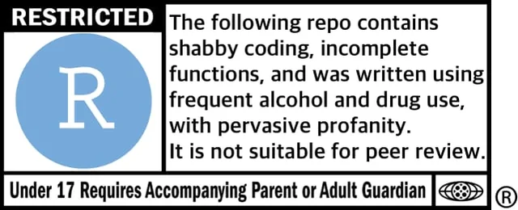

A project has to survive two journeys: **across time**, so that the you of next
November can re-run what the you of this Sepetember wrote, and **across space**, so
that it runs on a machine that is not yours. This session is about the three
habits that get it there — a project layout that travels, a version history that
explains itself, and, as a payoff, a website that publishes itself from the same
repository.

::: {.callout-note}
## Companion chapters

This session consolidates two earlier ones. They ran in Season 1 as separate
sittings and are kept as the record of when the material was first taught:

- [File Management and Workflow](01-intro.html) — 29 August 2025
- [Version Control with Git and Github](02-github.html) — 4 September 2025

The material here is the same. What is new is the sequence: one pass from a
folder on your laptop to a site on the web, ending with the website those two
chapters never reached.
:::

::: callout-note

### Setup


**MacOS**: For mac, open terminal and type `git`. If a list of commands shows up, you have git installed. Else, download and install using the [link here](https://git-scm.com/downloads/mac).  

**Windows**: Install using the [link here](https://git-scm.com/downloads/win). Check all default installations. If installed correctly, upon right-clicking in any folder you should see `open terminal here`.  


Detailed instructions on installation [here](https://git-scm.com/book/en/v2/Getting-Started-Installing-Git)
:::


<!-- ===================================================================
     Everything below is pulled from chapters 01-intro.qmd and
     02-github.qmd. Prose, tables, callouts and code are verbatim.
     The only edits are heading levels (to nest under the four parts),
     chunk labels (renamed to avoid clashing with the originals, which
     are still in the book) and the footnote id. Search "FLAG:" for
     every point where something is missing or needs your decision.
     =================================================================== -->




## Why Programming or Coding? (Revisiting)

Coding is about formalizing your thinking about how you treat the data
and automating the formalization task to be done repetitively. It
improves efficiency, enhances reproducibility, and boosts creativity
when it comes to finding new patterns in your data.

Benchmarks for reproducible data and statistical analyses:[^repro-1]

[^repro-1]: Inspired by the summary provided by Prof [Aaron
    Williams](https://aaronrwilliams.com/about)' course on Data Analysis
    offered at McCourt School. Strongly recommended to learn good coding
    using R

1.  **Accuracy**: Write a code that reduces the chances of making an
    error and lets you catch one if it occurs.
2.  **Efficiency**: If you are doing it twice, see the pattern of your
    decision-making and formalize it in your code. *Difference between
    Excel and coding*
3.  **Replicate-and-Reproduce**: Ability to repeat the computational
    process which reflects your thinking and decisions that you took
    along the way. Improves transparency and forces one to be deliberate
    and responsible about choices during analyses.\
4.  **Human Interpretability**: Writing code is not just about analyzing
    but allowing yourself and then others to be able to understand your
    analytic choices.\
5.  **Public Good**: Research is a public good. And the code allows your
    research to be truly accessible. This means you write a code that
    anyone else who understands the language can read, reuse, and
    recreate without you being present. We essentially ensure that by
    writing a readable and ideally publicly accessible code.

## Reproducible and Replicable

These two words get used interchangeably. They are not the same thing, and the
difference decides what this session can and cannot do for you.

| | What you need | What counts as success |
|------------------|--------------------------------|-----------------------------|
| **Reproducible** | Same data, same code | You get the **same** numbers |
| **Replicable** | New data, same design | You get **consistent** findings |

The problem is not hypothetical. In a survey by *Nature*, most researchers said
they had failed to reproduce someone else's result, and more than half had failed
to reproduce their own [@baker2016]. The National Academies settled the
terminology in 2019: reproducibility is computational, replicability is empirical
[@nasem2019].

Everything below is about the first one. Folder structure, `here()`, and git make
your work reproducible. Replicability is a question about design and measurement,
and that is a different session. It is still the precondition, though: a finding
nobody can regenerate from its own data and code cannot really be replicated
either, because there is no way to tell what was done [@king1995].

## Part 1 — File Management and Folder Structuring

### Understanding Absolute and Relative Paths

When working with files in any programming environment, paths specify
the location of files and folders. These paths can be absolute or
relative, and the choice between them significantly impacts
reproducibility, portability, and ease of collaboration

**Absolute Paths** An absolute path provides the complete address of a
file or folder, starting from the root directory of the file system. It
tells the software exactly where to find a file, regardless of where the
script is run.

Example: C:/Users/YourName/Documents/Project/Data/raw_data.dta

**Relative Paths** A relative path specifies the location of a file or
folder relative to a "base directory" (e.g., the project's working
directory). It does not start from the root directory but instead is
calculated based on the location of the script.

Suppose your working directory is set to:
`C:/Users/YourName/Documents/Project`

Then, a relative path might look like: `Data/raw_data.dta`

::: callout
**Practical Analogy** Think of absolute and relative paths like giving
directions to a house:

Absolute Path: “Go to the main city square, then take the highway north,
turn right at the first traffic light, and find the house at 123 Main
Street.” Works for people starting anywhere, but requires detailed
instructions specific to the city. Relative Path: “From the library,
walk two blocks north, then turn left. The house is the second one on
the right.” Simpler and context-aware, but assumes everyone starts from
the library.
:::

**Key Differences Between Absolute and Relative Paths**

| **Feature** | **Absolute Path** | **Relative Path** |
|------------------|----------------------------------|---------------------|
| **Starting Point** | Starts from the root directory of the file system. | Starts from the current working directory. |
| **Portability** | Not portable—specific to the user's system. | Highly portable—adapts to different systems. |
| **Ease of Sharing** | Harder to share; others must update paths. | Easier to share; no changes needed if structure is consistent. |
| **Use Case** | Best for fixed environments or one-off scripts. | Ideal for collaborative and reproducible projects. |
| **Flexibility** | Breaks if the file is moved or the system changes. | Adapts as long as the folder structure remains consistent. |

```{r}
#| label: fig-repro-paths
#| echo: false
#| fig-width: 9
#| fig-height: 5
#| fig-cap: |
#|   Both routes end at the same file. The relative one starts counting at the
#|   project folder, which is why it still works on a machine that is not yours.

ABS  <- "#b5462f"; REL <- "#1f5ea8"
ink  <- "#1f2d3a"; muted <- "#4a5560"
rule <- "#c9c9c4"; panel <- "#fbfbf9"; soft <- "#e8e7e1"
LEFT <- 4; RIGHT <- 96; GAP <- 1.5; PAD <- 3.6

S1 <- c("C:", "Users", "YourName", "Documents", "Project", "Data", "raw_data.dta")
S2 <- c("D:", "phd", "shared", "Project", "Data", "raw_data.dta")

# One type scale for both rows, so the shared tail lands at identical x.
fit_cex <- function(rows, cap = 0.95) {
  need <- sapply(rows, function(s)
    (RIGHT - LEFT - length(s) * PAD - (length(s) - 1) * GAP) /
      sum(strwidth(s, cex = 1, family = "mono")))
  min(c(need, cap))
}

chain <- function(segs, y, h, from, cex) {
  w     <- strwidth(segs, cex = cex, family = "mono") + PAD
  total <- sum(w) + GAP * (length(segs) - 1)
  x0    <- RIGHT - total + c(0, cumsum(head(w, -1) + GAP))
  x1    <- x0 + w
  for (i in seq_along(segs)) {
    rect(x0[i], y - h / 2, x1[i], y + h / 2,
         col = if (i >= from) soft else "white", border = rule, lwd = 1)
    text((x0[i] + x1[i]) / 2, y, segs[i], cex = cex, family = "mono", col = ink)
    if (i < length(segs))
      text(x1[i] + GAP / 2, y, "/", cex = cex, family = "mono", col = muted)
  }
  list(x0 = x0, x1 = x1)
}

bracket <- function(xa, xb, y, col, lab, broken = FALSE, lty = 1) {
  segments(xa, y, xb, y, col = col, lwd = 2.4, lty = lty)
  segments(c(xa, xb), y, c(xa, xb), y + 1.5, col = col, lwd = 2.4)
  if (broken) points((xa + xb) / 2, y, pch = 4, col = col, cex = 1.6, lwd = 3.2)
  text(xa, y - 3.0, lab, col = col, cex = 0.78, adj = 0, font = 2)
}

op <- par(mar = c(0, 0, 0, 0), xaxs = "i", yaxs = "i")
plot.new(); plot.window(c(0, 100), c(0, 100))
rect(0, 0, 100, 100, col = panel, border = NA)
cx <- fit_cex(list(S1, S2))

text(LEFT, 93, "On your computer", col = ink, cex = 0.98, adj = 0, font = 2)
p1 <- chain(S1, 83, 7.2, 5, cx)
text((p1$x0[5] + p1$x1[5]) / 2, 76, "\u2191 .RProj", col = muted, cex = 0.68)
bracket(p1$x0[1], p1$x1[7], 70, ABS, "Absolute \u2014 starts at the disk root")
bracket(p1$x0[6], p1$x1[7], 61, REL, "Relative \u2014 starts at the project folder")

segments(LEFT, 51, RIGHT, 51, col = rule, lwd = 1)

text(LEFT, 43, "On a collaborator's computer", col = ink, cex = 0.98, adj = 0, font = 2)
p2 <- chain(S2, 33, 7.2, 4, cx)
text((p2$x0[4] + p2$x1[4]) / 2, 26, "\u2191 .RProj", col = muted, cex = 0.68)
bracket(p2$x0[1], p2$x1[6], 20, ABS, "Absolute \u2014 no such folder here", broken = TRUE, lty = 2)
bracket(p2$x0[5], p2$x1[6], 11, REL, "Relative \u2014 lands in the same place")

text(LEFT, 3.5, "The blue span sits in the same place in both rows. The red one does not.",
     col = muted, cex = 0.78, adj = 0)
par(op)
```

### R Projects

We used the `setwd()` command till now to trace the files we need in our
work. As your work expands, projects will have multiple datasets to be
loaded, different subsidiary scripts to be used, and multiple outputs to
be saved.

**R Projects** is a built-in mechanism in RStudio for seamless file
management and usage of relative paths.

Let's start by creating a new project. Click `File > New Project`. Name
the new project `govt-8001-dataessay`.

```{r}
#| label: fig-repro-new-project
#| echo: false
#| fig-cap: | 
#|   To create new project: (top) first click New Directory, then (middle)
#|   click New Project, then (bottom) fill in the directory (project) name,
#|   choose a good subdirectory for its home and click Create Project. [source](https://r4ds.hadley.nz/workflow-scripts)

knitr::include_graphics("new-project.png")
```

::: callout
**Exercise**

1.  Do this process again, this time creating a new project in the the
    existing directory of math camp files. That is, the folder where you
    have been saving R scripts and `.qmd` file associated with math
    camp 2025. Name it `mathcamp2025`

2.  Go to the folder on your system, and click the `.RProj` file.

3.  Start a new `qmd` file like we did before. Delete existing code
    except for YAML. Run `getwd()` command in console and see the
    difference.

4.  Start a new R code chunk (`cmd + option + I`) and load vdem dataset.
    Notice the change in behavior when you press `TAB` inside the
    `readRDS()` function.
:::

#### Standardized Folder and File Structure

An efficient file and folder management system is going to be crucial as
we move into working with serious projects. As stressed earlier, keeping
and using all the files associated with a project in a comprehensible
folder system is facilitated by R Projects. You would ideally want to
create your own template for folder management that you follow across
proejcts. For starters, the folder structure below is the one created
for your data essay assignment in Govt 8001 or Quant 1.

You can use the point-and-click fucntionality in your computers to
create this structure. Later today, we will briefly go through an R
script that do this programmatically.

```         
📦 govt-8001-dataessay
├─ govt-8001-dataessay.RProj
├─ 000-setup.R
├─ 001-eda.qmd
├─ 002-analysis.qmd
└─ 003-manuscript.qmd
├─ Data
│  ├─ Raw
│  │  ├─ Dataset1
│  │  │  ├─ dataset1.csv
│  │  │  └─ codebook-dataset1.pdf
│  │  └─ Dataset2
│  │     ├─ ...dta
│  │     └─ codebook-dataset2.pdf
│  └─ Clean
│     └─ Merged-df1-df2.csv
├─ Scripts
│  ├─ R-scripts
│  │  ├─ plotting-some-variable.R
│  │  └─ exploring-different-models.R
│  ├─ Stata-Scripts
│  │  └─ seeing-variable-labels.do
│  └─ Python-Scripts
│     └─ scraping-data-from-website.py
└─ Outputs
   ├─ Plots
   │  ├─ ...jpeg
   │  └─ ...png
   ├─ Tables
   │  └─ .csv
   └─ Text
      └─ ...txt
```

**Suggested folder structure for a Quant-1 project**

#### The `here` package

While we learnt how to create or associate an `.RProj` with a folder,
integrating it with `here()` function from the `here` package, makes
workflow smoother. Let's do it with the following exercise.

::: callout
**Exercise**

1.  Go the RStudio window with `mathcamp2024` project. Check the extreme
    upper right corner to see if you are in the right window.

2.  In the qmd file we were working in, add an R chunk.

3.  Load the library `here` with the following code. Run the code line
    by line

```{r}
#| eval: false

library(here)


 # See the output for each of the following lines
here()

here("Datasets-mathcamp","V-Dem-CY-Full+Others-v12.rds")

# syntax is

# here("First subfolder from the root folder", "second subfolder",...., "file")


vdem_new <- readRDS(here("Datasets-mathcamp","V-Dem-CY-Full+Others-v12.rds"))

```

This is a cleaner syntax which when coupled with usage of R projects
saves time in typing file paths and avoids issues when the project is
run on some other computer system.

Note: `here()` always notes the path from the main folder or the root
directory where your `.RProj` file is located.

**Save the files and close the `mathcamp2025` project window**
:::

Make it a habit of using R Projects and `here()` function in your
scripts for writing portable code.

You can read this quick and informative blogpost on using these two
[here](http://jenrichmond.rbind.io/post/how-to-use-the-here-package/).

::: callout
Exercise

1.  Download the `000-setup.R` from
    [here](https://georgetown.app.box.com/file/1629650190568)

2.  Place it in the `govt-8001-dataessay` folder.

3.  Open it in the opened RStudio window. The script is reproduced in
    the appendix at the end of this chapter.


4.  Run the file line-by-line. See the folder structure created in your
    main folder.
:::

## Part 2 — Version Control with Git

```{r}
#| label: repro-git-meme
#| echo: false
#| fig-cap: | 
#|    [source](https://www.reddit.com/r/ProgrammerHumor/comments/gtl9qy/git_checkout_memesfolder/)

knitr::include_graphics("git-supreme.png")
```
### What is Version Control?

Version Control System (VCS) is keeps records of changes made to files/files over time. Using a VCS enables us to revisit and/or restore older version of files, in case we made a mistake or even if we need to revisit our thinking as a process progressed. Think **Google Docs**.  
### Understanding Git

Git is a widely used VCS. A git project stores changes in a local repository. That is, snapshots with metadata and  how the folder system with its files looked like at a particular moment of time looked like is saved locally on your computer.  

```{r}
#| label: repro-how-git-works
#| echo: false
#| fig-cap: | 
#|   Git thinks of files as snapshots in time. In a git system, different versions of the folder with all the files are stored as snapshot with timestamps attached to them. [source](https://git-scm.com/book/en/v2/Getting-Started-What-is-Git%3F)

knitr::include_graphics("git-vcs.png")
```

Git is a **local** system (mostly). No connection to a server or internet is needed to access older snapshots.  Not just the older version of files, but details of the changes are recorded locally and can be accessed with locally available git commands.  

#### The Three States

The key to understanding a git project is to develop clarity about the three states it holds the file in.

1-  **Modified**: Any changes you make and save. Think, saving a word doc.  
2-  **Staged**: Any saved changes are **offered or assembled** on a table to git.  
3-  **Committed**: The staged table is deposited or **committed** to local git repository.  


```{r}
#| label: repro-git-states
#| echo: false
#| fig-cap: | 
#|   Modification happens in Working Directory (Your Local Folder). Staging happens in Staging Area. Committing saves a snapshot of the staged changes to the local Git repository (stored in the .git directory inside your folder) [source](https://git-scm.com/book/en/v2/Getting-Started-What-is-Git%3F)

knitr::include_graphics("git-stages.png")
```

::: callout-note

### From [Git-book](https://git-scm.com/)
The working tree is a single checkout of one version of the project. These files are pulled out of the compressed database in the Git directory and placed on disk for you to use or modify. This is the case when you *pull* file/s from online reporsitory

The staging area is a file, generally contained in your Git directory, that stores information about what will go into your next commit. Its technical name in Git parlance is the “index”, but the phrase “staging area” works just as well.

The Git directory is where Git stores the metadata and object database for your project. This is the most important part of Git, and it is what is copied when you clone a repository from another computer.

The basic Git workflow goes something like this:

1-  You modify files in your working tree.

2-  You selectively stage just those changes you want to be part of your next commit, which adds only those changes to the staging area.

3-  You do a commit, which takes the files as they are in the staging area and stores that snapshot permanently to your Git directory.
:::

#### Using Git

We use command-line program called **Bash** to run git on computer. This essentially means using Terminal on macOS and Git Bash on Windows.


We need some basic bash commands to get started:

1. `pwd`: prints working directory.  
2.  `ls`: lists all the files in the working directory.  
3.  `cd`: changes directory.  
4.  `mkdir`: Makes a new directory.  

Try these commands in Terminal/Bash on your systems.  

#### Git commands

Commands for git(or any program) start with name of the program. Try the following commands:

`git status`

`git log`

You can also using terminal/bash from `RStudio`. Look at the second button at the bottom left, next to console. It automatically shows bash in the working directory of your project.  

#### Local Git Workflow

Git workflow is anchored around **repository**. A repository is a folder where files including data, scripts, and other files are stored along with git log. 

In our workflow, this should ideally be the folder where `.RProj` file is located. 

::: callout-note

#### Practice

Let's practice using an existing folder with scripts and data.  

1-  Open an existing R project. If not available, start a new R Project using File>New Project.   

2-  In the terminal window of Rstudio, type `pwd` to see of the correct working directory is opened.    

3-  Type `git init`. This initializes the git repository for the project. **This step needs to be done only once per folder**.  

4-  Tell git which files are to be tracked and then staged.  Use `git add` followed by filename or tab to add a few files one by one.  

5-  Once added type `git commit -m "first commit"`. This takes a snapshot of staged file/s. ** Do not forget the -m**.

6-  Use `git status` and `git log` to see outputs about the process.

7. Repeat this process after modifications to any script.
:::

**As a norm, avoid hosting raw data files like .csv, .dta, or .xlsx on GitHub. Large or sensitive files should be listed in a .gitignore file to prevent accidental upload. Git is best suited for tracking code and small plain-text files.See more on `.gitignore` [here](https://docs.github.com/en/get-started/git-basics/ignoring-files)**.

Similar to comments in R codes, commit messages should also ideally be brief phrases explaining contextual change rather than being detailed messages.


```{r}
#| label: repro-commit-meme
#| echo: false
#| fig-cap: | 
#|    [source](https://programmerhumor.io/git-memes/from-small-changes-to-existential-crisis-neqt)

knitr::include_graphics("git-commit.png")
```

## Part 3 — GitHub

### Using Github

[Github](https://github.com/) is an online hosting service for git based VCS. Git and Github are often confused with one another. It is important to remeber how they are different and that they complement each other. 

The most common workflow involves creating and modifying files locally,intializing local git repo (`git init`), staging files (`git add`) and  committing changes with an informative message (`git commit -m"<message>"`) to local git repository, and then `push` changes to Github.  

::: callout-note

#### Github Practice

1.  Make you account on [Github](https://github.com/) if not already done. Ideally, use personal email id to register.

<!-- FLAG: the step below is connective wording written to chain this
     exercise onto the Git practice above, replacing three steps that
     rebuilt the project from scratch. Reword it in your own voice. -->
2.  Open the R Project you used in the Git practice above. It already has
    a git repository and at least one commit.

3.  On Github.com homescreen, click the green `New` button on top left corner.

4.  Call the new repository `my-git-practice` (same as local repository). Don't make ay other changes on this page. Click `Create repository`.

5.  Copy the code under **…or push an existing repository from the command line**. Note: If you're using an older version of Git or RStudio, your default branch may be master instead of main. You can rename it later or use git branch -M main.

6.  Paste it in the terminal window of Rstudio and press `Enter`.  

**fF any issues pop up here, resolve by talking amongst yourself or google**.  

7.  Refresh the github.com window.  

8. Run `git add 000-setup.R` in terminal.  (Staging state)

9. Run `git commit -m "setup file added"` in terminal.  (Committing state)

10. Run `git push` in terminal. This pushes the local changes from repository to remote (online) repository.

:::


While git is used for version control, Github is additionally used for collaborative work. We are not covering **branching** and collaboration today. Links below can help you with starting these at later stages.  

In addition to git functions, Github adds similar but additional stages. Compare the following flowchart to one in section on understanding git.


```{r}
#| label: repro-github-flow
#| echo: false
#| fig-cap: | 
#|  The backward arrow represent steps where repositiories are pulled from remote to local directory. This is used mostly when multiple peeople work on different systems on same repository or if your work involves working on different systems. The process is intuitive: Changes are pushed from one sytem to remote and then continued by first fetching or pulling the repository from the remote to local by next user or system.    [Image source](https://imgur.com/oodiCnB)

knitr::include_graphics("github.png")
```

## Bonus — Putting It All Together: Making Your Own Website

::: {.callout-warning}
## FLAG: drafted, not pulled from a session

Neither Season 1 chapter covers this, so unlike everything above, the words in
this section are not yours. Rewrite them in your own voice before teaching.
:::

Run this if there is time; otherwise send it home with people. Nothing new is
needed. After the three parts above you already have a project folder, a git
repository, and a GitHub remote. A personal website is one more file in that
repository.

### Quarto as the site generator

The `.qmd` file that renders a problem set also renders a web page. The only
difference is a line in `_quarto.yml` telling Quarto the project is a website
rather than a document.

```yaml
project:
  type: website

website:
  title: "Your Name"
  navbar:
    left:
      - href: index.qmd
        text: Home
      - href: research.qmd
        text: Research
```

A minimal site is four files:

```
📦 my-website
├─ _quarto.yml
├─ index.qmd        # landing page
├─ research.qmd
└─ cv.pdf
```

### Publishing it

One command, run from the project folder in the same terminal you used in Part 2:

`quarto publish gh-pages`

This renders the site, pushes the output to a branch called `gh-pages`, and
points GitHub Pages at it. You do not write a workflow file, and you do not
commit rendered HTML to `main`.

**The repository name decides your URL.** A repository named
`<username>.github.io` is served at `https://<username>.github.io/`. Every other
repository is served from a subpath, `https://<username>.github.io/<reponame>/`.
Name the repository before you publish, not after.

::: callout-note

#### Website Practice

1.  On Github.com, make a new repository named `<your-username>.github.io`.

2.  Make an R Project in a folder of that name, then `git init` and connect the
    remote exactly as you did in Part 3.

3.  Add a `_quarto.yml` with `project: type: website`, and an `index.qmd` with a
    heading and two lines about yourself.

4.  Run `quarto preview` and check it in your browser.

5.  Run `quarto publish gh-pages` and answer the prompt.

6.  Wait a minute, then open `https://<your-username>.github.io/`.
:::

### How this book is published

This book does not use `quarto publish`. It uses a GitHub Actions workflow,
`.github/workflows/pages.yml`, which renders on GitHub's machines every time
someone pushes to `main`. Nobody renders for deployment on a laptop.

That is the argument from Part 1 applied to the website itself: if publishing
depended on one person's computer, the site would be reproducible only by that
person. Worth knowing it exists; `quarto publish` is the right tool for a
personal site.

## Takeaways

Here's a quick workflow for starting a new project or assignment or
paper.

1.  Make a new folder in your computer with apt name. Ideally,
    `govt-<coursecode>-<project>`.

2.  Start RStudio.

3.  Create a new Rstudio Project by clicking `File > New Project`. Name
    it `govt-<coursecode>-<project`.

4.  Check if now your RStudio Window shows the project name on top right
    corner. If not, go to folder and double-click the `.RProj` file.

5.  Paste the `000-setup.R` file in the main project folder. Open it in
    the same Rstudio window with the project and run the complete file.
    Your folder structure is created.

6.  Copy your raw data in `Data/Raw` folder. Similarly, your scripts in
    `Scripts/RScripts` folder

7.  Start your new `.qmd` file and save it in the main folder.

8.  Remember to use `here()` package extensively in both, scripts and
    quarto files, when loading or saving the data.

9.  You can zip the whole project folder for sharing. The receiver will
    just need to unzip and run the code after starting the associated
    `.RProj` file, without changing file paths on their computer.

## Guidelines

The article "Ten Simple Rules for Reproducible Computational Research"
by @sandveTenSimpleRules2013 provides guidelines to ensure that
computational research is reproducible, transparent, and robust. Here’s
a summary of the key points:

| Rule | Description | Notes |
|----------------|---------------------------------------|----------------|
| Documentation | Track how results are produced, including all steps in the analysis workflow. | Keep short notes on reults |
| Automation | Minimize manual data manipulation by using scripts and documenting any manual changes. | Make changes to raw data in your scripts |
| Version Control | Use version control systems for all custom scripts to track changes and maintain reproducibility. | Using Github |
| Comprehensive Records | Archive all versions of external programs used, all intermediate results, and exact observation conditions. | Keep notes about data in comments |
| Accessibility | Make raw data, scripts, and results publicly accessible to enhance transparency and replication. | Maintainig good workflow |

## Additonal Resource

1.  Git [Documentation](https://git-scm.com/doc)

2.  Advanced Git operations [tutorial](https://gitimmersion.com/)

3.  Git [Cheatsheet](https://www.atlassian.com/git/tutorials/atlassian-git-cheatsheet)

4.  Video explainers of git workflow ([here](https://www.youtube.com/watch?v=e9lnsKot_SQ), [here](https://www.youtube.com/watch?v=HMoZ5cYzU4I), and [here](https://www.youtube.com/watch?v=mJ-qvsxPHpY))

5.  [Git Branching](https://git-scm.com/book/en/v2/Git-Branching-Branches-in-a-Nutshell)

## Appendix — `000-setup.R` {.unnumbered}

The script from the folder-structure exercise in Part 1.

```{{r}}
# Name: 000-setup.R
# Author: Parushya
# Purpose: Creates main folders, subfolders in the main project directory
# Will also ensure that you have basic packages required to run the repository
# Date Created: 2020/10/07


# Checking if packages are installed and installing


# check.packages function: install and load multiple R packages.
# Found this function here: https://gist.github.com/smithdanielle/9913897 on 2019/06/17
# Check to see if packages are installed. Install them if they are not, then load them into the R session.

check.packages <- function(pkg) {
  new.pkg <- pkg[!(pkg %in% installed.packages()[, "Package"])]
  if (length(new.pkg)) {
    install.packages(new.pkg, dependencies = TRUE)
  }
  sapply(pkg, require, character.only = TRUE)
}

# Check if packages are installed and loaded:
packages <- c("janitor",  "tidyverse", "utils", "here")
check.packages(packages)


# Setting Directories and creating subfolders


# Creating Sub Folders

## Data
dir.create(file.path(paste0(here("Data")))) # Data Folder
dir.create(file.path(paste0(here("Data","Raw")))) # Raw Data sub-folder
dir.create(file.path(paste0(here("Data","Clean")))) # Clean Data sub-folder


# Scripts
dir.create(file.path(paste0(here("Scripts")))) # Scripts Folder
dir.create(file.path(paste0(here("Scripts","RScripts")))) # RScripts  sub-folder
dir.create(file.path(paste0(here("Scripts","Stata-Scripts")))) # Stata Scripts sub-folder
dir.create(file.path(paste0(here("Scripts","Python-Scripts")))) # Python Scripts sub-folder


# Output
dir.create(file.path(paste0(here("Outputs")))) # Outputs Folder
dir.create(file.path(paste0(here("Outputs","figures")))) # Figures sub-folder
dir.create(file.path(paste0(here("Outputs","tables")))) # Tables sub-folder
dir.create(file.path(paste0(here("Outputs","text")))) # Text sub-folder

```

::: {.callout-warning}
## FLAG: not carried over

- **A workflow section of its own.** *Workflow* is no longer a middle part:
  its only content was the nine-step list, which is a recap of Part 1 and now
  closes the chapter as **Takeaways**. Nothing in either source covers file
  naming conventions, numbering scripts in run order, the raw/clean data
  discipline as a habit, or what to do at the end of a work session. Write
  those and it earns a middle part back.
- **The website bonus.** You originally asked for "Putting it all together:
  making your own website" as a bonus. Neither source chapter has any material
  for it, so nothing was pulled. Say the word and I will scaffold it, or drop it.
- **Branching, merge conflicts, recovery.** `02-github.qmd` states outright that
  branching and collaboration are not covered, and links out instead (those links
  are in Additonal Resource above). Nothing on merge conflicts or undoing a bad
  commit exists in either source.
- **`.gitignore`.** Only the single bolded sentence in Part 3 exists.
:::


::: {.callout-warning collapse="true"}
## FLAG: source wording left exactly as-is

Carried over unchanged, since you asked for minimal edits. All are yours to fix
or leave:

- **Project name inconsistency.** The first exercise creates `mathcamp2025`; the
  `here()` exercise two sections later says to open `mathcamp2024`.
- **Course/term references.** "your data essay assignment in Govt 8001 or
  Quant 1", "math camp 2025", and a Georgetown Box link for `000-setup.R` — all
  tied to the 2025 offering.
- **Typos.** `reults`, `Maintainig`, `proejcts`, `fucntionality`, `remeber`,
  `repositiories`, `Additonal`, `ay other changes`, `peeople`, `sytem`, and
  `**fF any issues pop up here**` in the GitHub practice block.
- **Truncated placeholder.** The Takeaways list has
  `govt-<coursecode>-<project` — missing the closing `>`.
:::

::: {.content-visible when-format="html"}
## References {.unnumbered}
:::
