## Why Network Analysis

“Actors do not behave or decide as atoms outside a social context… Their attempts at purposive action are instead embedded in concrete, ongoing systems of social relations.” (Granovetter 1985, 487)

- Granovetter: Economic action is **embedded in ongoing social ties**—neither atomized (undersocialized) nor fully dictated by roles (oversocialized). **Networks provide information, trust, and sanctions**, reducing opportunism and transaction costs.
- Human action is situated within institutionalized relational contexts that structure thought, emotion, and conduct. These actions feed back into the very contexts that enable them, thereby influencing others and reshaping the social order.
- **Embedded political action.** Political behavior and institutions are **situated in relational contexts** (parties, coalitions, movements, alliances, supply chains). Actors pursue goals **through** these ties and, in doing so, **reshape** the networks that structure future action.
- Many outcomes are **networked**: information spread, innovation diffusion, cooperation/conflict. And Networks can capture **dependencies** (reciprocity, homophily, triadic closure) that individual-level models miss. 


### Example 1 

```{r}
#| echo: false
#| out.width: "500px"

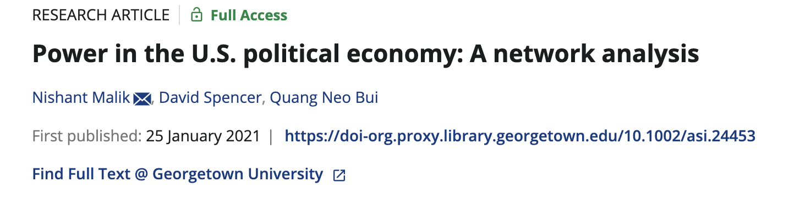
```


```{r}
#| echo: false
#| out.width: "500px"

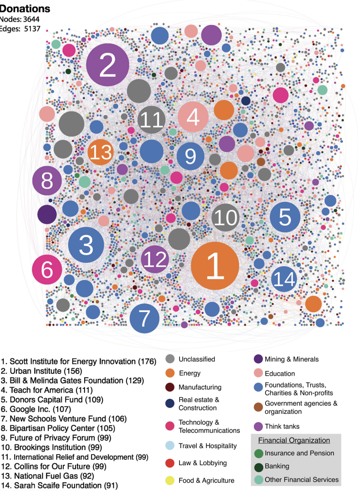
```

### Example 2

```{r}
#| echo: false
#| out.width: "500px"

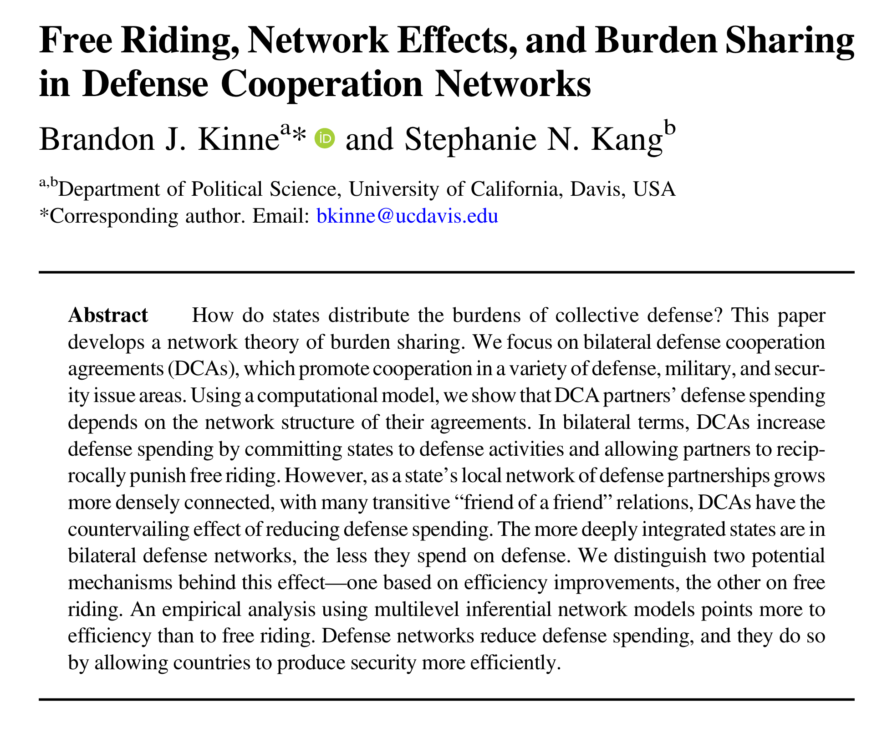
```


```{r}
#| echo: false
#| out.width: "500px"

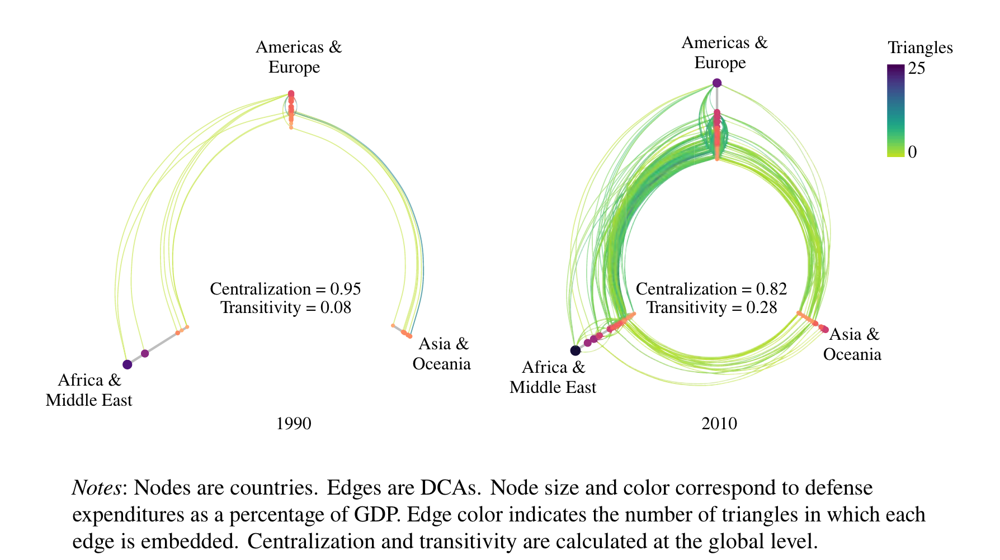
```
 
 
- Mass behavior & opinion: discussion networks → turnout, persuasion, polarization.
- Parties & elites: endorsements, donor ties, activists/interest groups → factions & leadership.
- Movements & mobilization: protest cascades, organizational networks, brokerage under repression.
- Security networks: alliances, basing, intelligence sharing → deterrence, burden sharing.
- IPE & global production: trade/finance/supply chains → leverage, vulnerability, sanctions.

<details>
<summary><strong>Further Readings (click to expand)</strong></summary>

- Granovetter, Mark. “Economic Action and Social Structure: The Problem of Embeddedness.” *American Journal of Sociology* 91, no. 3 (1985): 481–510. http://www.jstor.org/stable/2780199.
- Scott, John. *Social Network Analysis*. Fourth. 55 City Road, London: SAGE Publications Ltd, 2017. https://doi.org/10.4135/9781529716597.
- Cranmer, Skyler J., and Bruce A. Desmarais. “Inferential Network Analysis with Exponential Random Graph Models.” Political Analysis 19, no. 1 (2011): 66–86. https://doi-org.proxy.library.georgetown.edu/10.1093/pan/mpq037.
- Hafner-Burton, Emilie M., Miles Kahler, and Alexander H. Montgomery. “Network Analysis for International Relations.” *International Organization* 63, no. 3 (2009): 559–92. https://doi-org.proxy.library.georgetown.edu/10.1017/S0020818309090195.
- Jackson, Patrick Thaddeus, and Daniel H. Nexon. 2019. “Reclaiming the Social: Relationalism in Anglophone International Studies.” *Cambridge Review of International Affairs* 32 (5): 582–600. https://doi.org/10.1080/09557571.2019.1567460.
- Nexon, Daniel H. “Network Theory and Grand Strategy.” In *The Oxford Handbook of Grand Strategy*, edited by Thierry Balzacq and Ronald R. Krebs. Oxford Academic, 2021. https://doi-org.proxy.library.georgetown.edu/10.1093/oxfordhb/9780198840299.013.7. Accessed 2 Oct. 2025.
- Farrell, Henry, and Abraham L. Newman. “Weaponized Interdependence: How Global Economic Networks Shape State Coercion.” *International Security* 44, no. 1 (2019): 42–79. https://doi.org/10.1162/isec_a_00351.
- Noel, Hans. 2012. “Towards a Networks Theory of Political Parties: A Social Networks Analysis of Internal Party Cleavages in Presidential Nominations, 1972–2008.” Paper presented at American Political Parties: Past, Present, and Future, University of Virginia, Charlottesville, October 8–9. https://faculty.georgetown.edu/hcn4/Downloads/Noel_SNA_UVa.pdf
- Bailey, Michael, Rachel Cao, Theresa Kuchler, Johannes Stroebel, and Arlene Wong. 2018. “Social Connectedness: Measurement, Determinants, and Effects.” *Journal of Economic Perspectives* 32 (3): 259–80. https://doi.org/10.1257/jep.32.3.259.
- Winecoff, W. K. 2020. “The Persistent Myth of Lost Hegemony, Revisited: Structural Power as a Complex Network Phenomenon.” *European Journal of International Relations* 26 (1_suppl): 209–252. https://doi-org.proxy.library.georgetown.edu/10.1177/1354066120952876.
- Kinne, Brandon J., and Stephanie N. Kang. “Free Riding, Network Effects, and Burden Sharing in Defense Cooperation Networks.” *International Organization* 77, no. 2 (2023): 405–39. https://doi-org.proxy.library.georgetown.edu/10.1017/S0020818322000315.

</details>


## Network Introduction

### Basic Concepts of Networks {.mb-3}

**Node**: The things that are connected in a network (also called vertices).

**Edges, Ties, or Links**: The connections between nodes.

**Degree**: The number of edges a node has.

::: callout-note
A node with high degree (many connections) is called a **hub**.
:::

```{r}
#| echo: false
#| out.width: "350px"

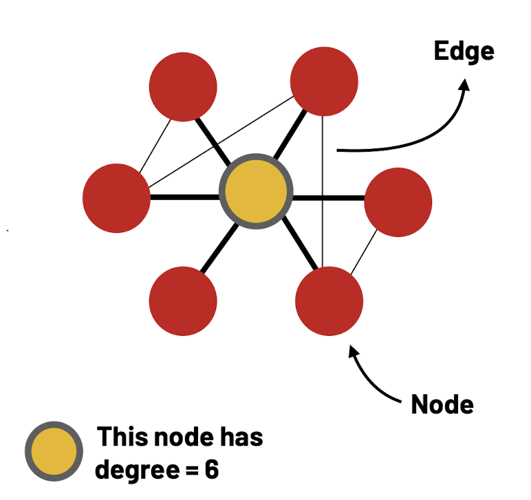
```

**Weights**: Edges may have different weights, indicating the strength of the connection.

**Direction**: Edges can be directed or undirected.

-   In-degree: Number of connections received.
-   Out-degree: Number of connections gave.

```{r}
#| echo: false
#| out.width: "450px"

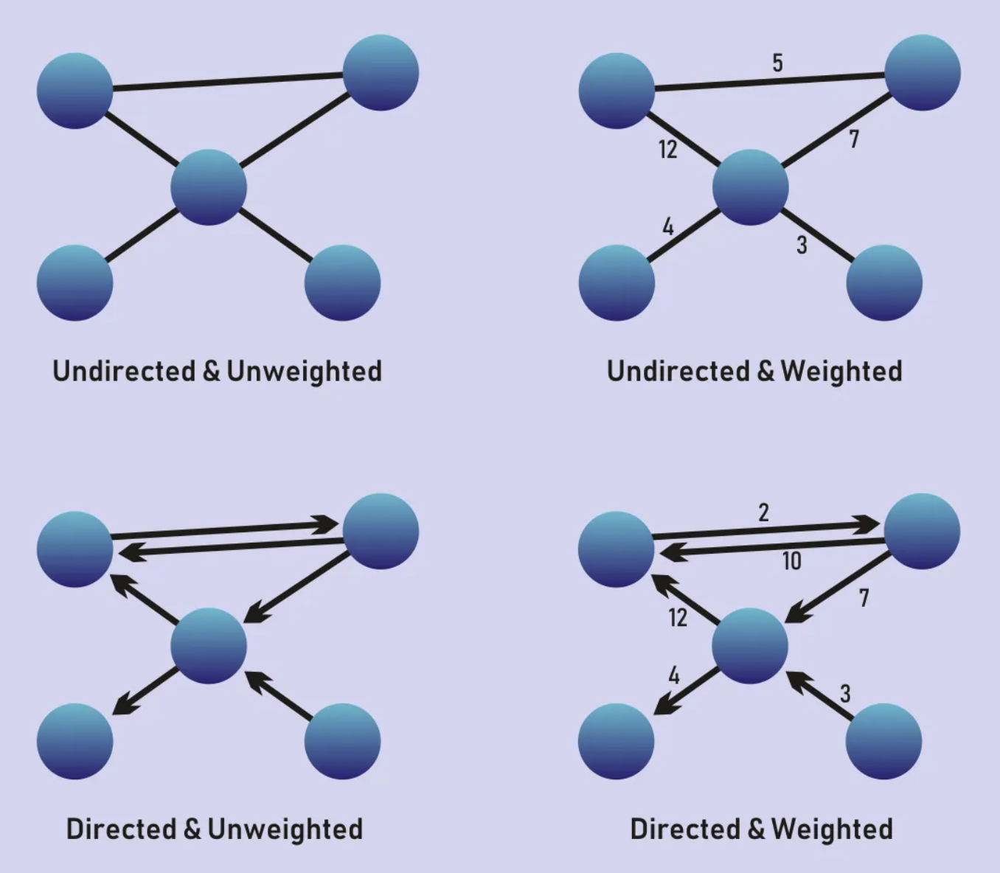
```

### View of Networks {.mb-3}

**Egocentric Networks**: An ego-net is one person’s local perspective of a network.

**Whole Network**: Whole network means that we know ALL nodes and edges of our network

::: callout-note
The data on the whole networks is usually challenging to come by in many fields (maybe IR is an exception?).
:::

```{r}
#| echo: false
#| out.width: "600px"

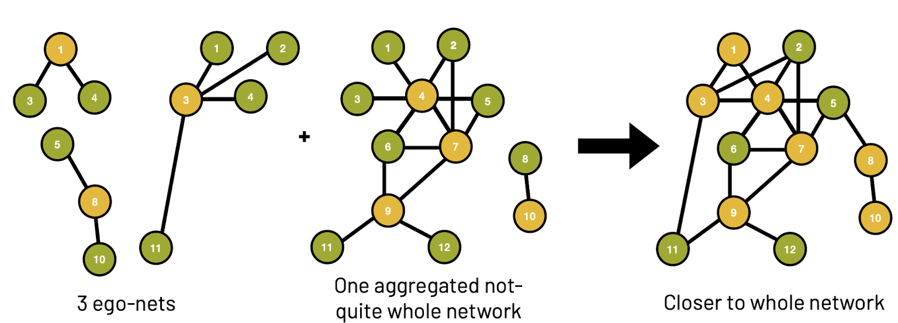
```

### Working With Network Data {.mb-3}

-   **Edge List**

Edge list is a concise way to summarize network structures.

-   **Adjacency Matrix**

Adjacency matrix includes more information than an edge list (e.g., it includes isolates) but also takes up more space.

::::: columns
::: {.column width="65%"}
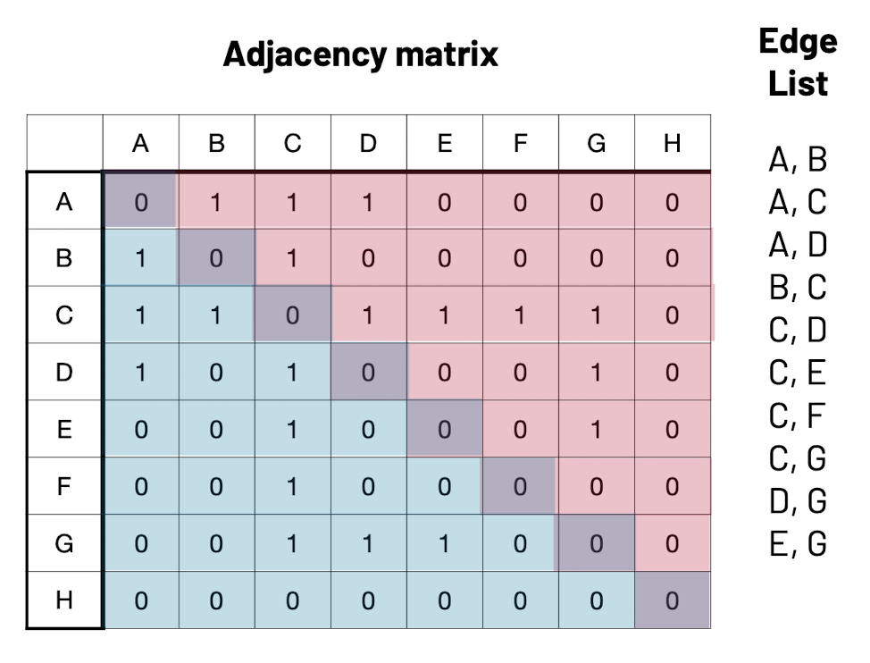
:::

::: {.column width="35%"}
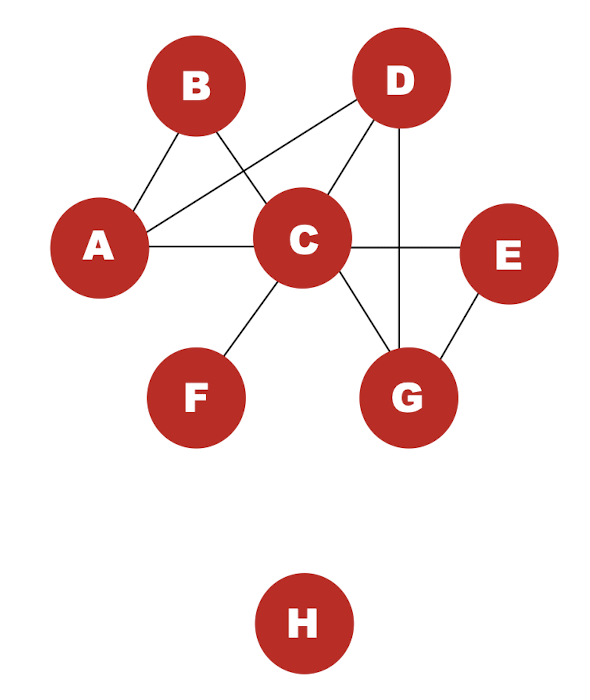
:::
:::::

## Network Evaluations: Descriptive Statistics

### Path & Diameter

-   A **path** is any traversal of edges from any node $n_i$ to any other node $n_j$
-   The shortest path between nodes $n_i$ and $n_j$ is the path with the fewest traversals
-   The **diameter** of a network is defined as the length of the longest shortest path in the network

### Clustering & Transitivity

-   **Clustering** is a measure of how *locally* interconnected a network is

```{r}
#| echo: false
#| out.width: "600px"

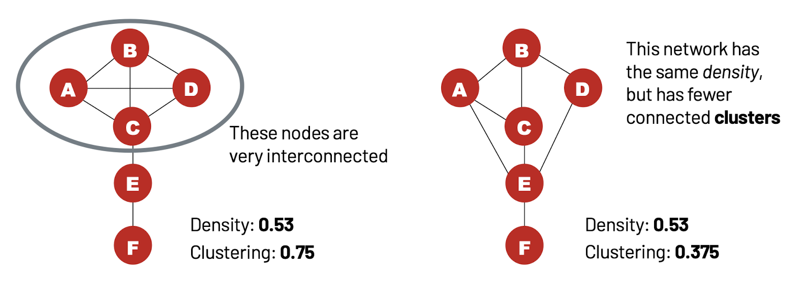
```

-   **Network level clustering (transitivity)** examines the proportion of closed traids among all the traids in a network.

```{r}
#| echo: false
#| out.width: "600px"

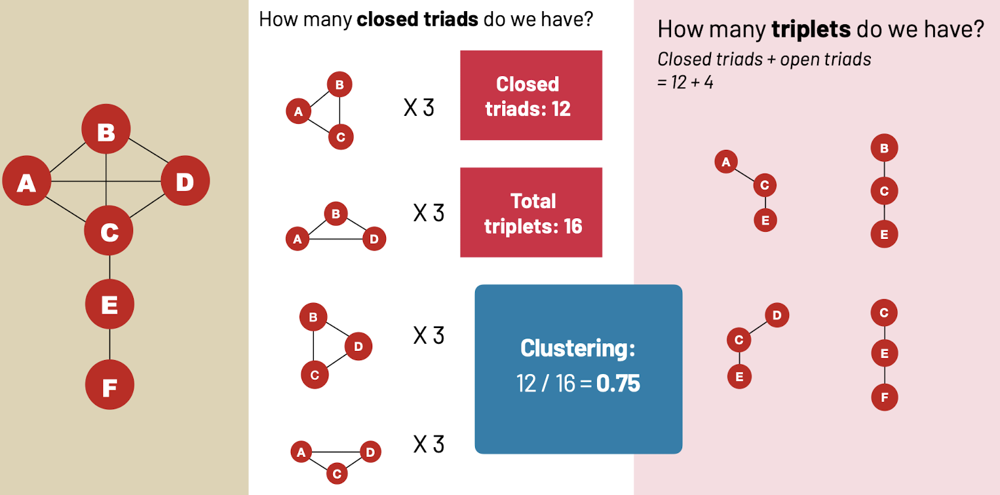
```

### Homophily & Assortativity

-   **Homophily** means that nodes tend to be connected with similar ones.

```{r}
#| echo: false
#| out.width: "600px"

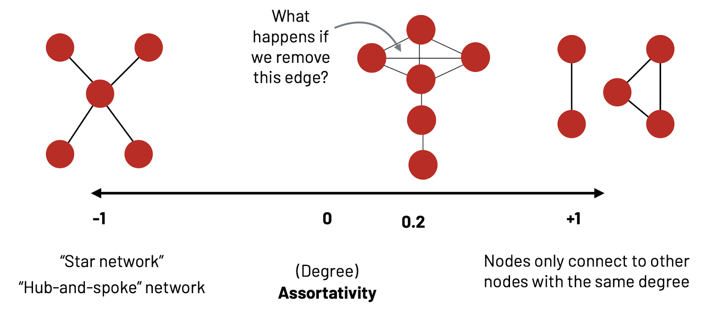
```

-   **Assortativity** measures the likelihood nodes are connected with those of similar degrees.

::: callout-note
**Assortativity** is basically an operationalization of homophily, degree homophily.
:::

## Centralities

### What is centrality?

-   **Centrality** is a property of a node in a graph.
-   People often talk about centrality as a measure of prominence or importance
-   There are different conceptions of what it means to be “central”
    -   **Power**: Control the flow of resources / information
    -   **Independence**: Able to be free of control
    -   **Influence**: Able to influence other people

### Network centrality measures

```{r}
#| echo: false
#| out.width: "600px"

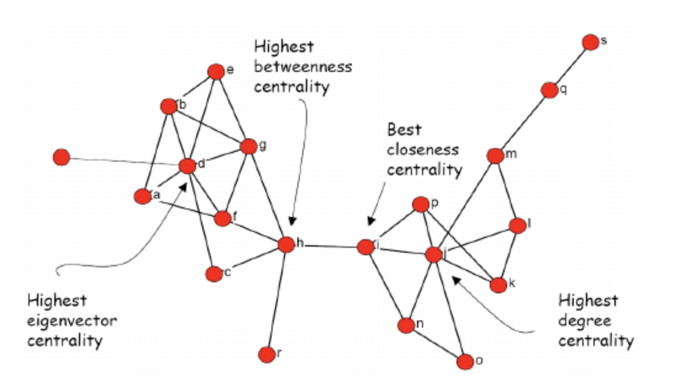
```

-   **Degree Centrality**: The degree of a node is the number of other nodes that single node is connected to. Important nodes tend to have more connections to other nodes. Highly connected nodes are interpreted to have high degree centrality.

-   **Eigenvector Centrality**: The extent to which adjacent nodes are connected themselves also indicate importance (e.g., Important nodes increase the importance of other nodes). A measure that takes into account the centrality of a node’s neighbors (the nodes it is connected to)

-   **Closeness centrality**: Closeness centrality measures how many steps are required to access every other node from a given node. In other words, important nodes have easy access to other nodes given multiple connections.

-   **Betweenness Centrality**: This ranks the nodes based on the flow of connections through the network. Importance is demonstrated through high frequency of connection with multiple other nodes. Nodes with high levels of betweenness tend to serve as a bridge for multiple sets of other important nodes.

## Exercises

Call out all the packages that would be needed

```{r, message=FALSE, warning=FALSE}
library(igraph)
library(statnet)
library(intergraph)
library(ergm)

```

Call out the dataset and explore it a bit.

```{r, message=FALSE, warning=FALSE}
data(florentine)
class(flomarriage)
summary(flomarriage) ## see the edgelist matrix stored in this network object
```

```{r, message=FALSE, warning=FALSE}
A <- as.matrix.network.adjacency(flomarriage)
g_flomarriage  <- graph_from_adjacency_matrix(A, mode = "undirected", diag = FALSE)

# Bring over labels and vertex attributes
V(g_flomarriage)$name     <- network.vertex.names(flomarriage)
V(g_flomarriage)$wealth   <- flomarriage %v% "wealth"
```

Let's check out how that adjacency matrix looks like

```{r}
#| label: print-A
A
```

Let's look at the centralities of the families in this network.

```{r}
deg  <- igraph::degree(g_flomarriage)  
bet  <- igraph::betweenness(g_flomarriage, directed = FALSE)
clo  <- igraph::closeness(g_flomarriage)  
eig  <- igraph::eigen_centrality(g_flomarriage, directed = FALSE)$vector

centralities <- data.frame(
  family      = V(g_flomarriage)$name,
  degree      = deg,
  betweenness = bet,
  closeness   = clo,
  eigenvector = eig
)
```

```{r}
#| message: false
#| fig.width: 16
#| fig.height: 12
#| dpi: 300
#| out.width: "100%"
#| fig.align: "center"
vsize <- 10 + 30 * (deg - min(deg)) / (max(deg) - min(deg) + 1e-9)

plot(
  g_flomarriage, layout = igraph::layout_with_fr(g_flomarriage),
  vertex.size = vsize+2,
  vertex.label = V(g_flomarriage)$name,
  vertex.label.cex = 0.9,
  vertex.frame.color = NA,
  edge.width = 1.2
)
```

::: callout-note
How about different layout formats? Try `layout_with_kk`, `layout_with_drl`, or `layout_in_circle`.
:::

## Network Inference

### Why Inference in Network Analysis is Special
- Inference in genral statistics relies on assumptions of independence (e.g., each observation is i.i.d.).
- In networks, **edges (ties)** are **not independent** 
    - Think about the mechanisms like triadic closure or preferential attachment
- Networks violate i.i.d. because ties are dependent ➜ Naïve regression fails. The network methods stop assuming i.i.d. They replace it with models/tests that explicitly allow dependence among ties.
- Inference in network analysis means **testing whether observed patterns (like reciprocity, homophily, or clustering) are due to chance or to systematic processes**.

::: callout-note
Yes, you generally cannot use network measures as outcome variables in most forms of regression (because this violates the assumption of independence). However, as predictors, network measures can be used (with caution!). For example, various forms of node centrality are commonly used as IVs. But note that multicollinearity is a common issue (e.g., degree, betweenness, eigenvector centrality often overlap). 
:::


### Hypothesis Testing in Network Analysis?

Let's say we observed network transitivity (clustering) of 0.08.
But by itself, the number is hard to interpret. Is that large or small? How surprising is the value we observed?

- **H0**: The observed clustering is due to random chance
- **H1:** The observed clustering is NOT due to random chance (In descriptive studies, this is typically the strongest statement we can make. But we might also want to answer *why*)

<!-- -->

How can we tell if our network’s pattern is more than chance when we only observe one network?
Ideally, we need to compare our observed network to ALL potential networks. But how do we generate these "alternate universe" networks? We use **simulation** to create many comparable networks, then compare the observed statistic to the simulated distribution (get a p-value / quantile).


```{r}
#| echo: false
#| out.width: "500px"

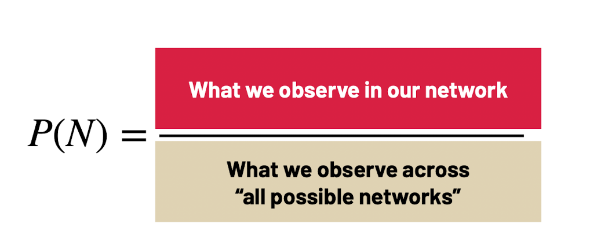
```


```{r}
#| echo: false
#| out.width: "800px"

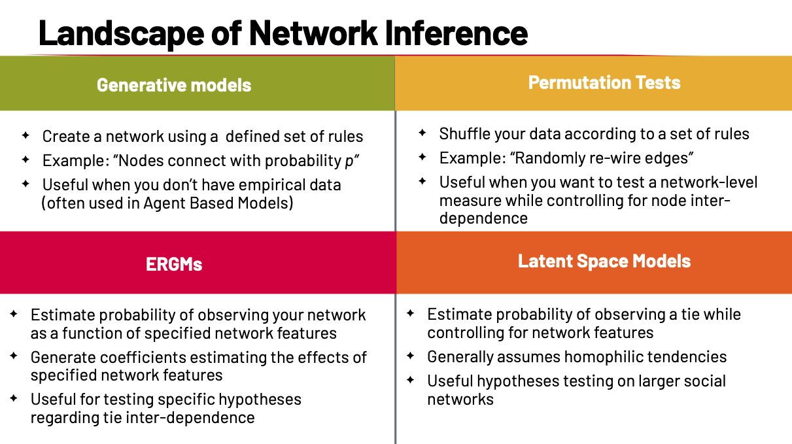
```

### Permutation Tests

- Estimate the probability of observing a specific network-level statistic (e.g., clustering, reciprocity, centralization).
- Work by **shuffling** the data according to defined rules (e.g., randomly re-wire edges).
- **Control for network structure:**

    - When asking “Is clustering higher than random?”, we don’t want bias from density or degree distribution.
    - During permutation, preserve certain properties of the observed network:

        - **Preserve density**: keep the same number of edges, but rewire them randomly.
        - **Preserve degree distribution**: each node keeps the same number of ties, but partners are randomized.
- This creates a **universe of possible networks** (a null model = permutations of the observed network) that matches observed density/degree distribution.
- Useful for testing whether a network statistic is **significantly different from random**, while accounting for node inter-dependence. It can also test whether the similarity between two networks is significantly different from random.
- Good for descriptive inference.
- But cannot test *why* a pattern occurs.


### ERGMs (Exponential Random Graph Models)

- “Of all possible networks we could have observed, what’s the probability of observing the one we did?”

- ERGMs can answer questions such as…
    - What is the probability of tie formation in the observed network?
    - What effect does **homophily** have on tie formation?
    - What effect does **triadic closure** have on tie formation?
    - What effect does a **node characteristic** (e.g., wealth, gender) have on tie formation?
    - What role does a **specific node with a specific attribute** play in tie formation?

- ERGM treats the entire network (adjacency matrix) as a **single multivariate observation** (no i.i.d. dyads). Because probability is assigned to the entire network, edges are jointly modeled; independence of dyads is not assumed.

- Model the probability of the observed network as a function of specified features.
    - Each feature (reciprocity, triangles, homophily, covariates) is added as a term.
    - ERGM estimates coefficients → show how strongly each feature influences tie formation.

- We want $P(N)$, the probability of observing network $N$. Let $h(N)$ be a vector of network statistics (captures interdependence among edges + covariates).


:::: {.columns}
::: {.column width="50%"}
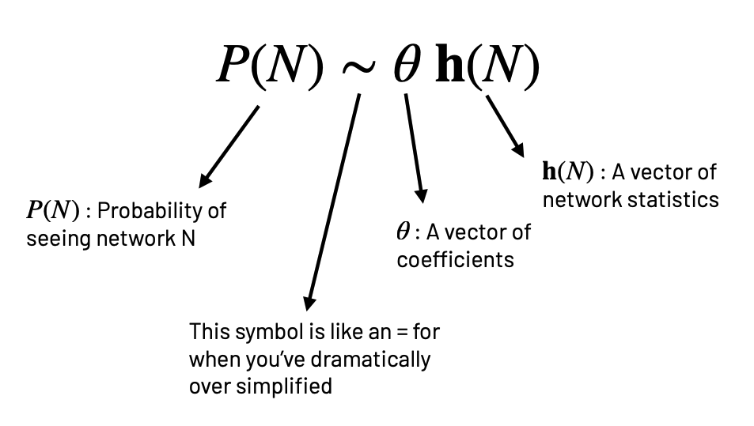
:::
::: {.column width="50%"}
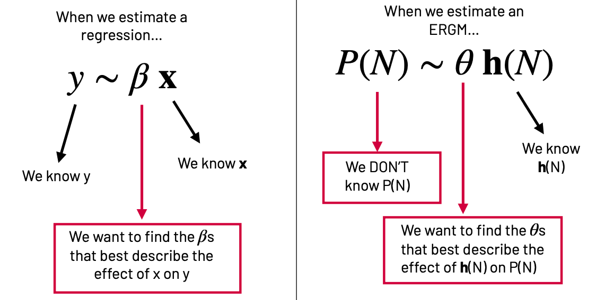
:::
::::


#### ERGMs (Exponential Random Graph Models) Exercise


```{r}
#| echo: false
#| out.width: "500px"

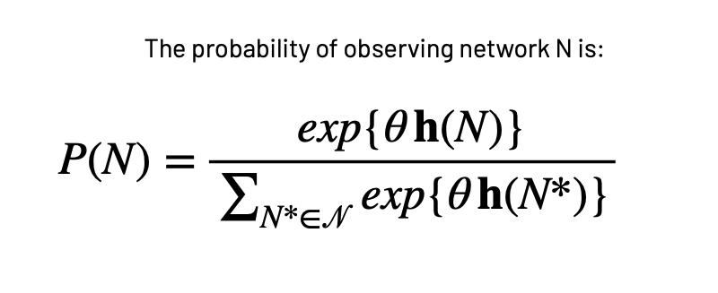
```

```{r}
#| echo: false
#| out.width: "500px"

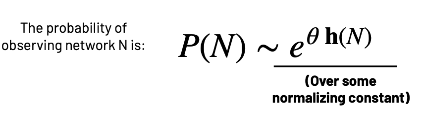
```


Let's just see how it works!
Let's first see what we have in our data.
We can see the items in our environment using:
```{r}
ls()
```
**flobusiness** contains the network of business ties and **flomarriage** contains the network of marriage ties.

```{r}
set.seed(42)
```

Let’s start with a simple model which estimates the probability of seeing our network of marriage ties as a
function of the number of edges in our network:
```{r}
ergm1 <- ergm(flomarriage~ edges)
summary(ergm1)
```

This model specifies a single homogeneous probability for all ties, which is captured by the **edges coefficient** (θ<sub>E</sub>). To interpret this coefficient, we can return to the logit form of the ERGM. 

The ERGM can be written in logistic form:

  $$
  \operatorname{logit}(p_{ij}) = \theta_E \,\delta^{E}_{ij}(N)
  $$

- Where:

  - $\theta_E$ = coefficient for edges (here: $-1.6094$).
  - $\delta^{E}_{ij}(N)$ = change in the edge count when adding edge $ij$.

- Adding an edge always increases the edge count by 1:

  $$
  \delta^{E}_{ij}(N) = 1
  $$

  So the formula simplifies to:

  $$
  \operatorname{logit}(p_{ij}) = \theta_E
  $$

- To get the probability, take the inverse logit:

  $$
  p_{ij} = \frac{e^{\theta_E}}{1 + e^{\theta_E}}
  $$

With θ<sub>E</sub> = –1.6094:  

$$
p_{ij} = \frac{e^{-1.6094}}{1 + e^{-1.6094}} \approx 0.167
$$

    
We can use R to calculate:
```{r}
p <- exp(-1.6094) / (1 + exp(-1.6094))
p
```

The probability of an edge existing between i and j is 0.167.
This is the baseline ERGM: it only accounts for network density (how many edges exist).  

We can also do this with node-level covariate data.
```{r}
list.vertex.attributes(flomarriage)
```

Let's see how the "wealth" affects the tie formation.

```{r}
get.vertex.attribute(flomarriage, "wealth")
summary(get.vertex.attribute(flomarriage, "wealth"))
```

Let's do some “pre-checks” to sanity-check the covariate and inspect the model’s sufficient statistics before estimating the ERGM. We check range/skew/outliers or missingness. We should also see whether units are large/uneven, so that we can consider centering/scaling (or logging) for stability and interpretation.

```{r}
summary(get.vertex.attribute(flomarriage, "wealth"))
```

nodecov() is an ERGM term that uses a numeric node attribute as a predictor of tie formation. Are the values about the magnitude you expect? If a term is constant (or perfectly collinear with another term) across the networks allowed by your constraints, it can’t be identified.

```{r}
summary(flomarriage~ edges + nodecov('wealth'))
```

Now we run an ERGM with two parameters: edges and family wealth:
```{r}
ergm2 <- ergm(flomarriage~ edges + nodecov('wealth'))
```


```{r}
summary(ergm2)
```


Baseline ties are unlikely (edges coefficient $\approx -2.595$). Wealth has a small, positive, statistically significant effect(although barely at the 5% level) on tie formation ($\beta_{\text{wealth}} \approx 0.0105$, $p \approx 0.024$). Let’s plug in values to see the implied probabilities.

- **Model (logit form)**

  $$
  \operatorname{logit}(p_{ij}) \;=\; -2.594929 \;+\; 0.010546\,(\text{wealth}_i + \text{wealth}_j)
  $$

  where $\operatorname{logit}^{-1}(x)=\dfrac{e^{x}}{1+e^{x}}$ converts log-odds to probability.

- **Example 1: each family has wealth = 1**

  $$
  \operatorname{logit}(p_{ij}) = -2.594929 + 0.010546(1+1) = -2.573837
  $$

  $$
  p_{ij} \;=\; \operatorname{logit}^{-1}(-2.573837)
           \;=\; \frac{e^{-2.573837}}{1+e^{-2.573837}}
           \;\approx\; 0.071
  $$

- **Example 2: each family has wealth = 100**

  $$
  \operatorname{logit}(p_{ij}) = -2.594929 + 0.010546(100+100) = -0.485729
  $$

  $$
  p_{ij} \;=\; \operatorname{logit}^{-1}(-0.485729)
           \;=\; \frac{e^{-0.485729}}{1+e^{-0.485729}}
           \;\approx\; 0.381
  $$

This model suggests that wealthier families are more likely to have ties, but the effect size per wealth unit is small. Each +1 to (wealth_i + wealth_j) multiplies the odds by exp(0.0105) ≈ 1.011 (~1.1% increase per unit).


### Further Readings
- [ERGM equation](https://cran.r-project.org/web/packages/ergmito/vignettes/ergm-equations.html)
- [ERGMs tutorial (statnet)](https://statnet.org/workshop-ergm/ergm_tutorial.html)

### Special Thanks
The authors of this document want to express special thanks to Professor Sarah Shugars from Rutgers University. This document has used the resources from Professor Shugars' Network Analysis session at ICPSR (2023 and 2024). 